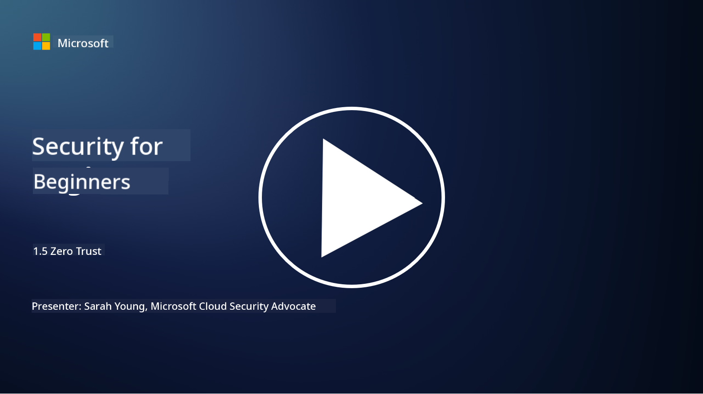
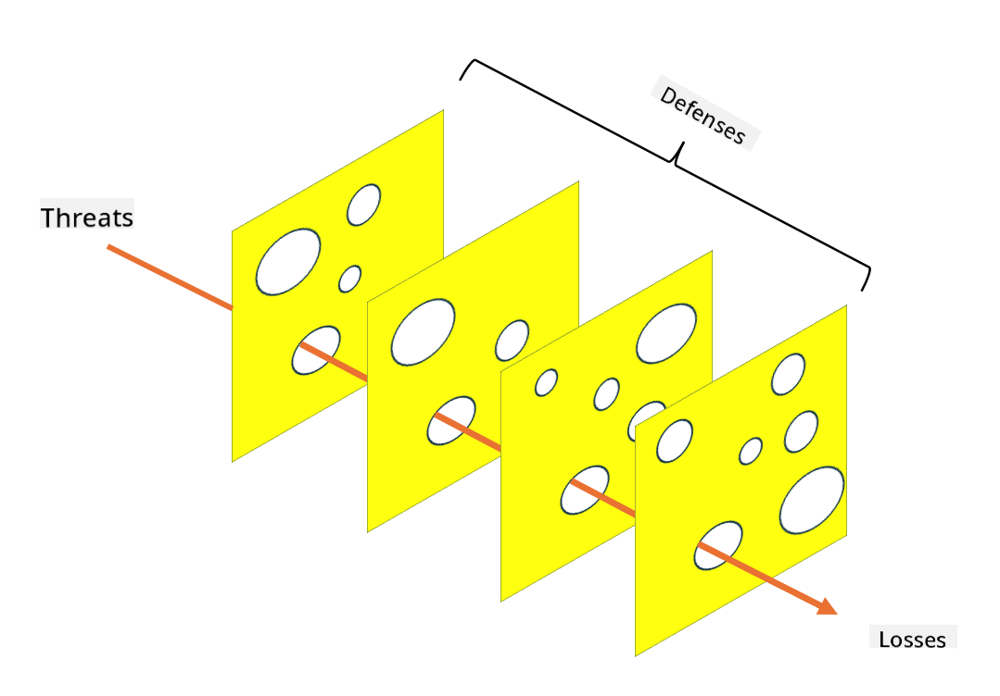

<!--
CO_OP_TRANSLATOR_METADATA:
{
  "original_hash": "75f77f972d2233c584f87c1eb96c983b",
  "translation_date": "2025-09-03T23:45:12+00:00",
  "source_file": "1.5 Zero trust.md",
  "language_code": "en"
}
-->
# Zero Trust

“Zero trust” is a term frequently used in security discussions these days. But what does it actually mean? Is it just another buzzword? In this lesson, we’ll explore the concept of zero trust in detail.

## Introduction

 - In this lesson, we’ll discuss:
   
   - What zero trust is
   
   - How zero trust differs from traditional security architectures
   
   - What defense in depth means

## Zero Trust

Zero Trust is a cybersecurity strategy that challenges the traditional "trust but verify" approach by assuming that no entity—whether inside or outside an organization’s network—should be trusted by default. Instead, Zero Trust emphasizes verifying every user, device, and application attempting to access resources, regardless of their location. The main goal of Zero Trust is to minimize the "attack surface" and reduce the potential impact of security breaches.

The Zero Trust model is built on the following principles:

1. **Verify Identity**: Authentication and authorization are strictly enforced for all users and devices, no matter where they are. Keep in mind that an identity doesn’t always refer to a person—it could also be a device, an application, etc.

2. **Least Privilege**: Users and devices are given only the minimum access they need to perform their tasks, limiting the damage that could occur if they are compromised.

3. **Micro-Segmentation**: Network resources are divided into smaller segments to restrict lateral movement within the network in the event of a breach.

4. **Continuous Monitoring**: User and device behavior is continuously monitored and analyzed to detect anomalies and potential threats. Modern monitoring techniques often incorporate machine learning, AI, and threat intelligence to provide deeper insights and context.

5. **Data Encryption**: Data is encrypted both while in transit and at rest to prevent unauthorized access.

6. **Strict Access Control**: Access is granted based on context, such as user roles, device health, and network location.

Microsoft organizes Zero Trust into five pillars, which we’ll explore in a later lesson.

## Differences from Traditional Security Architectures

Zero Trust differs from traditional security models, such as perimeter-based approaches, in several key ways:

1. **Perimeter vs. Identity-Centric**: Traditional models focus on securing the network perimeter, assuming that internal users and devices can be trusted once inside. Zero Trust, however, assumes that threats can come from both inside and outside the network, enforcing strict identity-based controls.

2. **Implicit vs. Explicit Trust**: Traditional models implicitly trust users and devices within the network until proven otherwise. Zero Trust explicitly verifies identities and continuously monitors for suspicious activity.

3. **Flat vs. Segmented Network**: Traditional architectures often use flat networks, where internal users have broad access. Zero Trust promotes segmenting the network into smaller, isolated zones to contain potential breaches.

4. **Reactive vs. Proactive**: Traditional security often relies on reactive measures like perimeter firewalls and intrusion detection systems. Zero Trust takes a proactive stance, assuming breaches are inevitable and working to minimize their impact.

## Defense in Depth

Defense in depth, also known as layered security, is a cybersecurity strategy that involves implementing multiple layers of security controls to protect an organization’s assets. The idea is to create overlapping layers of defense so that if one layer fails, others can still provide protection. Each layer addresses a different aspect of security, enhancing the organization’s overall security posture.

Defense in depth combines technical, procedural, and physical security measures. These can include firewalls, intrusion detection systems, access controls, encryption, user training, security policies, and more. The goal is to create multiple barriers that collectively make it harder for attackers to compromise an organization’s systems and networks. This approach is sometimes referred to as the "Swiss cheese" model, which is also used in accident prevention strategies in other industries (e.g., transportation).

## Further reading

[What is Zero Trust?](https://learn.microsoft.com/security/zero-trust/zero-trust-overview?WT.mc_id=academic-96948-sayoung)

[Evolving Zero Trust – Microsoft Position Paper](https://query.prod.cms.rt.microsoft.com/cms/api/am/binary/RWJJdT?WT.mc_id=academic-96948-sayoung)

[Zero Trust and BeyondCorp Google Cloud | Google Cloud Blog](https://cloud.google.com/blog/topics/developers-practitioners/zero-trust-and-beyondcorp-google-cloud)

---

**Disclaimer**:  
This document has been translated using the AI translation service [Co-op Translator](https://github.com/Azure/co-op-translator). While we strive for accuracy, please note that automated translations may contain errors or inaccuracies. The original document in its native language should be regarded as the authoritative source. For critical information, professional human translation is recommended. We are not responsible for any misunderstandings or misinterpretations resulting from the use of this translation.