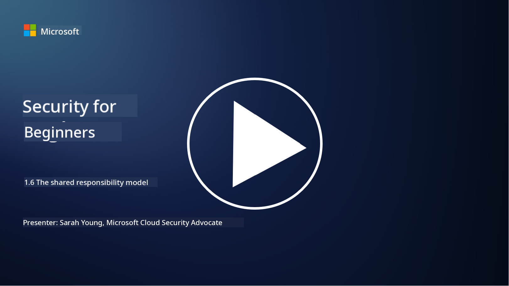

<!--
CO_OP_TRANSLATOR_METADATA:
{
  "original_hash": "a48db640d80c786b928ca178c414f084",
  "translation_date": "2025-09-04T00:23:42+00:00",
  "source_file": "1.6 Shared responsibility model.md",
  "language_code": "en"
}
-->
# The shared responsibility model

Shared responsibility is a relatively new concept in IT that emerged with the rise of cloud computing. From a cybersecurity standpoint, it’s essential to understand who is responsible for which security controls to avoid any gaps in protection.

## Introduction

In this lesson, we’ll discuss:

 - What shared responsibility means in the context of cybersecurity.
   
 - How shared responsibility for security controls differs between IaaS, PaaS, and SaaS.
   
 - Where to find information about the security controls provided by your cloud platform.
   
 - The concept of “trust but verify.”

## What is shared responsibility in the context of cybersecurity?

Shared responsibility in cybersecurity refers to the division of security tasks between a cloud service provider (CSP) and its customers. In cloud environments like Infrastructure as a Service (IaaS), Platform as a Service (PaaS), and Software as a Service (SaaS), both the CSP and the customer have roles to play in securing data, applications, and systems.

## What is the difference in shared responsibility for security controls between IaaS, PaaS, and SaaS?

The allocation of responsibilities varies depending on the type of cloud service:

 - **IaaS (Infrastructure as a Service)**: The CSP provides the core infrastructure (servers, networking, storage), while the customer is responsible for managing the operating systems, applications, and security configurations on that infrastructure.
   
 - **PaaS (Platform as a Service)**: The CSP delivers a platform for customers to build and deploy applications. The CSP handles the underlying infrastructure, while the customer focuses on application development and securing their data.
   
 - **SaaS (Software as a Service)**: The CSP offers fully functional applications accessible via the internet. Here, the CSP is responsible for the application's security and infrastructure, while the customer manages user access and data usage.

Understanding shared responsibility is vital because it clarifies which security aspects are managed by the CSP and which are the customer’s responsibility. This helps avoid misunderstandings and ensures comprehensive security measures are in place.

## Where can you find out what security controls your cloud platform is providing?

To determine the security controls offered by your cloud platform, consult the cloud service provider’s documentation and resources. These may include:

 - **CSP’s website and documentation**: The CSP’s website typically contains information about the security features and controls included in their services. They often provide detailed documentation, such as whitepapers, security guides, and technical resources, explaining their security practices and recommendations.
   
 - **Security assessments and audits**: Many CSPs undergo evaluations by independent security experts and organizations. These assessments can offer insights into the quality of the CSP’s security measures. In some cases, this results in the CSP obtaining security compliance certifications (see the next point).
   
 - **Security compliance certifications**: Most CSPs achieve certifications like ISO:27001, SOC 2, and FedRAMP, which demonstrate adherence to specific security and compliance standards.

Keep in mind that the level of detail and availability of information may vary between providers. Always refer to official and up-to-date resources from your CSP to make informed decisions about securing your cloud-based assets.

## What is “trust but verify”?

When working with a CSP, third-party software, or other IT security services, an organization may initially trust the provider’s claims about their security measures. However, to ensure the safety of their data and systems, they should verify these claims through security assessments, penetration testing, and reviews of the provider’s security controls before fully integrating the software or service into their operations. Both individuals and organizations should adopt the principle of “trust but verify” for any security controls they do not directly manage.

## Shared responsibility within an organization

It’s important to remember that shared responsibility for security also applies within an organization. The security team typically cannot implement all controls on their own and must collaborate with operations teams, developers, and other business units to ensure all necessary security measures are in place to protect the organization.

## Further reading

- [Shared responsibility in the cloud - Microsoft Azure | Microsoft Learn](https://learn.microsoft.com/azure/security/fundamentals/shared-responsibility?WT.mc_id=academic-96948-sayoung)
- [What is shared responsibility model? – Definition from TechTarget.com](https://www.techtarget.com/searchcloudcomputing/definition/shared-responsibility-model)
- [The shared responsibility model explained and what it means for cloud security | CSO Online](https://www.csoonline.com/article/570779/the-shared-responsibility-model-explained-and-what-it-means-for-cloud-security.html)
- [Shared Responsibility for Cloud Security: What You Need to Know (cisecurity.org)](https://www.cisecurity.org/insights/blog/shared-responsibility-cloud-security-what-you-need-to-know)

---

**Disclaimer**:  
This document has been translated using the AI translation service [Co-op Translator](https://github.com/Azure/co-op-translator). While we aim for accuracy, please note that automated translations may include errors or inaccuracies. The original document in its native language should be regarded as the authoritative source. For critical information, professional human translation is advised. We are not responsible for any misunderstandings or misinterpretations resulting from the use of this translation.