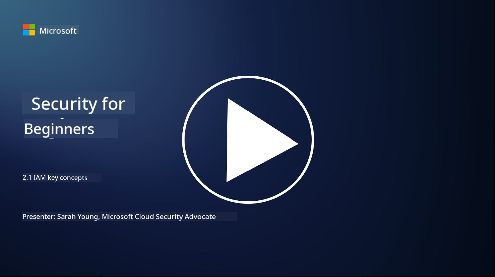

<!--
CO_OP_TRANSLATOR_METADATA:
{
  "original_hash": "2e3864e3d579f0dbb4ac2ec8c5f82acf",
  "translation_date": "2025-09-03T22:37:14+00:00",
  "source_file": "2.1 IAM key concepts.md",
  "language_code": "en"
}
-->
# IAM key concepts 

Have you ever logged into a computer or a website? Of course you have! That means you’ve already interacted with identity controls in your daily life. Identity and access management (IAM) is a critical aspect of security, and we’ll explore it further in the upcoming lessons.

**Introduction**

In this lesson, we’ll discuss:

 - What identity and access management (IAM) means in the context of cybersecurity.
 - The principle of least privilege.
 - The concept of segregation of duties.
 - The difference between authentication and authorization.

## What do we mean by identity and access management (IAM) in the context of cybersecurity?

Identity and Access Management (IAM) refers to the processes, technologies, and policies designed to ensure that the right people have the appropriate access to resources within an organization’s digital environment. IAM involves managing digital identities (users, employees, partners) and their access to systems, applications, data, and networks. Its main goals are to improve security, simplify user access, and ensure compliance with organizational policies and regulations. IAM solutions typically include user authentication, authorization, identity provisioning, access control, and user lifecycle management (ensuring accounts are removed when no longer needed).

## What is the principle of least privilege?

The principle of least privilege is a key concept that recommends giving users and systems only the minimum access necessary to perform their tasks or roles. This approach helps reduce the potential impact of security breaches or insider threats. By following this principle, organizations can minimize the risk of unauthorized access, data leaks, and accidental misuse of privileges. In practice, this means users are granted access only to the specific resources and functions required for their job, and nothing more. For instance, if you only need to read a document, it wouldn’t make sense to give you full administrative access to it.

## What is segregation of duties?

Segregation of duties is a principle designed to prevent conflicts of interest and reduce the risk of fraud or errors by dividing critical tasks and responsibilities among different individuals within an organization. In cybersecurity, this means ensuring that no single person has control over all aspects of a critical process or system. The idea is to create checks and balances that prevent one person from handling both the setup and approval stages of a process. For example, in financial systems, the person entering transactions should not be the same person approving them. This reduces the likelihood of unauthorized or fraudulent actions going unnoticed.

## What is authentication and authorization?

Authentication and authorization are two essential concepts in cybersecurity that work together to secure systems and data. They help control access to resources and protect sensitive information.

**1. Authentication**: Authentication is the process of verifying the identity of a user, system, or entity attempting to access a system or resource. It ensures that the claimed identity is legitimate. Common authentication methods include:

   a. Something you know: Passwords, PINs, or other secret information known only to the user.
   b. Something you have: Physical items like smart cards, security tokens, or mobile devices used to confirm identity.
   c. Something you are: Biometric data such as fingerprints, facial recognition, or retinal scans unique to the individual.

Authentication ensures that users are who they claim to be before granting access to systems or resources, helping prevent unauthorized access.

**2. Authorization**: Authorization is the process of determining what actions or permissions an authenticated user or entity is allowed to perform. It defines what resources or operations a user can access based on predefined policies, access control rules, and assigned roles.

Authorization answers the question, "What can an authenticated user do?" It enforces access control policies to protect sensitive data and resources from unauthorized use or modification.

**In summary:**

- Authentication verifies the identity of users or entities.
- Authorization determines what authenticated users are allowed to do or access.

## Further reading

- [Describe identity concepts - Training | Microsoft Learn](https://learn.microsoft.com/training/modules/describe-identity-principles-concepts/?WT.mc_id=academic-96948-sayoung)
- [Introduction to identity - Microsoft Entra | Microsoft Learn](https://learn.microsoft.com/azure/active-directory/fundamentals/identity-fundamental-concepts?WT.mc_id=academic-96948-sayoung)
- [What is Identity Access Management (IAM)? | Microsoft Security](https://www.microsoft.com/security/business/security-101/what-is-identity-access-management-iam?WT.mc_id=academic-96948-sayoung)
- [What is IAM? Identity and access management explained | CSO Online](https://www.csoonline.com/article/518296/what-is-iam-identity-and-access-management-explained.html)
- [What is IAM? (auth0.com)](https://auth0.com/blog/what-is-iam/)
- [Security+: implementing Identity and Access Management (IAM) controls [updated 2021] | Infosec (infosecinstitute.com)](https://resources.infosecinstitute.com/certifications/securityplus/security-implementing-identity-and-access-management-iam-controls/)
- [least privilege - Glossary | CSRC (nist.gov)](https://csrc.nist.gov/glossary/term/least_privilege)
- [Security: The Principle of Least Privilege (POLP) - Microsoft Community Hub](https://techcommunity.microsoft.com/t5/azure-sql-blog/security-the-principle-of-least-privilege-polp/ba-p/2067390?WT.mc_id=academic-96948-sayoung)
- [Principle of least privilege | CERT NZ](https://www.cert.govt.nz/it-specialists/critical-controls/principle-of-least-privilege/)
- [Why is separation of duties required by NIST 800-171 and CMMC? - (totem.tech)](https://www.totem.tech/cmmc-separation-of-duties/)

---

**Disclaimer**:  
This document has been translated using the AI translation service [Co-op Translator](https://github.com/Azure/co-op-translator). While we aim for accuracy, please note that automated translations may include errors or inaccuracies. The original document in its native language should be regarded as the authoritative source. For critical information, professional human translation is advised. We are not responsible for any misunderstandings or misinterpretations resulting from the use of this translation.