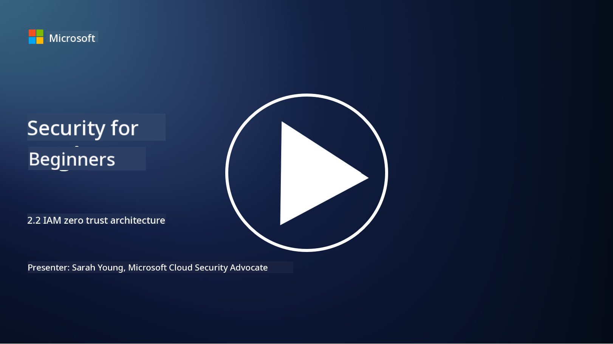

<!--
CO_OP_TRANSLATOR_METADATA:
{
  "original_hash": "4774a978af123f72ebb872199c4c4d4f",
  "translation_date": "2025-09-03T23:38:41+00:00",
  "source_file": "2.2 IAM zero trust architecture.md",
  "language_code": "en"
}
-->
# IAM Zero Trust Architecture

Identity is a crucial component in implementing a zero trust architecture and establishing a security perimeter for any IT environment. In this section, we’ll discuss why identity controls are essential for zero trust implementation.

## Introduction

In this lesson, we’ll cover:

 - Why identity should serve as the perimeter in modern IT environments.
   
 - How this approach differs from traditional IT architectures.
   
 - How identity is leveraged to implement a zero trust architecture.

## Why identity should serve as the perimeter in modern IT environments

In today’s IT landscape, the traditional concept of a physical perimeter (using tools like firewalls and network boundaries) as the main defense against cyber threats is becoming less effective. This is due to the growing complexity of technology, the prevalence of remote work, and the adoption of cloud services. As a result, organizations are shifting to using identity as the new perimeter. This approach centers on verifying and managing the identity of users, devices, and applications accessing resources, regardless of their physical location.

Here’s why identity-based perimeters are essential in modern IT environments:

**Remote Workforce**: With remote work and mobile devices becoming standard, users access resources from various locations and devices. Traditional perimeter defenses fail when users are no longer confined to a physical office.

**Cloud and Hybrid Environments**: Organizations increasingly use cloud services and hybrid environments. Data and applications are no longer exclusively housed within an organization’s premises, making traditional perimeter defenses less effective.

**Zero Trust Security**: Zero trust security assumes that no entity, whether inside or outside the network, should be trusted by default. Identity becomes the foundation for verifying access requests, regardless of their origin.

**Threat Landscape**: Cyber threats are evolving, and attackers are bypassing traditional perimeter defenses. Techniques like phishing, social engineering, and insider threats exploit human vulnerabilities rather than network perimeters.

**Data-Centric Approach**: Protecting sensitive data is critical. By focusing on identity, organizations can control who accesses specific data, reducing the risk of breaches.

## How this approach differs from traditional IT architectures

Traditional IT architectures relied heavily on perimeter-based security models, where firewalls and network boundaries were the primary defense mechanisms. The key differences between traditional and identity-centric approaches are:

|      Aspect                 |      Traditional IT Architectures                                                                  |      Identity-Centric Approach                                                                             |
|-----------------------------|----------------------------------------------------------------------------------------------------|------------------------------------------------------------------------------------------------------------|
|     Focus                   |     Perimeter Focus: Relied on perimeter defenses like firewalls and   access control.             |     Focus on Identity Verification: Shift from network boundaries to verifying   user/device identity.     |
|     Location                |     Location Dependency: - Security tied to physical office locations and   network boundaries.    |     Location Independence: Security not tied to specific locations; access   from anywhere.                |
|     Trust Assumption        |     Assumed Trust: Assumed trust within the network perimeter for   users/devices.                 |     Zero Trust Approach: Trust is never assumed; access is verified based   on identity and context.       |
|     Device Consideration    |     Device Diversity: Assumed devices within the network perimeter were   secure.                  |     Device Awareness: Consider device health and security posture,   regardless of location.               |
|     Data Protection         |     Data Protection: Focused on securing network perimeters for data   protection.                 |     Data-Centric Protection: Focus on controlling data access based on   identity and data sensitivity.    |
|                             |                                                                                                    |                                                                                                            |

## How identity is leveraged to implement a zero trust architecture

In a zero trust architecture, the core principle is to never automatically trust any entity, whether inside or outside the network perimeter. Identity plays a central role in implementing zero trust by enabling continuous verification of entities attempting to access resources. Modern identity security controls ensure that every user, device, application, and service requesting access is thoroughly identified and authenticated before access is granted. This involves verifying their digital identity through methods like username/password combinations, multi-factor authentication (MFA), biometrics, and other robust authentication mechanisms.

## Further reading

- [Securing identity with Zero Trust | Microsoft Learn](https://learn.microsoft.com/security/zero-trust/deploy/identity?WT.mc_id=academic-96948-sayoung)
- [Zero Trust Principles and Guidance for Identity and Access | CSA (cloudsecurityalliance.org)](https://cloudsecurityalliance.org/artifacts/zero-trust-principles-and-guidance-for-iam/)
- [Zero Trust Identity Controls - Essentials Series - Episode 2 - YouTube](https://www.youtube.com/watch?v=fQZQznIKcGM&list=PLXtHYVsvn_b_gtX1-NB62wNervQx1Fhp4&index=13)

---

**Disclaimer**:  
This document has been translated using the AI translation service [Co-op Translator](https://github.com/Azure/co-op-translator). While we aim for accuracy, please note that automated translations may include errors or inaccuracies. The original document in its native language should be regarded as the authoritative source. For critical information, professional human translation is advised. We are not responsible for any misunderstandings or misinterpretations resulting from the use of this translation.