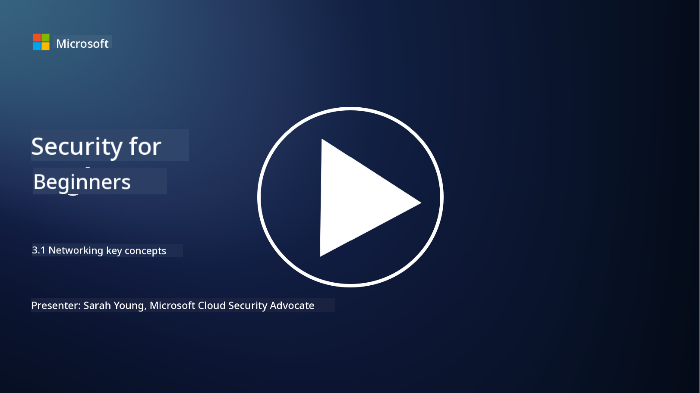
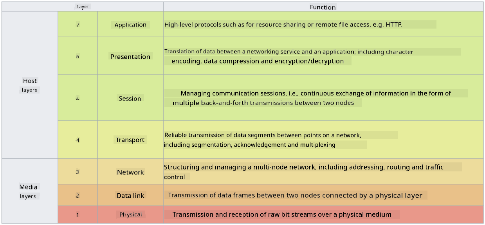

<!--
CO_OP_TRANSLATOR_METADATA:
{
  "original_hash": "252724eceeb183fb9018f88c5e1a3f0c",
  "translation_date": "2025-09-04T01:42:32+00:00",
  "source_file": "3.1 Networking key concepts.md",
  "language_code": "en"
}
-->
# Networking key concepts

If you’ve worked in IT, you’ve probably encountered networking concepts. While modern environments primarily use identity as the main perimeter control, network controls are still essential. Networking is a vast topic, but in this lesson, we’ll focus on some key concepts.

In this lesson, we’ll cover:

 - What is IP addressing?
   
 - What is the OSI model?

 - What is TCP/UDP?

 - What are port numbers?

 - What is encryption at rest and in transit?

## What is IP addressing?

IP addressing, or Internet Protocol addressing, is a numerical label assigned to every device connected to a computer network that uses the Internet Protocol for communication. It acts as a unique identifier for devices within a network, enabling them to send and receive data across the internet or other interconnected networks. There are two main versions of IP addressing: IPv4 (Internet Protocol version 4) and IPv6 (Internet Protocol version 6). An IP address is typically represented in either IPv4 format (e.g., 192.168.1.1) or IPv6 format (e.g., 2001:0db8:85a3:0000:0000:8a2e:0370:7334).

## What is the OSI Model?

The OSI (Open Systems Interconnection) model is a conceptual framework that organizes the functions of a communication system into seven distinct layers. Each layer has specific responsibilities and interacts with adjacent layers to ensure efficient and reliable data communication between devices in a network. The layers, from bottom to top, are:

 1. Physical Layer
    
 2. Data Link Layer

 3. Network Layer

 4. Transport Layer

 5. Session Layer

 6. Presentation Layer

 7. Application Layer

The OSI model provides a standard reference for understanding how networking protocols and technologies work together, regardless of the hardware or software being used.

_ref: https://en.wikipedia.org/wiki/OSI_model_

## What is TCP/UDP?

TCP (Transmission Control Protocol) and UDP (User Datagram Protocol) are two key transport layer protocols used in computer networks to enable communication between devices over the internet or within a local network. They handle the process of breaking data into packets for transmission and reassembling those packets at the receiving end. However, they differ in their features and use cases.

**TCP (Transmission Control Protocol)**:

TCP is a connection-oriented protocol that ensures reliable and ordered data delivery between devices. It establishes a connection between the sender and receiver before data exchange begins. TCP guarantees that data packets arrive in the correct order and retransmits lost packets to ensure data integrity and completeness. This makes TCP ideal for applications that require reliable data delivery, such as web browsing, email, file transfers (FTP), and database communication.

**UDP (User Datagram Protocol)**:

UDP is a connectionless protocol that prioritizes faster data transmission but does not provide the same level of reliability as TCP. It does not establish a formal connection before sending data and lacks mechanisms for acknowledging or retransmitting lost packets. UDP is suitable for applications where speed and efficiency are more important than guaranteed delivery, such as real-time communication, streaming media, online gaming, and DNS queries.

In summary, TCP focuses on reliability and ordered delivery, making it suitable for applications that require data accuracy, while UDP emphasizes speed and efficiency, making it ideal for applications where minor data loss or order rearrangement is acceptable in exchange for reduced latency. The choice between TCP and UDP depends on the specific needs of the application or service.

## What are Port Numbers?

In networking, a port number is a numeric identifier used to distinguish between different services or applications running on a single device within a network. Ports help direct incoming data to the correct application. Port numbers are 16-bit unsigned integers, meaning they range from 0 to 65535. They are categorized into three ranges:

- Well-Known Ports (0-1023): Reserved for standard services like HTTP (port 80) and FTP (port 21).

- Registered Ports (1024-49151): Used for applications and services that are not part of the well-known range but are officially registered.

- Dynamic/Private Ports (49152-65535): Available for temporary or private use by applications.

## What is encryption at rest and in transit?

Encryption is the process of converting data into a secure format to protect it from unauthorized access or tampering. It can be applied to data both "at rest" (when stored on a device or server) and "in transit" (when being transmitted between devices or over networks).

Encryption at Rest: This involves encrypting data stored on devices, servers, or storage systems. Even if an attacker gains physical access to the storage media, they cannot access the data without the encryption keys. This is critical for protecting sensitive data in cases of device theft, data breaches, or unauthorized access.

Encryption in Transit: This involves encrypting data as it moves between devices or over networks. It prevents eavesdropping and unauthorized interception of data during transmission. Common protocols for encryption in transit include HTTPS for web communication and TLS/SSL for securing various types of network traffic.

## Further reading
- [How Do IP Addresses Work? (howtogeek.com)](https://www.howtogeek.com/341307/how-do-ip-addresses-work/)
- [Understanding IP Address: An Introductory Guide (geekflare.com)](https://geekflare.com/understanding-ip-address/)
- [What is the OSI model? The 7 layers of OSI explained (techtarget.com)](https://www.techtarget.com/searchnetworking/definition/OSI)
- [The OSI Model – The 7 Layers of Networking Explained in Plain English (freecodecamp.org)](https://www.freecodecamp.org/news/osi-model-networking-layers-explained-in-plain-english/)
- [TCP/IP protocols - IBM Documentation](https://www.ibm.com/docs/en/aix/7.3?topic=protocol-tcpip-protocols)
- [Common Ports Cheat Sheet: The Ultimate Ports & Protocols List (stationx.net)](https://www.stationx.net/common-ports-cheat-sheet/)
- [Azure Data Encryption-at-Rest - Azure Security | Microsoft Learn](https://learn.microsoft.com/azure/security/fundamentals/encryption-atrest?WT.mc_id=academic-96948-sayoung)

---

**Disclaimer**:  
This document has been translated using the AI translation service [Co-op Translator](https://github.com/Azure/co-op-translator). While we strive for accuracy, please note that automated translations may contain errors or inaccuracies. The original document in its native language should be regarded as the authoritative source. For critical information, professional human translation is recommended. We are not responsible for any misunderstandings or misinterpretations resulting from the use of this translation.