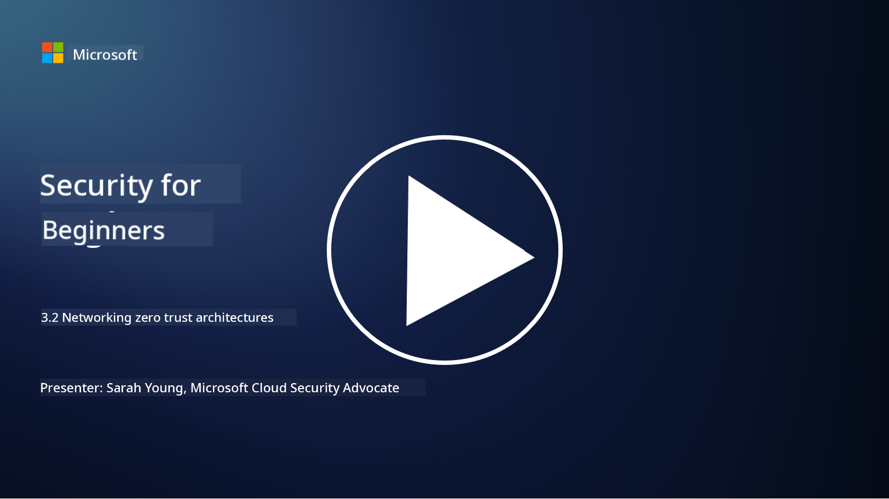

<!--
CO_OP_TRANSLATOR_METADATA:
{
  "original_hash": "680d6e14d9d33fc471c22f44679713f8",
  "translation_date": "2025-09-04T00:35:14+00:00",
  "source_file": "3.2 Networking zero trust architecture.md",
  "language_code": "en"
}
-->
# Networking Zero Trust Architectures

The network plays a key role in zero trust controls. In this lesson, we will explore the following topics:

- What is network segmentation?  
- How does network segmentation support zero trust implementation?  
- What is end-to-end encryption?  

## What is network segmentation?

Network segmentation involves dividing a network into smaller, isolated segments or subnetworks. Each segment is separated from the others, and access between them is controlled and restricted based on specific security policies. This practice enhances security by containing the impact of potential breaches and limiting attackers' ability to move laterally within the network.

By using network segmentation, organizations can create "zones" that separate different types of users, applications, and data. This reduces the attack surface and minimizes the damage caused by security incidents. Technologies like virtual LANs (VLANs), firewalls, and access controls are commonly used to achieve network segmentation.

## How does network segmentation help implement zero trust?

Network segmentation aligns closely with the principles of the Zero Trust model. In a Zero Trust architecture, segmentation enforces the "least privilege" principle by ensuring that users and devices can only access the specific resources and services necessary for their tasks. By dividing the network into smaller zones, organizations can implement strict access controls, isolate critical assets, and prevent attackers from moving laterally.

Additionally, network segmentation supports identity-based access controls, where users and devices are thoroughly authenticated and authorized before accessing specific segments. This approach prevents unauthorized access to sensitive resources and reduces the impact of compromised credentials.

## What is end-to-end encryption?

End-to-end (E2E) encryption ensures that data remains encrypted throughout its entire journey from the sender to the recipient. In this process, data is encrypted at the sender's end, and only the recipient has the decryption key to unlock and read the data. Encryption and decryption occur at the endpoints, making it extremely difficult for unauthorized parties, including service providers and intermediaries, to access the plaintext data.

E2E encryption provides a high level of confidentiality and security for data transmission, even when the data passes through multiple intermediary systems or networks. It is widely used in secure messaging apps, email services, and other communication platforms to protect sensitive information from interception and unauthorized access.

This method ensures that even if attackers intercept the data in transit, they will only see encrypted content that is meaningless without the decryption key. End-to-end encryption is essential for safeguarding user privacy and protecting sensitive information from unauthorized exposure.

## What is SASE?

SASE, or "Secure Access Service Edge," is a cybersecurity framework and architecture that combines network security and wide-area networking (WAN) capabilities into a single cloud-based service. SASE is designed to provide secure and scalable access to network resources, applications, and data for remote and mobile users while simplifying network management and reducing the complexity of traditional network and security architectures.

Key characteristics and components of SASE include:

1. **Cloud-Based:** SASE is delivered as a cloud service, meaning that security and networking functions are provided from the cloud rather than relying on traditional on-premises hardware and appliances.  

2. **Integration of Security and Networking:** SASE integrates various security services, such as secure web gateways (SWG), firewall as a service (FWaaS), data loss prevention (DLP), zero-trust network access (ZTNA), and WAN optimization, with wide-area networking capabilities. This integration streamlines security and networking operations.  

3. **Zero Trust:** SASE operates on the zero trust principle, enforcing strict access controls and least-privilege access policies. Users and devices are not trusted by default and must be authenticated and authorized before accessing resources.  

4. **Identity-Centric:** SASE focuses on user and device identities as the foundation for access control. Identity and context-based policies determine access permissions, adapting dynamically based on user behavior and context.  

5. **Scalability and Flexibility:** SASE can easily scale to accommodate a large number of users and devices, making it suitable for organizations with diverse and evolving networking and security needs.  

SASE is particularly relevant in today's era of remote work and cloud adoption, offering a comprehensive and agile approach to securing and managing network access. It helps organizations adapt to changing security and networking requirements while maintaining a strong focus on user-centric and zero-trust security models.

## Further reading

- [What Is Network Segmentation? - Cisco](https://www.cisco.com/c/en/us/products/security/what-is-network-segmentation.html#~benefits)  
- [What Is Micro-Segmentation? - Cisco](https://www.cisco.com/c/en/us/products/security/what-is-microsegmentation.html)  
- [Implementing Network Segmentation and Segregation | Cyber.gov.au](https://www.cyber.gov.au/resources-business-and-government/maintaining-devices-and-systems/system-hardening-and-administration/network-hardening/implementing-network-segmentation-and-segregation)  
- [What Is Network Segmentation and Why It Matters | CompTIA](https://www.comptia.org/blog/security-awareness-training-network-segmentation)  
- [Network Segmentation: Concepts and Practices (cmu.edu)](https://insights.sei.cmu.edu/blog/network-segmentation-concepts-and-practices/)  
- [Secure networks with Zero Trust | Microsoft Learn](https://learn.microsoft.com/security/zero-trust/deploy/networks?WT.mc_id=academic-96948-sayoung)  
- [What is end-to-end encryption? | IBM](https://www.ibm.com/topics/end-to-end-encryption)  
- [What Is End-to-End Encryption, and Why Does It Matter? (howtogeek.com)](https://www.howtogeek.com/711656/what-is-end-to-end-encryption-and-why-does-it-matter/)  
- [Definition of Secure Access Service Edge (SASE) - Gartner Information Technology Glossary](https://www.gartner.com/en/information-technology/glossary/secure-access-service-edge-sase)  
- [What Is Secure Access Service Edge (SASE)? | Microsoft Security](https://www.microsoft.com/security/business/security-101/what-is-sase?WT.mc_id=academic-96948-sayoung)  

---

**Disclaimer**:  
This document has been translated using the AI translation service [Co-op Translator](https://github.com/Azure/co-op-translator). While we aim for accuracy, please note that automated translations may include errors or inaccuracies. The original document in its native language should be regarded as the authoritative source. For critical information, professional human translation is advised. We are not responsible for any misunderstandings or misinterpretations resulting from the use of this translation.