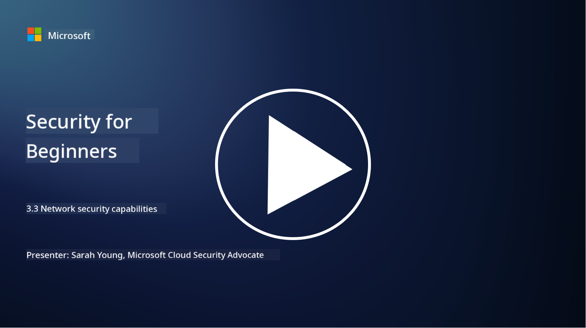

<!--
CO_OP_TRANSLATOR_METADATA:
{
  "original_hash": "c3aba077bb98eebc925dd58d870229ab",
  "translation_date": "2025-09-03T23:31:18+00:00",
  "source_file": "3.3 Network security capabilities.md",
  "language_code": "en"
}
-->
# Network Security Capabilities

In this lesson, we’ll explore the following tools and techniques for securing a network:

 - Traditional firewalls
 - Web application firewalls
 - Cloud security groups
 - CDN
 - Load balancers
 - Bastion hosts
 - VPNs
 - DDoS protection

## Traditional Firewalls

Traditional firewalls are security devices that regulate and monitor incoming and outgoing network traffic based on established security rules. They serve as a protective barrier between a trusted internal network and untrusted external networks, filtering traffic to block unauthorized access and potential threats.

## Web Application Firewalls

Web Application Firewalls (WAFs) are specialized tools designed to safeguard web applications from attacks like SQL injection, cross-site scripting, and other vulnerabilities. They inspect HTTP requests and responses to detect and block malicious traffic targeting web applications.

## Cloud Security Groups

Security groups are a key network security feature offered by cloud service providers. They function as virtual firewalls, managing inbound and outbound traffic to and from cloud resources such as virtual machines (VMs) and instances. Security groups enable organizations to define rules that specify which types of traffic are permitted or denied, adding an extra layer of protection to cloud environments.

## Content Delivery Network (CDN)

A Content Delivery Network is a distributed system of servers located in various regions. CDNs enhance website performance and availability by caching content and delivering it from servers closer to the user. They also provide some defense against DDoS attacks by distributing traffic across multiple server locations.

## Load Balancers

Load balancers distribute incoming network traffic across multiple servers to optimize resource use, ensure high availability, and improve application performance. They help prevent server overload and maintain efficient response times, increasing the network's resilience.

## Bastion Hosts

Bastion hosts are highly secure, isolated servers that provide controlled access to a network from an external, untrusted network (like the internet). They act as secure entry points for administrators to access internal systems. Bastion hosts are typically configured with robust security measures to reduce the attack surface.

## Virtual Private Networks (VPNs)

VPNs establish encrypted tunnels between a user's device and a remote server, ensuring secure and private communication over potentially unsafe networks like the internet. VPNs are commonly used to enable remote access to internal networks, allowing users to access resources as if they were physically present on the same network.

## DDoS Protection Tools

DDoS (Distributed Denial of Service) protection tools and services are designed to reduce the impact of DDoS attacks, where multiple compromised devices flood a network or service to overwhelm it. These solutions identify and filter out malicious traffic, ensuring legitimate traffic can still reach its destination.

## Further Reading

- [What Is a Firewall? - Cisco](https://www.cisco.com/c/en/us/products/security/firewalls/what-is-a-firewall.html#~types-of-firewalls)
- [What Does a Firewall Actually Do? (howtogeek.com)](https://www.howtogeek.com/144269/htg-explains-what-firewalls-actually-do/)
- [What is a Firewall? How Firewalls Work & Types of Firewalls (kaspersky.com)](https://www.kaspersky.com/resource-center/definitions/firewall)
- [Network security group - how it works | Microsoft Learn](https://learn.microsoft.com/azure/virtual-network/network-security-group-how-it-works)
- [Introduction to Azure Content Delivery Network (CDN) - Training | Microsoft Learn](https://learn.microsoft.com/training/modules/intro-to-azure-content-delivery-network/?WT.mc_id=academic-96948-sayoung)
- [What is a content delivery network (CDN)? - Azure | Microsoft Learn](https://learn.microsoft.com/azure/cdn/cdn-overview?WT.mc_id=academic-96948-sayoung)
- [What Is Load Balancing? How Load Balancers Work (nginx.com)](https://www.nginx.com/resources/glossary/load-balancing/)
- [Bastion hosts vs. VPNs · Tailscale](https://tailscale.com/learn/bastion-hosts-vs-vpns/)
- [What is VPN? How It Works, Types of VPN (kaspersky.com)](https://www.kaspersky.com/resource-center/definitions/what-is-a-vpn)
- [Introduction to Azure DDoS Protection - Training | Microsoft Learn](https://learn.microsoft.com/training/modules/introduction-azure-ddos-protection/?WT.mc_id=academic-96948-sayoung)
- [What Is a DDoS Attack? | Microsoft Security](https://www.microsoft.com/security/business/security-101/what-is-a-ddos-attack?WT.mc_id=academic-96948-sayoung)

---

**Disclaimer**:  
This document has been translated using the AI translation service [Co-op Translator](https://github.com/Azure/co-op-translator). While we aim for accuracy, please note that automated translations may include errors or inaccuracies. The original document in its native language should be regarded as the authoritative source. For critical information, professional human translation is advised. We are not responsible for any misunderstandings or misinterpretations resulting from the use of this translation.