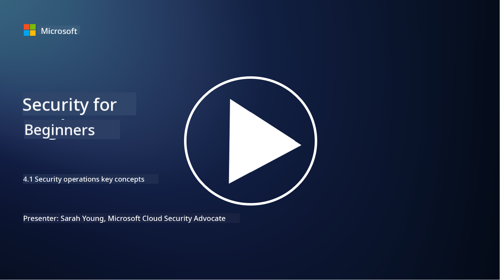

<!--
CO_OP_TRANSLATOR_METADATA:
{
  "original_hash": "6a55b31df9eebf550d040cef0ef7dff3",
  "translation_date": "2025-09-04T02:00:23+00:00",
  "source_file": "4.1 SecOps key concepts.md",
  "language_code": "en"
}
-->
# Security operations key concepts

Security operations are a vital part of an organization’s overall security strategy. In this lesson, we’ll explore the following:

 - What is the role of a security operations function within a business?
   
 - What forms can security operations take?
   
 - How do security operations differ from traditional IT operations?

## What is a security operations function within a business?

A security operations function within a business refers to a dedicated team or department tasked with monitoring, detecting, investigating, and responding to cybersecurity threats and incidents. The primary objective of this function is to safeguard the confidentiality, integrity, and availability of an organization’s digital assets by proactively identifying and addressing security risks and effectively managing security incidents.

## What forms can security operations take?

Security operations can vary in structure depending on the size and complexity of the organization. Common forms include:

**Security Operations Center (SOC):** A centralized team that provides round-the-clock monitoring, analysis, and response to security events. SOCs often leverage advanced tools and technologies to detect and respond to threats in real time.

**Incident Response Team:** A specialized group focused on managing security incidents and breaches. They investigate incidents, coordinate response efforts, and support recovery processes.

**Threat Hunting Team:** A team dedicated to proactively searching for advanced threats and hidden vulnerabilities that traditional security tools might miss.

**Red Team/Blue Team:** The red team simulates attacks to uncover vulnerabilities, while the blue team defends against these simulated attacks. Together, they work to strengthen the organization’s security posture.

**Managed Security Services Provider (MSSP):** Some organizations choose to outsource their security operations to third-party providers that specialize in security monitoring and incident response.

## How do security operations differ from traditional IT operations?

While security operations and traditional IT operations are interconnected, they serve distinct purposes:

**Focus:** IT operations concentrate on managing and maintaining the organization’s IT infrastructure to ensure functionality and availability. Security operations focus on identifying and mitigating security risks and addressing incidents.

**Responsibilities:** IT operations handle tasks such as system maintenance, software updates, and user support. Security operations are responsible for threat detection, incident response, vulnerability management, and security monitoring.

**Timeliness:** IT operations prioritize immediate system availability and performance. Security operations emphasize identifying and addressing threats, which may not always align with immediate availability goals.

**Skillset:** Security operations require expertise in threat analysis, incident response, and cybersecurity tools. IT operations demand skills in system administration, network management, and application support.

## Incident response workflow

The NIST Cybersecurity Framework Core Functions outline five key activities that should be continuously performed as part of an organization’s operational environment to reduce cybersecurity risks.

It’s important to understand that these activities should be part of a broader cycle that integrates with and aligns to the organization’s overall cybersecurity processes.

**Note:** You can learn more about the NIST Cybersecurity Framework at [https://www.nist.gov/cybersecurity](https://www.nist.gov/cybersecurity)

## Further reading

- [Security operations | Microsoft Learn](https://learn.microsoft.com/security/operations/overview?WT.mc_id=academic-96948-sayoung)
- [Implementing security operations processes | Microsoft Learn](https://learn.microsoft.com/security/operations/?WT.mc_id=academic-96948-sayoung)
- [What is a security operations center (SOC)? | Microsoft Security](https://www.microsoft.com/security/business/security-101/what-is-a-security-operations-center-soc?WT.mc_id=academic-96948-sayoung)
- [What Is a Security Operations Center | Cybersecurity | CompTIA](https://www.comptia.org/content/articles/what-is-a-security-operations-center)

---

**Disclaimer**:  
This document has been translated using the AI translation service [Co-op Translator](https://github.com/Azure/co-op-translator). While we strive for accuracy, please note that automated translations may contain errors or inaccuracies. The original document in its native language should be regarded as the authoritative source. For critical information, professional human translation is recommended. We are not responsible for any misunderstandings or misinterpretations resulting from the use of this translation.