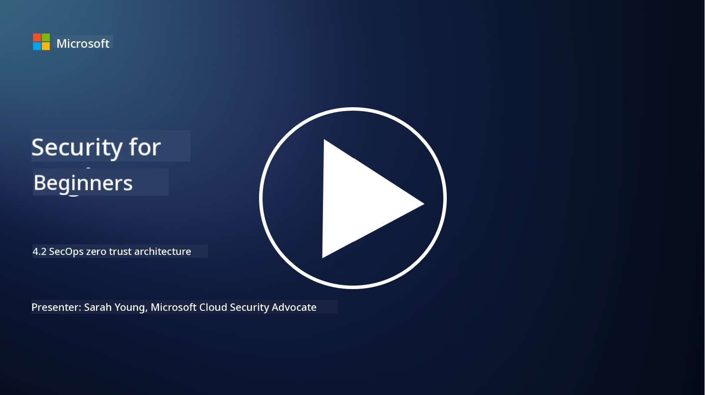

<!--
CO_OP_TRANSLATOR_METADATA:
{
  "original_hash": "45bbdc114e70936816b0b3e7c40189cf",
  "translation_date": "2025-09-04T00:42:58+00:00",
  "source_file": "4.2 SecOps zero trust architecture.md",
  "language_code": "en"
}
-->
# SecOps Zero Trust Architecture

Security operations are a key part of zero trust architecture, and in this lesson, we will explore two main aspects:

- How should IT architectures be designed to enable centralized log collection?

- What are the best practices for security operations in modern IT environments?

## How should IT architectures be designed to enable centralized log collection?

Centralized log collection is a vital element of modern security operations. It enables organizations to gather logs and data from various sources, such as servers, applications, network devices, and security tools, into a single repository for analysis, monitoring, and incident response. Below are some best practices for designing IT architectures to support centralized log collection:

1. **Log Source Integration**:

- Ensure all relevant devices and systems are configured to generate logs. This includes servers, firewalls, routers, switches, applications, and security appliances.

- Set up log sources to forward logs to a centralized log collector or management system.

2. **Choose the right SIEM (Security Information and Event Management) tool**:

- Select a SIEM solution that fits your organization's requirements and scale.

- Verify that the chosen solution supports log collection, aggregation, analysis, and reporting.

3. **Scalability and Redundancy**:

- Design the architecture to scale as the number of log sources and log volume grows.

- Incorporate redundancy to ensure high availability and prevent disruptions caused by hardware or network failures.

4. **Secure Log Transport**:

- Use secure protocols like TLS/SSL or IPsec to transmit logs from sources to the centralized repository.

- Implement authentication and access controls to ensure only authorized devices can send logs.

5. **Normalization**:

- Standardize log formats and normalize data to ensure consistency and simplify analysis.

6. **Storage and Retention**:

- Define the appropriate retention period for logs based on compliance and security needs.

- Store logs securely to protect them from unauthorized access and tampering.

## What are the best practices for security operations in modern IT environments?

Beyond centralized log collection, here are some best practices for security operations in modern IT environments:

1. **Continuous Monitoring**: Continuously monitor network and system activities to detect and respond to threats in real time.

2. **Threat Intelligence**: Stay updated on emerging threats and vulnerabilities by using threat intelligence feeds and services.

3. **User Training**: Provide regular security awareness training to employees to reduce risks from social engineering and phishing attacks.

4. **Incident Response Plan**: Create and test an incident response plan to ensure a quick and effective reaction to security incidents.

5. **Security Automation**: Use security automation and orchestration tools to streamline incident response and repetitive tasks.

6. **Backup and Recovery**: Implement strong backup and disaster recovery solutions to ensure data availability in the event of data loss or ransomware attacks.

## Further Reading

- [Microsoft Security Best Practices module: Security operations | Microsoft Learn](https://learn.microsoft.com/security/operations/security-operations-videos-and-decks?WT.mc_id=academic-96948-sayoung)
- [Security operations - Cloud Adoption Framework | Microsoft Learn](https://learn.microsoft.com/azure/cloud-adoption-framework/secure/security-operations?WT.mc_id=academic-96948-sayoung)
- [What is Security Operations and Analytics Platform Architecture? A Definition of SOAPA, How It Works, Benefits, and More (digitalguardian.com)](https://www.digitalguardian.com/blog/what-security-operations-and-analytics-platform-architecture-definition-soapa-how-it-works#:~:text=All%20in%20all%2C%20security%20operations%20and%20analytics%20platform,become%20more%20efficient%20and%20operative%20with%20your%20security.)

---

**Disclaimer**:  
This document has been translated using the AI translation service [Co-op Translator](https://github.com/Azure/co-op-translator). While we strive for accuracy, please note that automated translations may contain errors or inaccuracies. The original document in its native language should be regarded as the authoritative source. For critical information, professional human translation is recommended. We are not responsible for any misunderstandings or misinterpretations resulting from the use of this translation.