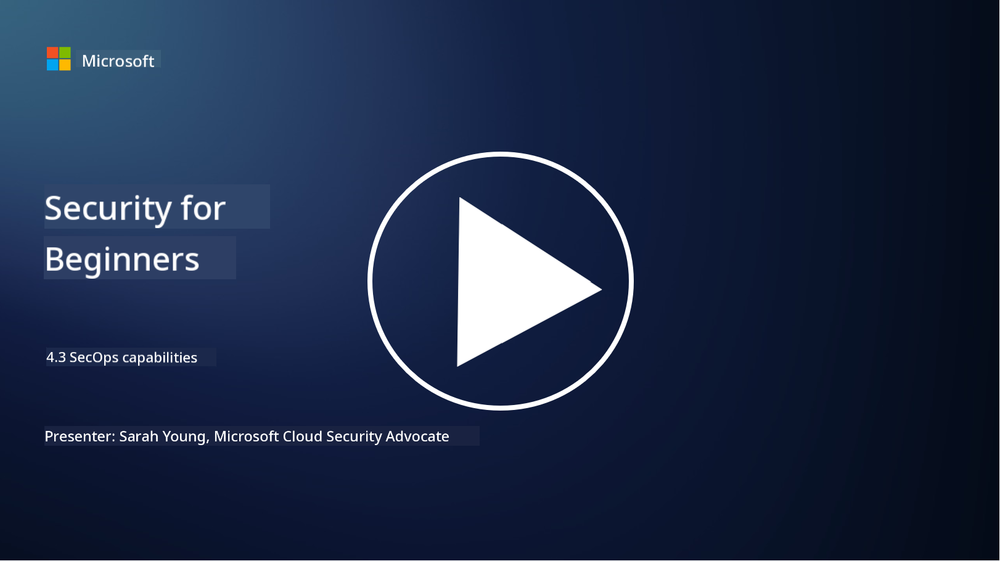

<!--
CO_OP_TRANSLATOR_METADATA:
{
  "original_hash": "553eb694c89f1caca0694e8d8ab89e0e",
  "translation_date": "2025-09-04T01:15:25+00:00",
  "source_file": "4.3 SecOps capabilities.md",
  "language_code": "en"
}
-->
# SecOps capabilities

In this section, we’ll dive deeper into the essential tools and features that support security operations.

In this lesson, we’ll explore:

- What is a security information and event management (SIEM) tool?

- What is XDR?

- What capabilities can enhance security operations?

## What is a security information and event management (SIEM) tool?

A Security Information and Event Management (SIEM) tool is designed to analyze security alerts generated across an organization's IT environment. It collects, aggregates, correlates, and analyzes log data and security events from various sources, such as network devices, servers, applications, and security systems.

Key functions and features of SIEM tools include:

1. **Log Collection**: SIEM tools gather logs and security event data from a wide range of devices, systems, and applications, including firewalls, intrusion detection systems, antivirus software, and more.

2. **Data Normalization**: They standardize log data into a common format to simplify analysis and correlation.

3. **Event Correlation**: SIEM tools correlate events to identify patterns and anomalies that may signal security incidents or threats.

4. **Alerting and Notification**: SIEM tools generate real-time alerts and notifications when suspicious activities or security violations are detected, enabling immediate action.

5. **Incident Detection**: They help detect security incidents, such as unauthorized access, data breaches, malware infections, and insider threats.

6. **User and Entity Behavior Analytics (UEBA)**: Some SIEM tools include UEBA capabilities to identify unusual user and entity behaviors that may indicate compromised accounts or insider threats.

7. **Threat Intelligence Integration**: SIEM tools can integrate with threat intelligence feeds to enhance threat detection by comparing known indicators of compromise (IOCs) with network activity.

8. **Automation and Orchestration**: Automation features allow SIEMs to respond to common security incidents automatically, reducing response times and manual effort.

9. **Dashboard and Visualization**: They provide dashboards and visualization tools for monitoring security data and generating custom reports.

10. **Integration with Other Security Tools**: SIEM tools often work with other security technologies, such as endpoint detection and response (EDR) solutions, to offer a comprehensive view of an organization's security posture.

## What is XDR?

XDR (Extended Detection and Response) is a technology that builds on traditional Endpoint Detection and Response (EDR) by incorporating broader security telemetry from multiple sources. It provides a more holistic view of an organization's security posture, aiming to improve threat detection, incident response, and overall security by addressing the limitations of relying solely on EDR, SIEM, or other standalone tools.

Key characteristics and components of XDR include:

1. **Data Integration**: XDR combines data from various sources, including endpoints, network traffic, cloud services, email, and more. This comprehensive aggregation offers greater context for threat detection and analysis.

2. **Advanced Analytics**: XDR uses advanced analytics, machine learning, and behavioral analysis to identify and prioritize security threats. It detects patterns and anomalies in the integrated data to uncover both known and unknown threats.

3. **Automated Threat Detection**: XDR automates the identification of security threats and anomalies by correlating data from multiple sources. It can detect complex attack chains spanning different vectors.

4. **Incident Investigation and Response**: XDR provides tools to investigate and respond to incidents, enabling security teams to quickly assess the scope and impact of threats and take appropriate actions.

5. **Threat Intelligence Integration**: It incorporates threat intelligence feeds to enhance detection by comparing known indicators of compromise (IOCs) with the organization's network and endpoint activity.

6. **Unified Console**: XDR typically offers a centralized console or dashboard where security teams can manage alerts and incidents from various sources in one place.

7. **Cross-Platform Coverage**: XDR solutions support a wide range of platforms, including endpoints, servers, cloud environments, and mobile devices, making them suitable for modern, multi-platform IT environments.

## What capabilities can enhance security operations?

Organizations can leverage several capabilities to strengthen security operations beyond SIEM tools:

1. **Machine Learning and Artificial Intelligence**: Use advanced analytics, machine learning, and AI to detect emerging threats and automate threat hunting.

2. **User and Entity Behavior Analytics (UEBA)**: Monitor user and entity behavior to identify anomalies and insider threats.

3. **Threat Intelligence Feeds**: Integrate threat intelligence feeds to stay informed about the latest threats and indicators of compromise.

4. **Security Orchestration, Automation, and Response (SOAR)**: Deploy SOAR platforms to automate incident response and streamline security workflows.

5. **Deception Technologies**: Utilize deception technologies to mislead attackers and detect their presence within the network.

## Further reading

- [What is SIEM? | Microsoft Security](https://www.microsoft.com/security/business/security-101/what-is-siem?WT.mc_id=academic-96948-sayoung)
- [What Is SIEM? - Security Information and Event Management - Cisco](https://www.cisco.com/c/en/us/products/security/what-is-siem.html)
- [Security information and event management - Wikipedia](https://en.wikipedia.org/wiki/Security_information_and_event_management)
- [What Is XDR? | Microsoft Security](https://www.microsoft.com/security/business/security-101/what-is-xdr?WT.mc_id=academic-96948-sayoung)
- [XDR & XDR Security (kaspersky.com.au)](https://www.kaspersky.com.au/resource-center/definitions/what-is-xdr)
- [The Power of SecOps: Redefining Core Security Capabilities - The New Stack](https://thenewstack.io/the-power-of-secops-redefining-core-security-capabilities/)
- [Seven Steps to Improve Your Security Operations and Response (securityintelligence.com)](https://securityintelligence.com/seven-steps-to-improve-your-security-operations-and-response/)

---

**Disclaimer**:  
This document has been translated using the AI translation service [Co-op Translator](https://github.com/Azure/co-op-translator). While we aim for accuracy, please note that automated translations may include errors or inaccuracies. The original document in its native language should be regarded as the authoritative source. For critical information, professional human translation is advised. We are not responsible for any misunderstandings or misinterpretations resulting from the use of this translation.