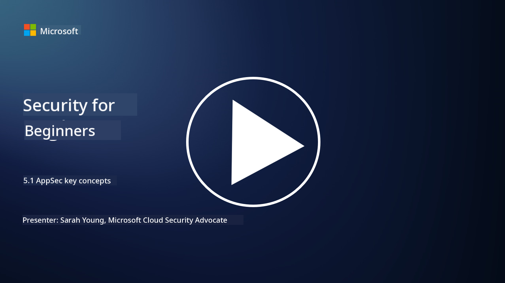

<!--
CO_OP_TRANSLATOR_METADATA:
{
  "original_hash": "e4b56bb23078d3ffb7ad407d280b0c36",
  "translation_date": "2025-09-04T00:30:03+00:00",
  "source_file": "5.1 AppSec key concepts.md",
  "language_code": "en"
}
-->
# AppSec key concepts

Application security is a specialized field within cybersecurity. In this section of the course, we’ll dive deeper into application security.

## Introduction

In this lesson, we’ll explore:

- What is application security?

- What are the fundamental concepts and principles of application security?

## What is application security?

Application security, commonly referred to as "AppSec," involves safeguarding software applications against security threats, vulnerabilities, and attacks. It includes the processes, methods, and tools used to identify, address, and prevent security risks throughout an application's development, deployment, and maintenance lifecycle.

Application security is essential because applications are frequent targets for cyberattacks. Attackers exploit software vulnerabilities to gain unauthorized access, steal information, disrupt operations, or carry out other harmful activities. Robust application security ensures the confidentiality, integrity, and availability of an application and its associated data.

## What are the key concepts/principles of application security?

The foundational concepts and principles of application security include:

1. **Secure by Design**:

- Security should be embedded into the application's design and architecture from the outset, rather than being added later.

2. **Input Validation**:

- Validate all user inputs to ensure they meet expected formats and are free from malicious content.

3. **Output Encoding**:

- Properly encode data sent to the client to prevent vulnerabilities like cross-site scripting (XSS).

4. **Authentication and Authorization**:

- Verify user identities and control their access to resources based on roles and permissions.

5. **Data Protection**:

- Encrypt sensitive data during storage, transmission, and processing to prevent unauthorized access.

6. **Session Management**:

- Implement secure session management to protect user sessions from hijacking and unauthorized access.

7. **Secure Dependencies**:

- Regularly update software dependencies with security patches to address vulnerabilities.

8. **Error Handling and Logging**:

- Use secure error handling to avoid exposing sensitive information and adopt safe logging practices.

9. **Security Testing**:

- Conduct regular security testing, including penetration testing, code reviews, and automated scans, to identify vulnerabilities.

10. **Secure Software Development Lifecycle (SDLC)**:

- Incorporate security measures into every stage of the software development lifecycle, from requirements gathering to deployment and maintenance.

## Further reading

- [SheHacksPurple: What is Application Security? - YouTube](https://www.youtube.com/watch?v=eNmccQNzSSY)
- [What Is Application Security? - Cisco](https://www.cisco.com/c/en/us/solutions/security/application-first-security/what-is-application-security.html#~how-does-it-work)
- [What is application security? A process and tools for securing software | CSO Online](https://www.csoonline.com/article/566471/what-is-application-security-a-process-and-tools-for-securing-software.html)
- [OWASP Cheat Sheet Series | OWASP Foundation](https://owasp.org/www-project-cheat-sheets/)

---

**Disclaimer**:  
This document has been translated using the AI translation service [Co-op Translator](https://github.com/Azure/co-op-translator). While we strive for accuracy, please note that automated translations may contain errors or inaccuracies. The original document in its native language should be regarded as the authoritative source. For critical information, professional human translation is recommended. We are not responsible for any misunderstandings or misinterpretations resulting from the use of this translation.