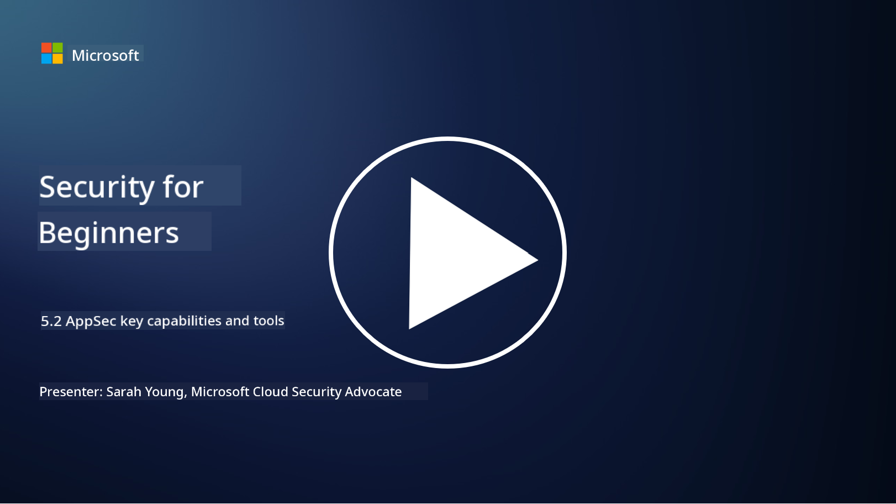

<!--
CO_OP_TRANSLATOR_METADATA:
{
  "original_hash": "790a3fa7e535ec60bb51bde13e759781",
  "translation_date": "2025-09-04T00:48:24+00:00",
  "source_file": "5.2 AppSec key capabilities.md",
  "language_code": "en"
}
-->
In this section, we’ll explore more details about the essential tools and capabilities used in application security:

## Introduction

In this lesson, we’ll discuss the key capabilities and tools commonly used in application security.

## AppSec key capabilities and tools

The key capabilities and tools in application security are crucial for identifying, mitigating, and preventing security vulnerabilities and threats in software applications. Below are some of the most important ones:

**1. Static Application Security Testing (SAST)**:

- **Capabilities**: Examines source code, bytecode, or binary code to detect security vulnerabilities within the application's codebase.

- **Tools**: Examples include Fortify, Checkmarx, and Veracode.

**2. Dynamic Application Security Testing (DAST)**:

- **Capabilities**: Tests a running application by sending input requests and analyzing responses to uncover vulnerabilities.

- **Tools**: Examples include ZAP, Burp Suite, and Qualys Web Application Scanning.

**3. Interactive Application Security Testing (IAST)**:

- **Capabilities**: Combines aspects of SAST and DAST to analyze code during runtime, offering more precise results and reducing false positives.

- **Tools**: Examples include Contrast Security and HCL AppScan.

**4. Runtime Application Self-Protection (RASP)**:

- **Capabilities**: Monitors and safeguards applications in real-time, detecting and responding to security threats as they occur.

- **Tools**: Examples include Veracode Runtime Protection and F5 Advanced WAF with RASP.

**5. Web Application Firewalls (WAFs)**:

- **Capabilities**: Acts as a protective barrier between the application and the internet, filtering incoming traffic and blocking malicious requests.

- **Tools**: Examples include ModSecurity, AWS WAF, and Akamai Kona Site Defender.

**6. Dependency Scanning**:

- **Capabilities**: Identifies vulnerabilities in third-party libraries and components used in the application.

- **Tools**: Examples include OWASP Dependency-Check and Snyk.

**7. Penetration Testing (Pen Testing)**:

- **Capabilities**: Simulates real-world attacks to identify vulnerabilities and evaluate the security of an application.

- **Tools**: Conducted by certified ethical hackers and security professionals using tools like Metasploit and Nmap.

**8. Security Scanning and Analysis**:

- **Capabilities**: Scans for known vulnerabilities, configuration errors, and security misconfigurations.

- **Tools**: Examples include Nessus, Qualys Vulnerability Management, and OpenVAS.

**9. Container Security Tools**:

- **Capabilities**: Focuses on securing containerized applications and their environments.

- **Tools**: Examples include Docker Security Scanning and Aqua Security.

**10. Secure Development Training**:

- **Capabilities**: Offers training and awareness programs for development teams to promote secure coding practices.

- **Tools**: Customized training programs and platforms.

**11. Security Testing Frameworks**:

- **Capabilities**: Provides comprehensive testing frameworks for various application security testing needs.

- **Tools**: OWASP Amass, OWASP OWTF, and FrAppSec.

**12. Secure Code Review Tools**:

- **Capabilities**: Reviews source code to identify security vulnerabilities and ensure adherence to coding best practices.

- **Tools**: Examples include SonarQube and Checkmarx.

**13. Secure APIs and Microservices Tools**:

- **Capabilities**: Focuses on securing APIs and microservices, including authentication, authorization, and data protection.

- **Tools**: Examples include Apigee, AWS API Gateway, and Istio.

## Further reading

- [What Is Application Security? Concepts, Tools & Best Practices | HackerOne](https://www.hackerone.com/knowledge-center/what-application-security-concepts-tools-best-practices)
- [What is IAST? (Interactive Application Security Testing) (comparitech.com)](https://www.comparitech.com/net-admin/what-is-iast/)
- [10 Types of Application Security Testing Tools: When and How to Use Them (cmu.edu)](https://insights.sei.cmu.edu/blog/10-types-of-application-security-testing-tools-when-and-how-to-use-them/)
- [Shifting the Balance of Cybersecurity Risk: Principles and Approaches for Security-by-Design and Default | Cyber.gov.au](https://www.cyber.gov.au/about-us/view-all-content/publications/principles-and-approaches-for-security-by-design-and-default)

---

**Disclaimer**:  
This document has been translated using the AI translation service [Co-op Translator](https://github.com/Azure/co-op-translator). While we strive for accuracy, please note that automated translations may contain errors or inaccuracies. The original document in its native language should be regarded as the authoritative source. For critical information, professional human translation is recommended. We are not responsible for any misunderstandings or misinterpretations resulting from the use of this translation.