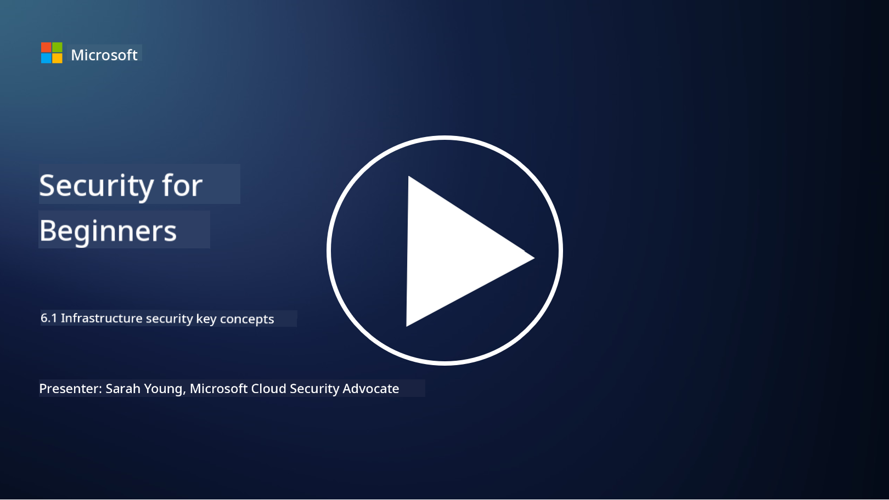

<!--
CO_OP_TRANSLATOR_METADATA:
{
  "original_hash": "882ebf66a648f419bcbf680ed6aefa00",
  "translation_date": "2025-09-03T23:10:27+00:00",
  "source_file": "6.1 Infrastructure security key concepts.md",
  "language_code": "en"
}
-->
# Infrastructure security key concepts

“Infrastructure” refers to the foundational components of any IT environment, including servers, cloud services, and containers—a wide range of technologies. The applications discussed in the previous section operate on this infrastructure, which can also become a target for attackers.

In this lesson, we’ll explore:

- What is security hygiene and why is it important?

- What is security posture management?

- What is patching and why is it important?

- What are containers and what makes their security unique?

## What is security hygiene and why is it important?

**Security hygiene** refers to the practices and habits that individuals and organizations adopt to maintain strong cybersecurity. It involves proactive measures to protect systems, data, and networks from threats and vulnerabilities. Good security hygiene is essential for several reasons:

- **Preventing Attacks**: Adhering to best practices can help prevent common cyberattacks, such as phishing, malware infections, and unauthorized access.

- **Protecting Data**: Effective security hygiene ensures sensitive and confidential data is safeguarded against theft or exposure.

- **Building Trust**: Organizations that prioritize security hygiene earn trust from customers and partners.

- **Compliance**: Many regulations and standards mandate adherence to security hygiene practices.

- **Reducing Risk**: Consistent security hygiene minimizes the likelihood of security incidents and breaches.

Key practices include keeping software updated, using strong passwords and multi-factor authentication, performing regular backups, training employees, and monitoring for suspicious activity. Security hygiene forms the foundation of a robust cybersecurity strategy.

## What is security posture management?

Security Posture Management involves assessing, monitoring, and improving an organization's overall cybersecurity readiness. A cybersecurity posture represents an organization's approach and preparedness to protect its IT systems, networks, data, and assets from cyber threats. It includes strategies, policies, practices, and technologies designed to safeguard digital assets and ensure the confidentiality, integrity, and availability of information.

This practice focuses on evaluating and maintaining the security of systems, networks, applications, and data to ensure alignment with security policies, best practices, and compliance requirements. Security Posture Management provides a comprehensive view of an organization's security status, identifies vulnerabilities and weaknesses, and prioritizes actions to address them.

## What is patching and why is it important?

**Patching** is the process of applying updates—known as patches or fixes—to software, operating systems, and applications. These updates address security vulnerabilities, bugs, and other issues that attackers might exploit. Hardware devices also require patching, such as firmware or built-in operating systems, though hardware patching can be more challenging than software patching.

Patching is critical for several reasons:

- **Security**: Patches resolve known vulnerabilities that attackers could exploit to compromise systems and steal data.

- **Stability**: Updates often improve system stability and performance, reducing the risk of crashes or failures.

- **Compliance**: Many regulations and standards require organizations to apply security patches promptly.

- **Building Trust**: Regular patching demonstrates a commitment to security, fostering trust among customers and stakeholders.

- **Risk Reduction**: Patching reduces the attack surface and lowers the likelihood of successful cyberattacks.

Delays in applying patches can leave systems exposed to known vulnerabilities, increasing the risk of breaches and data loss.

## What are containers and what makes their security unique?

Containers are lightweight, standalone, and executable software packages that include everything needed to run an application—such as code, runtime, libraries, and system tools. Containers provide a consistent and isolated environment for applications, simplifying development, packaging, and deployment across various platforms. Popular containerization technologies include Docker and Kubernetes.

Container Security involves protecting containers and the applications they host from security threats and vulnerabilities. While containers offer advantages like portability and scalability, they also introduce unique security challenges:

1. **Image Security**: Container images may contain vulnerabilities. Regularly updating and scanning images for known issues is essential to prevent exploitation. Only trusted images should be used.

2. **Runtime Security**: Containers must be isolated from each other and the host system to prevent unauthorized access and attacks. Technologies like namespaces and cgroups, along with monitoring tools, help ensure runtime security.

3. **Network Security**: Containers communicate over networks, making proper segmentation and firewall rules critical to control traffic and prevent unauthorized access.

4. **Access Control**: Restricting access to containers is vital. Role-based access control (RBAC) and identity management tools help enforce secure access policies.

5. **Logging and Monitoring**: Collecting and analyzing logs and monitoring data is key to detecting and responding to security incidents and anomalies in real time.

6. **Orchestration Security**: Securing container orchestration platforms like Kubernetes is equally important. This includes protecting the Kubernetes API server, implementing RBAC policies, and auditing cluster activity.

7. **Secrets Management**: Sensitive information, such as API keys and passwords, must be securely stored and managed to prevent exposure.

Container security relies on a combination of best practices, vulnerability scanning tools, runtime protection mechanisms, network security configurations, and orchestration security features. Continuous monitoring and automation are essential to quickly detect and respond to threats as containerized applications evolve and scale.

## Further reading

- [The importance of security hygiene | Security Magazine](https://www.securitymagazine.com/articles/99510-the-importance-of-security-hygiene)
- [What is CSPM? | Microsoft Security](https://www.microsoft.com/security/business/security-101/what-is-cspm?WT.mc_id=academic-96948-sayoung)
- [What is Cloud Security Posture Management (CSPM)? | HackerOne](https://www.hackerone.com/knowledge-center/what-cloud-security-posture-management)
- [Function of cloud security posture management - Cloud Adoption Framework | Microsoft Learn](https://learn.microsoft.com/azure/cloud-adoption-framework/organize/cloud-security-posture-management?WT.mc_id=academic-96948-sayoung)
- [What Is a CNAPP? | Microsoft Security](https://www.microsoft.com/security/business/security-101/what-is-cnapp)
- [Why Everyone Is Talking About CNAPP (forbes.com)](https://www.forbes.com/sites/forbestechcouncil/2021/12/10/why-everyone-is-talking-about-cnapp/?sh=567275ca1549)
- [Why is patching important to cybersecurity? - CyberSmart](https://cybersmart.co.uk/blog/why-is-patching-important-to-cybersecurity/)
- [What Is Container Security? Complete Guide [2023] (aquasec.com)](https://www.aquasec.com/cloud-native-academy/container-security/container-security/)

---

**Disclaimer**:  
This document has been translated using the AI translation service [Co-op Translator](https://github.com/Azure/co-op-translator). While we strive for accuracy, please note that automated translations may contain errors or inaccuracies. The original document in its native language should be regarded as the authoritative source. For critical information, professional human translation is recommended. We are not responsible for any misunderstandings or misinterpretations resulting from the use of this translation.