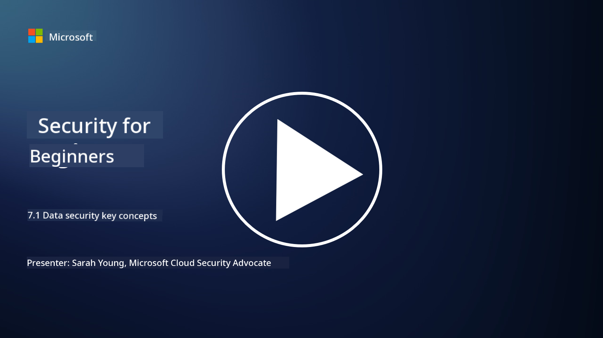

<!--
CO_OP_TRANSLATOR_METADATA:
{
  "original_hash": "9703868f41dcddd5a98dea9ea6fcd94d",
  "translation_date": "2025-09-03T23:54:19+00:00",
  "source_file": "7.1 Data security key concepts.md",
  "language_code": "en"
}
-->
# Data security key concepts

We’ve mentioned data security and touched on it several times throughout this course. Now, let’s explore this topic in greater detail. In this lesson, you will learn:

- What is data security?

- What is data classification?

- What is data lifecycle management?

- What is data loss prevention (DLP)?

- Why is data security important for an organization?

## What is data security?

**Data security** involves protecting digital data, such as databases, files, and sensitive information, from unauthorized access, disclosure, alteration, or destruction. The main goal of data security is to ensure the confidentiality, integrity, and availability of data. Achieving this requires a mix of technical, administrative, and physical security measures to defend against threats like cyberattacks, insider risks, and data breaches. Common data security practices include encryption, access controls, authentication, audit trails, and security policies.

## What is data classification?

**Data classification** is the process of organizing data based on its sensitivity, value, and importance to an organization. The goal is to help organizations identify and prioritize the protection and handling of different types of data. Typical classification categories include "public," "internal," "confidential," and "restricted" or "highly confidential." Once data is classified, organizations can apply suitable security measures and access restrictions to protect sensitive data and ensure compliance with regulations.

## What is data lifecycle management?

**Data lifecycle management** is a systematic approach to managing data throughout its entire lifecycle, from creation or acquisition to archival or deletion. The lifecycle generally includes stages like creation, storage, processing, transmission, archival, and disposal. Managing the data lifecycle involves setting policies and procedures for each stage, such as data retention, access controls, backups, and data cleansing. Effective data lifecycle management helps organizations optimize storage, improve data quality, and comply with data protection regulations.

## What is data loss prevention (DLP)?

**Data Loss Prevention (DLP)** refers to technologies, policies, and practices designed to prevent unauthorized access, sharing, or leakage of sensitive or confidential data. DLP solutions use content inspection and contextual analysis to monitor and control data in motion (e.g., email, web traffic), data at rest (e.g., stored files and databases), and data in use (e.g., data being accessed or manipulated by users). The goal of DLP is to identify, block, or encrypt sensitive data to prevent breaches, ensure regulatory compliance, and protect an organization’s reputation.

## Why is data security important for an organization?

Data security is vital for organizations for several reasons:

- **Protecting Sensitive Information**: Organizations often store sensitive data, such as customer records, intellectual property, financial data, and employee information. Data security ensures this information is protected from unauthorized access or theft.

- **Regulatory Compliance**: Many industries and regions have strict data protection and privacy laws. Data security helps organizations meet these requirements, avoiding legal penalties and reputational harm.

- **Preventing Data Breaches**: Data breaches can lead to financial losses, reputational damage, and legal issues. Strong data security measures help prevent breaches or minimize their impact.

- **Maintaining Trust**: Customers and stakeholders trust organizations with their data. Breaches undermine this trust. Robust data security helps maintain confidence and credibility.

- **Competitive Advantage**: A commitment to data security can set an organization apart. Customers and partners are more likely to engage with businesses that prioritize data protection.

- **Ensuring Operational Continuity**: Data security measures, such as backups and disaster recovery plans, ensure critical data remains available and business operations can continue during disruptions.

- **Addressing Insider Threats**: Data security also mitigates risks from within the organization, such as accidental data exposure or malicious actions by employees.

In summary, data security is essential for protecting sensitive information, meeting regulatory requirements, preventing breaches, maintaining trust, and ensuring the success and reputation of an organization.

## Further reading

- [What Is Data Security? | Microsoft Security](https://www.microsoft.com/en-au/security/business/security-101/what-is-data-security?WT.mc_id=academic-96948-sayoung)
- [Automatically Classify & Protect Documents & Data | Microsoft Purview Information Protection](https://youtu.be/v8LqmzBUaOo)
- [Example data classification policy](https://www.cmu.edu/data/guidelines/data-classification.html)
- [What is Data Security? Data Security Definition and Overview | IBM](https://www.ibm.com/topics/data-security)
- [Data Lifecycle Management: A 2023 Guide for Your Business (cloudwards.net)](https://www.cloudwards.net/data-lifecycle-management/)
- [What is data loss prevention (DLP)? | Microsoft Security](https://www.microsoft.com/security/business/security-101/what-is-data-loss-prevention-dlp?WT.mc_id=academic-96948-sayoung)
- [What is DLP? How data loss prevention software works and why you need it | CSO Online](https://www.csoonline.com/article/569559/what-is-dlp-how-data-loss-prevention-software-works-and-why-you-need-it.html)

---

**Disclaimer**:  
This document has been translated using the AI translation service [Co-op Translator](https://github.com/Azure/co-op-translator). While we strive for accuracy, please note that automated translations may contain errors or inaccuracies. The original document in its native language should be regarded as the authoritative source. For critical information, professional human translation is recommended. We are not responsible for any misunderstandings or misinterpretations resulting from the use of this translation.