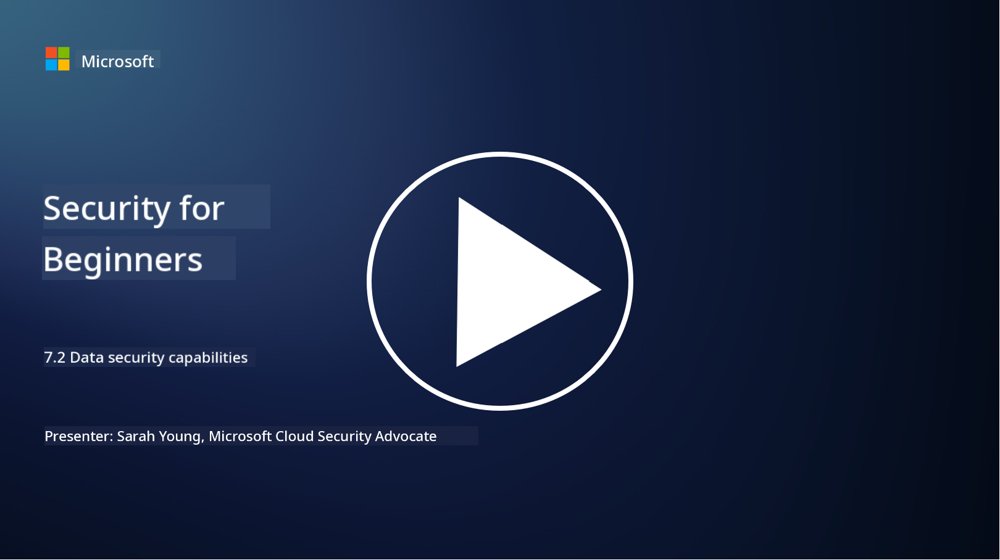

<!--
CO_OP_TRANSLATOR_METADATA:
{
  "original_hash": "50697add9758e54693442d502d2d5f8a",
  "translation_date": "2025-09-04T00:54:33+00:00",
  "source_file": "7.2 Data security capabilities.md",
  "language_code": "en"
}
-->
# Data security capabilities

In this section, we’ll explore the key tools and features used to ensure data security:

**Introduction**

In this lesson, we’ll discuss:

- What is data loss prevention tooling?

- What is insider risk management tooling?

- What data retention tooling is available?

## What is data loss prevention tooling?

Data Loss Prevention (DLP) tools are software solutions and technologies designed to prevent unauthorized access, sharing, or leakage of sensitive or confidential data within an organization. These tools use content inspection, policy enforcement, and monitoring to identify and protect sensitive data from exposure or misuse. Examples of DLP products include: Symantec Data Loss Prevention, McAfee Total Protection for Data Loss Prevention, Microsoft 365 DLP**: Integrates with Microsoft 365 applications to help organizations identify and protect sensitive data within emails, documents, and messages.

## What is insider risk management tooling?

Insider Risk Management tools help organizations detect and address risks posed by employees, contractors, or partners who may intentionally or unintentionally compromise data security. These tools monitor user behavior, access patterns, and data usage to identify suspicious activities and potential insider threats. Examples of insider risk management products include: Microsoft Insider Risk Management (part of Microsoft 365), Forcepoint Insider Threat Data Protection, Varonis Insider Threat Detection.

## What data retention tooling is available?

Data retention tools consist of software and solutions designed to manage the retention and deletion of data in line with an organization's data retention policies and legal requirements. These tools automate the process of retaining data for specific periods and securely deleting it when it is no longer needed. Examples of data retention products include: Veritas Enterprise Vault, Commvault Complete Data Protection, Microsoft data lifecycle management. These tools help organizations maintain control over data retention and disposal, ensuring compliance with data protection regulations while efficiently managing data throughout its lifecycle.

## Further reading

- [Guide to Data Security Posture Management (DSPM) | CSA (cloudsecurityalliance.org)](https://cloudsecurityalliance.org/blog/2023/03/31/the-big-guide-to-data-security-posture-management-dspm/)
- [Data Loss Prevention across endpoints, apps, & services | Microsoft Purview](https://youtu.be/hvqq8L_0kgI)
- [18 Best Data Loss Prevention Software Tools 2023 (Free + Paid) (comparitech.com)](https://www.comparitech.com/data-privacy-management/data-loss-prevention-tools-software/)
- [Data Loss Prevention (nist.gov)](https://tsapps.nist.gov/publication/get_pdf.cfm?pub_id=904672)
- [Learn about insider risk management | Microsoft Learn](https://learn.microsoft.com/purview/insider-risk-management?WT.mc_id=academic-96948-sayoung)
- [Data Lifecycle Management | IBM](https://www.ibm.com/topics/data-lifecycle-management)
- [What Is Data Lifecycle Management (DLM)? | 2023 Best Practices (selecthub.com)](https://www.selecthub.com/big-data-analytics/data-lifecycle-management/)

---

**Disclaimer**:  
This document has been translated using the AI translation service [Co-op Translator](https://github.com/Azure/co-op-translator). While we strive for accuracy, please note that automated translations may contain errors or inaccuracies. The original document in its native language should be regarded as the authoritative source. For critical information, professional human translation is recommended. We are not responsible for any misunderstandings or misinterpretations resulting from the use of this translation.