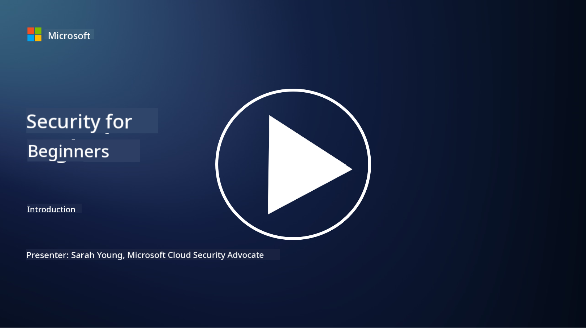

<!--
CO_OP_TRANSLATOR_METADATA:
{
  "original_hash": "ec0b921727399a8a980305086a6d3832",
  "translation_date": "2025-09-04T06:16:27+00:00",
  "source_file": "README.md",
  "language_code": "en"
}
-->
  
  
  
  
  
  

### 🌐 Multi-Language Support

#### Supported via GitHub Action (Automated & Always Up-to-Date)

[French](../fr/README.md) | [Spanish](../es/README.md) | [German](../de/README.md) | [Russian](../ru/README.md) | [Arabic](../ar/README.md) | [Persian (Farsi)](../fa/README.md) | [Urdu](../ur/README.md) | [Chinese (Simplified)](../zh/README.md) | [Chinese (Traditional, Macau)](../mo/README.md) | [Chinese (Traditional, Hong Kong)](../hk/README.md) | [Chinese (Traditional, Taiwan)](../tw/README.md) | [Japanese](../ja/README.md) | [Korean](../ko/README.md) | [Hindi](../hi/README.md) | [Bengali](../bn/README.md) | [Marathi](../mr/README.md) | [Nepali](../ne/README.md) | [Punjabi (Gurmukhi)](../pa/README.md) | [Portuguese (Portugal)](../pt/README.md) | [Portuguese (Brazil)](../br/README.md) | [Italian](../it/README.md) | [Polish](../pl/README.md) | [Turkish](../tr/README.md) | [Greek](../el/README.md) | [Thai](../th/README.md) | [Swedish](../sv/README.md) | [Danish](../da/README.md) | [Norwegian](../no/README.md) | [Finnish](../fi/README.md) | [Dutch](../nl/README.md) | [Hebrew](../he/README.md) | [Vietnamese](../vi/README.md) | [Indonesian](../id/README.md) | [Malay](../ms/README.md) | [Tagalog (Filipino)](../tl/README.md) | [Swahili](../sw/README.md) | [Hungarian](../hu/README.md) | [Czech](../cs/README.md) | [Slovak](../sk/README.md) | [Romanian](../ro/README.md) | [Bulgarian](../bg/README.md) | [Serbian (Cyrillic)](../sr/README.md) | [Croatian](../hr/README.md) | [Slovenian](../sl/README.md) | [Ukrainian](../uk/README.md) | [Burmese (Myanmar)](../my/README.md)

**If you wish to have additional translations, supported languages are listed [here](https://github.com/Azure/co-op-translator/blob/main/getting_started/supported-languages.md)**

#### Join Our Community  

# 🚀 Cybersecurity for Beginners – a curriculum

In this fast-paced era of AI technology adoption, understanding how to secure IT systems is more important than ever. This course is designed to teach you the basics of cybersecurity and help you start your journey in this field. It is vendor-neutral and divided into short lessons that take about 30-60 minutes to complete. Each lesson includes a short quiz and links to additional resources for deeper exploration.

What this course covers 📚

- 🔐 Fundamental cybersecurity concepts like the CIA triad, and the differences between risks, threats, and vulnerabilities.
- 🛡️ An understanding of what security controls are and the various forms they take.
- 🌐 An introduction to zero trust and its importance in modern cybersecurity.
- 🔑 Key concepts and themes across identity, networking, security operations, infrastructure, and data security.
- 🔧 Examples of tools used to implement security controls.

What this course does not cover 🙅‍♂️

- 🚫 How to use specific security tools.
- 🚫 Hacking or red teaming/offensive security techniques.
- 🚫 Details about specific compliance standards.

Once you complete this course, you can explore additional learning opportunities through Microsoft Learn. We recommend starting with [Microsoft Security, Compliance, and Identity Fundamentals.](https://learn.microsoft.com/training/paths/describe-concepts-of-security-compliance-identity/?WT.mc_id=academic-96948-sayoung)

Eventually, you might consider taking the [Exam SC-900: Microsoft Security, Compliance, and Identity Fundamentals.](https://learn.microsoft.com/credentials/certifications/exams/sc-900/?WT.mc_id=academic-96948-sayoung)

> 💁 We welcome your feedback and suggestions for this course. Let us know if there’s anything you think we should add!

## Modules Overview 📝  
| **Module number** | **Module name**                           | **Concepts taught**                  | **Learning objectives**                                                                                          |
|-------------------|-------------------------------------------|--------------------------------------|-----------------------------------------------------------------------------------------------------------------|
| **1.1**           | Basic security concepts                   | [The CIA triad](https://github.com/microsoft/Security-101/blob/main/1.1%20The%20CIA%20triad%20and%20other%20key%20concepts.md)                        | Learn about confidentiality, availability, and integrity, as well as authenticity, non-repudiation, and privacy. |
| **1.2**           | Basic security concepts                   | [Common cyber security threats](https://github.com/microsoft/Security-101/blob/main/1.2%20Common%20cybersecurity%20threats.md)        | Learn about the common cybersecurity threats faced by individuals and organizations.                             |
| **1.3**           | Basic security concepts                   | [Understanding risk management](https://github.com/microsoft/Security-101/blob/main/1.3%20Understanding%20risk%20management.md)       | Learn how to assess and understand risk – including impact, likelihood, and implementing controls.              |
| **1.4**           | Basic security concepts                   | [Security practices and documentation](https://github.com/microsoft/Security-101/blob/main/1.4%20Security%20practices%20and%20documentation.md) | Learn the differences between policies, procedures, standards, and regulations/laws.                            |
| **1.5**           | Basic security concepts                   | [Zero trust](https://github.com/microsoft/Security-101/blob/main/1.5%20Zero%20trust.md)                           | Learn what zero trust is, how it affects architecture, and the concept of defense in depth.                     |
| **1.6**           | Basic security concepts                   | [The shared responsibility model](https://github.com/microsoft/Security-101/blob/main/1.6%20Shared%20responsibility%20model.md)                           | Understand the shared responsibility model and its impact on cybersecurity.                                     |
| **1.7**           | [End of module quiz](https://github.com/microsoft/Security-101/blob/main/1.7%20End%20of%20module%20quiz.md)                        |                                      |                                                                                                                 |
| **2.1**           | Identity & access management fundamentals | [IAM key concepts](https://github.com/microsoft/Security-101/blob/main/2.1%20IAM%20key%20concepts.md)                     | Learn about the principle of least privilege, segregation of duties, and how IAM supports zero trust.           |
| **2.2**           | Identity & access management fundamentals | [IAM zero trust architecture](https://github.com/microsoft/Security-101/blob/main/2.2%20IAM%20zero%20trust%20architecture.md)          | Learn how identity serves as the new perimeter in modern IT environments and the threats it mitigates.          |
| **2.3**           | Identity & access management fundamentals | [IAM capabilities](https://github.com/microsoft/Security-101/blob/main/2.3%20IAM%20capabilities.md)                     | Learn about IAM capabilities and controls to secure identities.                                                 |
| **2.4**           | [End of module quiz](https://github.com/microsoft/Security-101/blob/main/2.4%20End%20of%20module%20quiz.md)                        |                                      |                                                                                                                 |
| **3.1**           | Network security fundamentals             | [Networking key concepts](https://github.com/microsoft/Security-101/blob/main/3.1%20Networking%20key%20concepts.md)              | Learn about networking concepts like IP addressing, port numbers, encryption, and more.                         |
| **3.2**           | Network security fundamentals             | [Networking zero trust architecture](https://github.com/microsoft/Security-101/blob/main/3.2%20Networking%20zero%20trust%20architecture.md)   | Learn how networking contributes to an end-to-end zero trust architecture and the threats it mitigates.         |
| **3.3**           | Network security fundamentals             | [Network security capabilities](https://github.com/microsoft/Security-101/blob/main/3.3%20Network%20security%20capabilities.md)        | Learn about network security tools like firewalls, WAF, DDoS protection, and more.                              |
| **3.4**           | [End of module quiz](https://github.com/microsoft/Security-101/blob/main/3.4%20End%20of%20module%20quiz.md)                        |                                      |                                                                                                                 |
| **4.1**           | Security operations fundamentals          | [SecOps key concepts](https://github.com/microsoft/Security-101/blob/main/4.1%20SecOps%20key%20concepts.md)                  | Learn why security operations are important and how they differ from regular IT operations.                     |
| **4.2**           | Security operations fundamentals          | [SecOps zero trust architecture](https://github.com/microsoft/Security-101/blob/main/4.2%20SecOps%20zero%20trust%20architecture.md)       | Learn how SecOps contributes to an end-to-end zero trust architecture and the threats it mitigates.             |
| **4.3**           | Security operations fundamentals          | [SecOps capabilities](https://github.com/microsoft/Security-101/blob/main/4.3%20SecOps%20capabilities.md)                  | Learn about SecOps tools like SIEM, XDR, and more.                                                              |
| **4.4**           | [End of module quiz](https://github.com/microsoft/Security-101/blob/main/4.4%20End%20of%20module%20quiz.md)                        |                                      |                                                                                                                 |
| **5.1**           | Application security fundamentals         | [AppSec key concepts](https://github.com/microsoft/Security-101/blob/main/5.1%20AppSec%20key%20concepts.md)                  | Learn about AppSec concepts like secure by design, input validation, and more.                                  |
| **5.2**           | Application security fundamentals         | [AppSec capabilities](https://github.com/microsoft/Security-101/blob/main/5.2%20AppSec%20key%20capabilities.md)                  | Learn about AppSec tools like pipeline security tools, code scanning, secret scanning, and more.                |
| **5.3**           | [End of module quiz](https://github.com/microsoft/Security-101/blob/main/5.3%20End%20of%20module%20quiz.md)                        |                                      |                                                                                                                 |
| **6.1**           | Infrastructure security fundamentals      | [Infrastructure security key concepts](https://github.com/microsoft/Security-101/blob/main/6.1%20Infrastructure%20security%20key%20concepts.md) | Learn about system hardening, patch management, security best practices, and container security.                 |
| **6.2**           | Infrastructure security fundamentals      | [Infrastructure security capabilities](https://github.com/microsoft/Security-101/blob/main/6.2%20Infrastructure%20security%20capabilities.md) | Learn about tools that support infrastructure security, such as CSPM, container security, and more.             |
| **6.3**           | [End of module quiz](https://github.com/microsoft/Security-101/blob/main/6.3%20End%20of%20module%20quiz.md)                        |                                      |                                                                                                                 |
| **7.1**           | Data security fundamentals                | [Data security key concepts](https://github.com/microsoft/Security-101/blob/main/7.1%20Data%20security%20key%20concepts.md)           | Learn about data classification and retention, and why these are critical for organizations.                     |
| **7.2**           | Data security fundamentals                | [Data security capabilities](https://github.com/microsoft/Security-101/blob/main/7.2%20Data%20security%20capabilities.md)           | Learn about data security tools like DLP, insider risk management, data governance, and more.                   |
| **7.3**           | [End of module quiz](https://github.com/microsoft/Security-101/blob/main/7.3%20End%20of%20module%20quiz.md)                        |
| **8.1**           | AI security fundamentals                | [AI security key concepts](https://github.com/microsoft/Security-101/blob/main/8.1%20AI%20security%20key%20concepts.md)          | Learn about the similarities and differences between traditional security and AI security.                       |
| **8.2**           | AI security fundamentals                | [AI security capabilities](https://github.com/microsoft/Security-101/blob/main/8.2%20AI%20security%20capabilities.md)           | Learn about tools and controls for securing AI systems.                                                          |
| **8.3**           | AI security fundamentals                | [Responsible AI](https://github.com/microsoft/Security-101/blob/main/8.3%20Responsible%20AI.md)          | Learn about responsible AI practices and specific risks that security professionals should be aware of.          |
| **8.4**           | [End of module quiz](https://github.com/microsoft/Security-101/blob/main/8.4%20End%20of%20module%20quiz.md)     

## 🎒 Other Courses 

Our team offers additional courses! Check out:

- [Generative AI for Beginners](https://aka.ms/genai-beginners)
- [Generative AI for Beginners .NET](https://github.com/microsoft/Generative-AI-for-beginners-dotnet)
- [Generative AI with JavaScript](https://github.com/microsoft/generative-ai-with-javascript)
- [Generative AI with Java](https://github.com/microsoft/Generative-AI-for-beginners-java)
- [AI for Beginners](https://aka.ms/ai-beginners)
- [Data Science for Beginners](https://aka.ms/datascience-beginners)
- [ML for Beginners](https://aka.ms/ml-beginners)
- [Cybersecurity for Beginners](https://github.com/microsoft/Security-101) 
- [Web Dev for Beginners](https://aka.ms/webdev-beginners)
- [IoT for Beginners](https://aka.ms/iot-beginners)
- [XR Development for Beginners](https://github.com/microsoft/xr-development-for-beginners)
- [Mastering GitHub Copilot for Paired Programming](https://github.com/microsoft/Mastering-GitHub-Copilot-for-Paired-Programming)
- [Mastering GitHub Copilot for C#/.NET Developers](https://github.com/microsoft/mastering-github-copilot-for-dotnet-csharp-developers)
- [Choose Your Own Copilot Adventure](https://github.com/microsoft/CopilotAdventures)

---

**Disclaimer**:  
This document has been translated using the AI translation service [Co-op Translator](https://github.com/Azure/co-op-translator). While we aim for accuracy, please note that automated translations may include errors or inaccuracies. The original document in its native language should be regarded as the authoritative source. For critical information, professional human translation is advised. We are not responsible for any misunderstandings or misinterpretations resulting from the use of this translation.