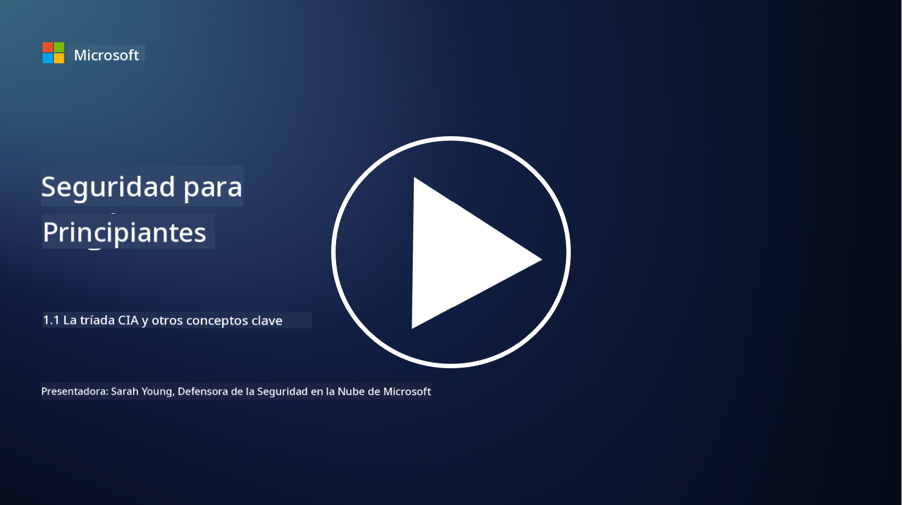
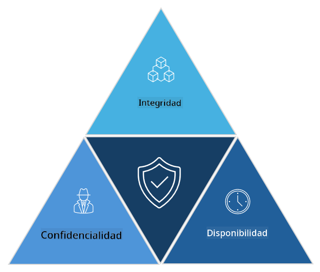

<!--
CO_OP_TRANSLATOR_METADATA:
{
  "original_hash": "16a76f9fa372fb63cffb6d76b855f023",
  "translation_date": "2025-09-03T18:46:42+00:00",
  "source_file": "1.1 The CIA triad and other key concepts.md",
  "language_code": "es"
}
-->
# La tríada CIA y otros conceptos clave

## Introducción

En esta lección, cubriremos:

 - ¿Qué es la ciberseguridad?
   
 
 - ¿Qué es la tríada CIA de la ciberseguridad?

   

 - ¿Qué son la autenticidad, la no repudio y la privacidad en el contexto de la ciberseguridad?

## ¿Qué es la ciberseguridad?

La ciberseguridad, también conocida como seguridad de la información, es la práctica de proteger sistemas informáticos, redes, dispositivos y datos contra ataques digitales, accesos no autorizados, daños o robos. El objetivo principal de la ciberseguridad es garantizar la confidencialidad, integridad y disponibilidad de los activos digitales y la información. Los profesionales de la ciberseguridad diseñan e implementan controles de seguridad para proteger activos, datos e información. A medida que más aspectos de nuestras vidas se han digitalizado y están en línea, la ciberseguridad se ha convertido en una preocupación principal tanto para individuos como para organizaciones.

## ¿Qué es la tríada CIA de la ciberseguridad?

La tríada de la ciberseguridad se refiere al modelo que incorpora las tres consideraciones principales para cualquier trabajo de ciberseguridad o diseño de un sistema/entorno:

### Confidencialidad

Esta es la consideración con la que la mayoría de las personas están familiarizadas cuando piensan en "ciberseguridad": la confidencialidad es el proceso de proteger datos e información contra intentos de acceso no autorizados, es decir, solo las personas que necesitan ver la información pueden acceder a ella. Sin embargo, no todos los datos son iguales, y generalmente se categorizan y protegen según el daño que podría ocurrir si fueran accedidos por personas no autorizadas.

### Integridad

Se refiere a proteger la precisión y confiabilidad de los datos contenidos en los entornos y evitar que los datos sean alterados o modificados por individuos no autorizados. Por ejemplo, un estudiante modifica su fecha de nacimiento en su registro de conductor en el DMV para hacerse mayor y obtener una licencia reimpresa con una fecha de nacimiento anterior para comprar alcohol.

### Disponibilidad

Es una consideración en la operación de TI, pero la disponibilidad también es importante para la ciberseguridad. Existen tipos específicos de ataques que apuntan a la disponibilidad y contra los cuales los profesionales de seguridad deben protegerse (por ejemplo, ataques de denegación de servicio distribuida – DDoS).

**Tríada CIA de la ciberseguridad**

## ¿Qué son la autenticidad, la no repudio y la privacidad en el contexto de la ciberseguridad?

Estos son conceptos adicionales importantes que se relacionan con garantizar la seguridad y confiabilidad de los sistemas y datos:

**Autenticidad** - se refiere a la garantía de que la información, comunicación o entidad con la que estás interactuando es genuina y no ha sido manipulada o alterada por partes no autorizadas.

**No repudio** - es el concepto de garantizar que una parte no pueda negar su participación o la autenticidad de una transacción o comunicación. Evita que alguien afirme que no envió un mensaje o realizó una acción particular cuando hay evidencia en contrario.

**Privacidad** - se refiere a la protección de información sensible y personalmente identificable contra accesos, usos, divulgaciones o manipulaciones no autorizadas. Implica controlar quién tiene acceso a los datos personales y cómo se recopilan, almacenan y comparten esos datos.

## Lectura adicional

[¿Qué es la seguridad de la información (InfoSec)? | Microsoft Security](https://www.microsoft.com/security/business/security-101/what-is-information-security-infosec#:~:text=Three%20pillars%20of%20information%20security%3A%20the%20CIA%20triad,as%20guiding%20principles%20for%20implementing%20an%20InfoSec%20plan.)

---

**Descargo de responsabilidad**:  
Este documento ha sido traducido utilizando el servicio de traducción automática [Co-op Translator](https://github.com/Azure/co-op-translator). Si bien nos esforzamos por lograr precisión, tenga en cuenta que las traducciones automáticas pueden contener errores o imprecisiones. El documento original en su idioma nativo debe considerarse como la fuente autorizada. Para información crítica, se recomienda una traducción profesional realizada por humanos. No nos hacemos responsables de malentendidos o interpretaciones erróneas que puedan surgir del uso de esta traducción.