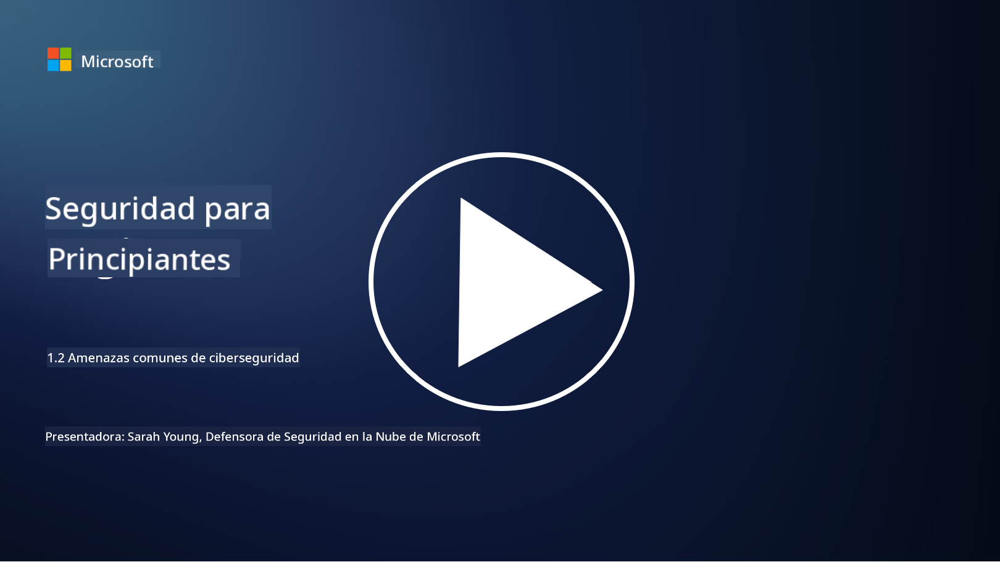

<!--
CO_OP_TRANSLATOR_METADATA:
{
  "original_hash": "6fc3030323139d7134a4ca9d03eccac9",
  "translation_date": "2025-09-03T18:16:06+00:00",
  "source_file": "1.2 Common cybersecurity threats.md",
  "language_code": "es"
}
-->
# Amenazas comunes de ciberseguridad

## Introducción

En esta lección, cubriremos:

- ¿Qué es una amenaza de ciberseguridad?

- ¿Por qué los actores maliciosos quieren comprometer datos y sistemas de TI?

- ¿Cuáles son los tipos más comunes de amenazas de ciberseguridad?

- ¿Qué es el marco MITRE ATT&CK?

- ¿Dónde puedo mantenerme al día con el panorama de amenazas de ciberseguridad?

## ¿Qué es una amenaza de ciberseguridad?

Una amenaza de ciberseguridad se refiere a cualquier peligro o riesgo potencial que pueda comprometer la confidencialidad, integridad o disponibilidad de datos o sistemas de TI. Estas amenazas son planteadas por actores maliciosos que intentan explotar vulnerabilidades para obtener acceso no autorizado, robar información sensible, interrumpir operaciones o causar daño a individuos, organizaciones o incluso naciones enteras. Las amenazas de ciberseguridad pueden adoptar diversas formas y apuntar a diferentes aspectos de los sistemas digitales y los datos.

## ¿Por qué los actores maliciosos quieren comprometer datos y sistemas de TI?

Los actores maliciosos comprometen datos y sistemas de TI por diversas razones, a menudo impulsados por beneficios personales, motivos ideológicos o el deseo de causar interrupciones. Comprender estas motivaciones puede ayudar a las organizaciones e individuos a defenderse mejor contra las amenazas cibernéticas. Algunas razones comunes por las que los actores maliciosos realizan ciberataques incluyen:

1. **Ganancia financiera**: Muchos ataques están motivados por el deseo de obtener beneficios económicos. Los actores maliciosos pueden robar información sensible como números de tarjetas de crédito, detalles de cuentas bancarias o información personal para cometer fraude, robo de identidad, extorsionar a una persona u organización o vender los datos robados en la web oscura.

2. **Espionaje**: Estados-nación, competidores u otras entidades pueden participar en espionaje cibernético para robar datos sensibles gubernamentales, corporativos o de investigación con fines políticos, económicos o militares.

3. **Interrupción y sabotaje**: Algunos ataques tienen como objetivo interrumpir infraestructuras críticas, servicios u operaciones por razones políticas o ideológicas. Estos ataques pueden causar caos generalizado, pérdidas económicas y daños a la reputación.

4. **Motivaciones ideológicas**: Hacktivistas y grupos con motivaciones ideológicas o políticas pueden comprometer sistemas para generar conciencia sobre ciertos temas, promover sus creencias o protestar contra acciones u organizaciones específicas.

5. **Acciones no intencionales**: No todas las acciones maliciosas son deliberadas; algunas personas pueden contribuir involuntariamente a las amenazas cibernéticas al caer en ingeniería social o ser parte de una red comprometida.

En última instancia, las motivaciones para comprometer datos y sistemas de TI pueden variar ampliamente, y el impacto de estos ataques puede ser grave. Es importante que individuos, organizaciones y gobiernos tomen la ciberseguridad en serio e implementen medidas para protegerse contra estas amenazas.

## ¿Cuáles son los tipos más comunes de amenazas de ciberseguridad?

Existen varios tipos comunes de ataques de ciberseguridad que los actores maliciosos utilizan para comprometer sistemas, robar datos y causar interrupciones. Aquí están algunos de los más prevalentes en el momento de escribir esto:

1. **Phishing**:

El phishing implica enviar correos electrónicos o mensajes engañosos que parecen provenir de fuentes legítimas para engañar a los destinatarios y que revelen información sensible, como contraseñas, números de tarjetas de crédito o datos personales. El phishing también puede llevar a las víctimas a sitios web maliciosos o a descargar malware.

2. **Malware**:

El malware (software malicioso) abarca una variedad de programas diseñados para infectar sistemas, robar datos o causar daño. Tipos de malware incluyen:

- **Ransomware**: Encripta archivos y exige un rescate para su desencriptación.

- **Troyanos**: Disfrazados como software legítimo, otorgan acceso no autorizado a los atacantes.

- **Virus**: Programas autorreplicantes que se adhieren a archivos y se propagan.

- **Gusanos**: Programas autorreplicantes que se propagan a través de redes.

3. **Denegación de servicio (DoS) y denegación de servicio distribuida (DDoS)**:

Los ataques DoS sobrecargan un sistema objetivo, haciéndolo inaccesible para los usuarios. Los ataques DDoS implican usar una red de dispositivos comprometidos para inundar un objetivo con tráfico, dificultando el funcionamiento del sistema o deteniéndolo por completo.

4. **Inyección SQL**:

En este ataque, los atacantes manipulan los campos de entrada de una aplicación web para inyectar consultas SQL maliciosas, obteniendo potencialmente acceso no autorizado a bases de datos y datos sensibles.

5. **Cross-Site Scripting (XSS)**:

Los atacantes inyectan scripts maliciosos en aplicaciones web, que luego son ejecutados por los navegadores de usuarios desprevenidos. Esto puede llevar al robo de datos de usuarios y/o la propagación de malware.

6. **Ingeniería social**:

La ingeniería social explota la psicología humana para manipular a las personas y que divulguen información confidencial o realicen acciones que comprometan la seguridad.

7. **Exploits de día cero (0day)**:

Estos ataques apuntan a vulnerabilidades en software o hardware que aún no son conocidas por el proveedor o el público. Los atacantes aprovechan estas vulnerabilidades antes de que se desarrollen parches. Muchas organizaciones se preocupan por los exploits de día cero, ya que no hay parches disponibles, pero no son tan comunes como otros ataques en esta lista. Cuando se descubre un día cero, los investigadores de seguridad trabajan rápidamente para crear un parche, por lo que generalmente tienen una vida útil corta.

8. **Ataques de credenciales**:

Estos ataques incluyen ataques de fuerza bruta, donde los atacantes adivinan repetidamente contraseñas, y ataques de relleno de credenciales, donde se utilizan credenciales robadas de un sitio para intentar acceder a otros sitios.

## ¿Qué es el marco MITRE ATT&CK?

El [marco MITRE ATT&CK](https://attack.mitre.org/) (Tácticas, Técnicas y Conocimientos Comunes de los Adversarios) es un marco que cataloga y categoriza las tácticas, técnicas y procedimientos (TTPs) que los adversarios utilizan durante los ciberataques. El marco fue creado por MITRE Corporation, una organización sin fines de lucro que opera centros de investigación y desarrollo para diversas agencias gubernamentales.

El marco MITRE ATT&CK proporciona una forma estandarizada de describir y analizar amenazas cibernéticas, permitiendo a los profesionales de ciberseguridad comprender mejor y defenderse contra diversas técnicas de ataque. Es ampliamente utilizado por equipos de seguridad, cazadores de amenazas y respondedores de incidentes para:

1. **Comprender el comportamiento adversario**: El marco documenta comportamientos de ataque del mundo real, describiendo los pasos que los atacantes toman desde la entrada inicial hasta lograr sus objetivos. Cubre una amplia gama de técnicas de ataque utilizadas por diferentes grupos de amenazas.

2. **Planificar e implementar estrategias de defensa**: Los equipos de seguridad pueden usar el marco para desarrollar estrategias de defensa proactivas que se alineen con las tácticas y técnicas específicas que los adversarios podrían emplear.

3. **Respuesta a incidentes y caza de amenazas**: Al investigar incidentes o realizar caza de amenazas, los profesionales de seguridad pueden referirse al marco para identificar y mitigar técnicas específicas utilizadas por los atacantes.

El marco MITRE ATT&CK está organizado en matrices que agrupan técnicas de ataque según plataformas y entornos específicos, como Windows, macOS, Linux y servicios en la nube. Cada matriz se divide en tácticas (objetivos de alto nivel) y técnicas (métodos específicos utilizados para lograr esos objetivos). Para cada técnica, el marco proporciona información sobre cómo funciona, posibles mitigaciones y referencias relevantes a actores de amenazas reales que han utilizado la técnica.

El marco se actualiza y expande continuamente a medida que se recopila nueva inteligencia de amenazas y evoluciona el panorama de ciberseguridad. Es un recurso valioso para mejorar la postura de ciberseguridad de una organización al permitir una comprensión más profunda de cómo operan los atacantes y cómo defenderse contra sus tácticas.

## ¿Dónde puedo mantenerme al día con el panorama de amenazas de ciberseguridad?

Existen muchas fuentes que se pueden utilizar para mantenerse al día con las amenazas de ciberseguridad, aquí hay una selección:

- [Open Web Application Security Project (OWASP) top 10 vulnerabilities](https://owasp.org/Top10/)
- [Common Vulnerabilities and Exposures (CVEs)](https://www.bing.com/ck/a?!&&p=53df6007f017bca2JmltdHM9MTY5MjU3NjAwMCZpZ3VpZD0zYmY4N2RiYS1jYWI1LTYwMDgtMWY1YS02ZmYyY2JjNjYxZWUmaW5zaWQ9NTc2OQ&ptn=3&hsh=3&fclid=3bf87dba-cab5-6008-1f5a-6ff2cbc661ee&psq=cve&u=a1aHR0cHM6Ly9iaW5nLmNvbS9hbGluay9saW5rP3VybD1odHRwcyUzYSUyZiUyZmN2ZS5taXRyZS5vcmclMmYmc291cmNlPXNlcnAtcnImaD1BZXN4S0VBWTNnbGhNZEFpd3daMlNSZkZQNTlrODhIUnYxRUtlSkY1RTk0JTNkJnA9a2NvZmZjaWFsd2Vic2l0ZQ&ntb=1 "Common Vulnerabilities and Exposures")
- [Microsoft Security Response Center blogs](https://msrc.microsoft.com/blog/)
- [National Institute of Standards and Technology (NIST)](https://www.dhs.gov/topics/cybersecurity): NIST proporciona recursos, alertas y actualizaciones sobre posibles amenazas de ciberseguridad.
- [Cybersecurity and Infrastructure Security Agency (CISA)](https://www.cisa.gov/resources-tools/resources/free-cybersecurity-services-and-tools): CISA ofrece recursos de ciberseguridad y mejores prácticas para empresas, agencias gubernamentales y otras organizaciones. CISA comparte información actualizada sobre tipos de actividad de seguridad de alto impacto que afectan a la comunidad en general y análisis detallados sobre amenazas cibernéticas nuevas y en evolución.
- [National Cybersecurity Center of Excellence (NCCoE)](https://www.dhs.gov/topics/cybersecurity): NCCoE es un centro que proporciona soluciones prácticas de ciberseguridad que pueden aplicarse en situaciones reales.
- [US-CERT](https://www.cisa.gov/resources-tools/resources/free-cybersecurity-services-and-tools): El Equipo de Preparación para Emergencias Informáticas de los Estados Unidos (US-CERT) ofrece una variedad de recursos de ciberseguridad, incluyendo alertas, consejos y más.
- El Equipo de Respuesta a Emergencias Informáticas (CERT) de tu país.

---

**Descargo de responsabilidad**:  
Este documento ha sido traducido utilizando el servicio de traducción automática [Co-op Translator](https://github.com/Azure/co-op-translator). Si bien nos esforzamos por garantizar la precisión, tenga en cuenta que las traducciones automatizadas pueden contener errores o imprecisiones. El documento original en su idioma nativo debe considerarse la fuente autorizada. Para información crítica, se recomienda una traducción profesional realizada por humanos. No nos hacemos responsables de malentendidos o interpretaciones erróneas que puedan surgir del uso de esta traducción.