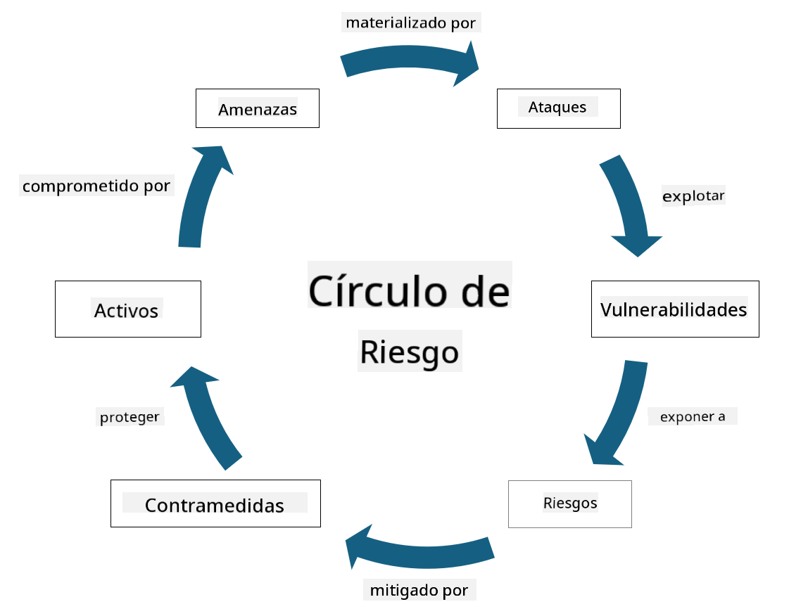

<!--
CO_OP_TRANSLATOR_METADATA:
{
  "original_hash": "fcca304f072cabf206388199e8e2e578",
  "translation_date": "2025-09-03T18:51:41+00:00",
  "source_file": "1.3 Understanding risk management.md",
  "language_code": "es"
}
-->
# Comprender la gestión de riesgos

## Introducción

En esta lección, cubriremos:

 - Definiciones de terminología de seguridad comúnmente utilizada
   
 - Tipos de controles de seguridad

 - Evaluación de riesgos de seguridad

## Definiciones de terminología de seguridad comúnmente utilizada

Estos términos son conceptos fundamentales en el campo de la ciberseguridad y la gestión de riesgos. Vamos a desglosar cada término y cómo se relacionan entre sí:

1. **Agente de amenaza**:

Un agente de amenaza es un individuo, grupo, organización o sistema automatizado que tiene el potencial de explotar vulnerabilidades en un sistema o red para causar daño o perjuicio. Los agentes de amenaza pueden ser hackers, autores de malware, empleados descontentos o cualquier entidad que represente un riesgo para los sistemas de información y tecnología.

2. **Amenaza**:

Una amenaza es un evento o acción potencial que puede explotar vulnerabilidades en un sistema y causar daño a un activo. Las amenazas pueden incluir acciones como hackeos, filtraciones de datos, ataques de denegación de servicio, entre otros. Las amenazas representan el "qué" en términos de daño potencial que puede infligirse a los activos de una organización.

3. **Vulnerabilidad**:

Una vulnerabilidad es una debilidad o falla en el diseño, implementación o configuración de un sistema que puede ser explotada por un agente de amenaza para comprometer la seguridad del sistema. Las vulnerabilidades pueden existir en software, hardware, procesos o comportamientos humanos. Identificar y abordar las vulnerabilidades es esencial para minimizar el riesgo de ataques exitosos.

4. **Riesgo**:

El riesgo es la posibilidad de pérdida, daño o perjuicio resultante de la interacción entre una amenaza y una vulnerabilidad. Es la probabilidad de que un agente de amenaza explote una vulnerabilidad para causar un impacto negativo. Los riesgos a menudo se evalúan en términos de su impacto potencial y la probabilidad de ocurrencia.

5. **Activo**:

Un activo es cualquier cosa de valor que una organización busca proteger. Los activos pueden incluir objetos físicos (como computadoras y servidores), datos (información de clientes, registros financieros), propiedad intelectual (secretos comerciales, patentes) e incluso recursos humanos (habilidades y conocimientos de los empleados). Proteger los activos es un objetivo clave de la ciberseguridad.

6. **Exposición**:

La exposición se refiere al estado de ser vulnerable a amenazas potenciales. Ocurre cuando existe una vulnerabilidad que podría ser explotada por un agente de amenaza. La exposición resalta el riesgo asociado con la presencia de vulnerabilidades en un sistema o red.

7. **Control**:

Un control es una medida implementada para reducir el riesgo asociado con vulnerabilidades y amenazas. Los controles pueden ser de naturaleza técnica, procedimental o administrativa. Están diseñados para prevenir, detectar o mitigar amenazas y vulnerabilidades potenciales. Ejemplos incluyen firewalls, controles de acceso, cifrado, políticas de seguridad y capacitación de empleados.

En resumen, la relación entre estos términos es la siguiente: Los agentes de amenaza explotan vulnerabilidades para llevar a cabo amenazas, lo que puede generar riesgos que tienen el potencial de causar daño a activos valiosos. La exposición ocurre cuando hay vulnerabilidades presentes, y los controles se implementan para reducir el riesgo al prevenir o mitigar el impacto de las amenazas en los activos. Este marco forma la base de la gestión de riesgos en ciberseguridad, guiando a las organizaciones en la identificación, evaluación y abordaje de riesgos potenciales para sus sistemas de información y activos.

## Tipos de controles de seguridad

Los controles de seguridad son medidas o salvaguardas implementadas para proteger los sistemas de información y activos frente a diversas amenazas y vulnerabilidades. Pueden clasificarse en varias categorías según su enfoque y propósito. A continuación, se presentan algunos tipos comunes de controles de seguridad:

1. **Controles Administrativos**:

Estos controles están relacionados con políticas, procedimientos y directrices que rigen las prácticas de seguridad de la organización y el comportamiento de los usuarios.

- Políticas y procedimientos de seguridad: Directrices documentadas que definen cómo se mantiene la seguridad dentro de una organización.

- Concienciación y capacitación en seguridad: Programas para educar a los empleados sobre las mejores prácticas de seguridad y las amenazas potenciales.

- Respuesta y gestión de incidentes: Planes para responder y mitigar incidentes de seguridad.

2. **Controles Técnicos**:

Los controles técnicos implican el uso de tecnología para aplicar medidas de seguridad y proteger sistemas y datos. Ejemplos de controles técnicos incluyen:

- Controles de acceso: Medidas que restringen el acceso de los usuarios a recursos según sus roles y permisos.

- Cifrado: Conversión de datos a un formato seguro para prevenir el acceso no autorizado.

- Firewalls: Dispositivos de seguridad de red que filtran y controlan el tráfico entrante y saliente.

- Sistemas de Detección y Prevención de Intrusiones (IDPS): Herramientas que monitorean el tráfico de red en busca de actividad sospechosa.

- Software antivirus y antimalware: Programas que detectan y eliminan software malicioso.

- Mecanismos de autenticación: Métodos para verificar la identidad de los usuarios, como contraseñas, biometría y autenticación multifactor.

- Gestión de parches: Actualización regular de software para abordar vulnerabilidades conocidas.

3. **Controles Físicos**:

Los controles físicos son medidas para proteger activos y instalaciones físicas.

- Guardias de seguridad y personal de control de acceso: Personal que monitorea y controla el acceso a las instalaciones físicas.

- Cámaras de vigilancia: Sistemas de monitoreo de video para observar y registrar actividades.

- Cerraduras y barreras físicas: Medidas físicas para restringir el acceso a áreas sensibles.

- Controles ambientales: Medidas para regular la temperatura, humedad y otros factores ambientales que afectan equipos y centros de datos.

4. **Controles Operativos**:

Estos controles están relacionados con las operaciones y actividades diarias que garantizan la seguridad continua de los sistemas.

- Gestión de cambios: Procesos para rastrear y aprobar cambios en sistemas y configuraciones.

- Copias de seguridad y recuperación ante desastres: Planes para respaldar y recuperar datos en caso de fallos del sistema o desastres.

- Registro y auditoría: Monitoreo y registro de actividades del sistema para fines de seguridad y cumplimiento.

- Prácticas de codificación segura: Directrices para escribir software que minimice vulnerabilidades.

5. **Controles Legales y Regulatorios**:

Estos controles garantizan el cumplimiento de leyes, regulaciones y estándares de la industria. Los estándares que una organización debe cumplir dependen de la jurisdicción, el sector industrial y otros factores.

- Regulaciones de protección de datos: Cumplimiento de leyes como GDPR, HIPAA y CCPA.

- Estándares específicos de la industria: Adherencia a estándares como PCI DSS para la seguridad de datos de tarjetas de pago.

Estas categorías de controles de seguridad trabajan juntas para crear una postura de seguridad integral para las organizaciones, ayudando a proteger sus sistemas, datos y activos frente a una amplia gama de amenazas.

## Evaluación de riesgos de seguridad

Algunos profesionales de la seguridad sienten que la gestión de riesgos es responsabilidad exclusiva de los especialistas en riesgos, pero comprender el proceso de gestión de riesgos de seguridad es importante para cualquier profesional de seguridad, ya que les ayuda a expresar los riesgos de seguridad en un lenguaje que el resto de la organización pueda entender y abordar.

Las organizaciones deben evaluar constantemente los riesgos de seguridad y decidir qué acciones (o no) tomar frente a los riesgos para el negocio. A continuación, se presenta una descripción general de cómo se realiza típicamente este proceso. Cabe destacar que este proceso generalmente se lleva a cabo entre varios equipos dentro de una organización; es raro que un solo equipo sea responsable de la gestión integral del riesgo.

1. **Identificar Activos y Amenazas**:

La organización identifica los activos que desea proteger. Estos pueden incluir datos, sistemas, hardware, software, propiedad intelectual y más. Luego, identifican las amenazas potenciales que podrían dirigirse a estos activos.

2. **Evaluar Vulnerabilidades**:

Las organizaciones identifican vulnerabilidades o debilidades en sistemas o procesos que podrían ser explotadas por amenazas. Estas vulnerabilidades pueden derivarse de fallas de software, configuraciones incorrectas, falta de controles de seguridad y errores humanos.

3. **Evaluación de Probabilidad**:

La organización evalúa la probabilidad de que ocurra cada amenaza. Esto implica considerar datos históricos, inteligencia de amenazas, tendencias de la industria y factores internos. La probabilidad puede categorizarse como baja, media o alta según la posibilidad de que la amenaza se materialice.

4. **Evaluación de Impacto**:

A continuación, la organización determina el impacto potencial de cada amenaza si llegara a explotar una vulnerabilidad. El impacto puede incluir pérdidas financieras, interrupciones operativas, daños a la reputación, consecuencias legales y más. El impacto también puede categorizarse como bajo, medio o alto según las posibles consecuencias.

5. **Cálculo del Riesgo**:

Las evaluaciones de probabilidad e impacto se combinan para calcular el nivel de riesgo general de cada amenaza identificada. Esto a menudo se realiza utilizando una matriz de riesgos que asigna valores numéricos o descriptores cualitativos a los niveles de probabilidad e impacto. El nivel de riesgo resultante ayuda a priorizar qué riesgos necesitan atención inmediata.

6. **Priorización y Toma de Decisiones**:

La organización prioriza los riesgos enfocándose en aquellos con los valores combinados de probabilidad e impacto más altos. Esto les permite asignar recursos e implementar controles de manera más efectiva. Las amenazas de alto riesgo requieren atención inmediata, mientras que las de menor riesgo pueden abordarse en un plazo más largo.

7. **Tratamiento del Riesgo**:

Basándose en la evaluación de riesgos, la organización determina cómo mitigar o gestionar cada riesgo. Esto podría implicar implementar controles de seguridad, transferir el riesgo mediante seguros o incluso aceptar ciertos niveles de riesgo residual si se consideran manejables/demasiado costosos de solucionar/etc.

8. **Monitoreo y Revisión Continuos**:

La evaluación de riesgos no es un proceso único. Debe realizarse periódicamente o siempre que haya cambios significativos en el entorno de la organización. El monitoreo continuo garantiza que se tengan en cuenta nuevas amenazas, vulnerabilidades o cambios en el panorama empresarial.

Al evaluar los riesgos de seguridad de manera estructurada, las organizaciones pueden tomar decisiones informadas sobre la asignación de recursos, los controles de seguridad y las estrategias generales de gestión de riesgos. El objetivo es reducir la exposición general al riesgo de la organización mientras se alinean los esfuerzos de seguridad con los objetivos y metas comerciales de la organización.

---

**Descargo de responsabilidad**:  
Este documento ha sido traducido utilizando el servicio de traducción automática [Co-op Translator](https://github.com/Azure/co-op-translator). Si bien nos esforzamos por lograr precisión, tenga en cuenta que las traducciones automáticas pueden contener errores o imprecisiones. El documento original en su idioma nativo debe considerarse como la fuente autorizada. Para información crítica, se recomienda una traducción profesional realizada por humanos. No nos hacemos responsables de malentendidos o interpretaciones erróneas que puedan surgir del uso de esta traducción.