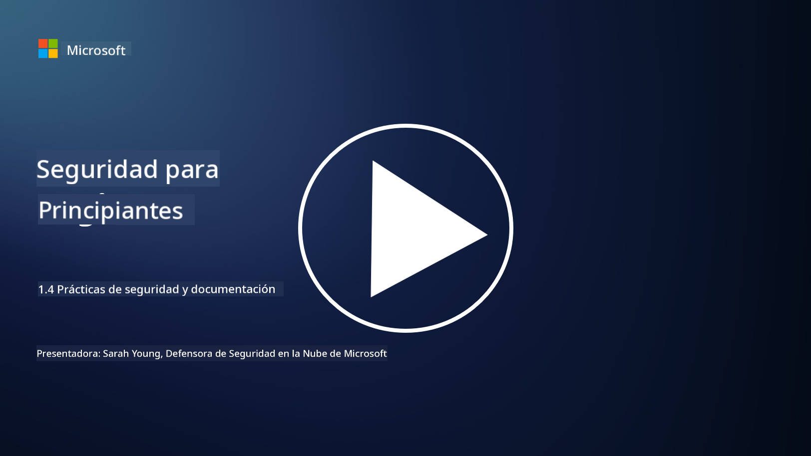

<!--
CO_OP_TRANSLATOR_METADATA:
{
  "original_hash": "d33500902124e52870935bdce4546fcc",
  "translation_date": "2025-09-03T18:32:55+00:00",
  "source_file": "1.4 Security practices and documentation.md",
  "language_code": "es"
}
-->
# Prácticas de seguridad y documentación

Es posible que hayas escuchado las frases "política de seguridad", "estándar de seguridad", etc., pero la realidad es que muchos profesionales de ciberseguridad no las utilizan correctamente. En esta sección explicaremos qué significa cada una de estas frases y por qué una organización las emplearía.

## Introducción

En esta lección, cubriremos:

- ¿Qué es una política de seguridad?

- ¿Qué es un estándar de seguridad?

- ¿Qué es una línea base de seguridad?

- ¿Qué es una guía de seguridad?

- ¿Qué es un procedimiento de seguridad?

- ¿Qué son las leyes y regulaciones en el contexto de la ciberseguridad?

Estos términos se utilizan frecuentemente en el contexto de la ciberseguridad para definir diferentes niveles de documentación y prácticas de seguridad dentro de una organización. Vamos a aclarar cada término:

## ¿Qué es una política de seguridad?

Una política de seguridad es un documento de alto nivel que describe los objetivos, principios y directrices generales de seguridad de una organización. Proporciona un marco para tomar decisiones relacionadas con la seguridad y establece el tono de la postura de seguridad de la organización. Las políticas de seguridad suelen cubrir temas como el uso aceptable de recursos, protección de datos, control de acceso, respuesta a incidentes, entre otros. Una política es independiente de soluciones y tecnologías. Un ejemplo de política de seguridad que muchos conocen sería la política de uso aceptable de una organización.

## ¿Qué es un estándar de seguridad?

Un estándar de seguridad es un documento más detallado y específico que proporciona directrices y requisitos para implementar controles y medidas de seguridad dentro de una organización. Los estándares son más concretos y técnicos que las políticas, ofreciendo instrucciones y recomendaciones específicas para configurar y mantener sistemas, redes y procesos para cumplir con los objetivos de seguridad. Un ejemplo de estándar de seguridad sería: _"Todos los datos internos deben estar cifrados en reposo y en tránsito."_ 

## ¿Qué es una línea base de seguridad?

Una línea base de seguridad es un conjunto de configuraciones mínimas de seguridad que se consideran esenciales para un sistema, aplicación o entorno en un momento dado. Define un punto de partida para la seguridad que debe implementarse en todas las instancias relevantes. Las líneas base de seguridad ayudan a garantizar consistencia y un nivel mínimo de seguridad en toda la infraestructura de TI de una organización. Un ejemplo de línea base de seguridad sería: _"Las máquinas virtuales de Azure no deben tener acceso directo a Internet."_ 

## ¿Qué es una guía de seguridad?

Una guía de seguridad es un documento que ofrece recomendaciones y orientación cuando un estándar de seguridad específico no aplica. Las guías intentan abordar las "zonas grises" que surgen cuando un estándar no cubre, o solo cubre parcialmente, un asunto.

## ¿Qué es un procedimiento de seguridad?

Un procedimiento de seguridad es una guía detallada paso a paso que describe las acciones y tareas específicas que deben realizarse para ejecutar un proceso o tarea relacionado con la seguridad. Los procedimientos son documentos prácticos y accionables que proporcionan una secuencia clara de acciones a seguir durante la respuesta a incidentes, el mantenimiento de sistemas, la incorporación de usuarios y otras actividades relacionadas con la seguridad. Un ejemplo de procedimiento de seguridad sería: _"Cuando se genera un incidente de seguridad P1 en Microsoft Sentinel, el centro de operaciones de seguridad (SOC) debe informar inmediatamente al gerente de seguridad de guardia y enviarle los detalles del incidente."_ 

En resumen, estos términos representan diferentes niveles de documentación y orientación dentro del marco de ciberseguridad de una organización. Las políticas de seguridad establecen los objetivos generales, los estándares proporcionan requisitos detallados, las líneas base definen configuraciones mínimas, las guías ofrecen mejores prácticas y los procedimientos ofrecen pasos accionables para los procesos de seguridad.

## ¿Qué son las leyes/regulaciones en el contexto de la ciberseguridad?

Las leyes y regulaciones se refieren a los marcos legales establecidos por gobiernos y organismos reguladores para definir y hacer cumplir reglas, estándares y requisitos para proteger sistemas digitales, datos e información. Estas leyes y regulaciones varían según la jurisdicción y se enfocan en diferentes aspectos de la ciberseguridad, incluyendo protección de datos, privacidad, reporte de incidentes y seguridad de infraestructura crítica. Aquí hay algunos ejemplos de leyes y regulaciones relacionadas con la ciberseguridad: por ejemplo, el Reglamento General de Protección de Datos (GDPR), la Ley de Portabilidad y Responsabilidad de Seguros de Salud (HIPAA), la Ley de Privacidad del Consumidor de California (CCPA), el Estándar de Seguridad de Datos para la Industria de Tarjetas de Pago (PCI DSS).

## Lecturas adicionales

[Plantillas de Políticas de Seguridad de la Información | SANS Institute](https://www.sans.org/information-security-policy/)

[Cumplimiento con Leyes y Regulaciones de Ciberseguridad y Privacidad | NIST](https://www.nist.gov/mep/cybersecurity-resources-manufacturers/compliance-cybersecurity-and-privacy-laws-and-regulations)

---

**Descargo de responsabilidad**:  
Este documento ha sido traducido utilizando el servicio de traducción automática [Co-op Translator](https://github.com/Azure/co-op-translator). Aunque nos esforzamos por garantizar la precisión, tenga en cuenta que las traducciones automatizadas pueden contener errores o imprecisiones. El documento original en su idioma nativo debe considerarse como la fuente autorizada. Para información crítica, se recomienda una traducción profesional realizada por humanos. No nos hacemos responsables de malentendidos o interpretaciones erróneas que puedan surgir del uso de esta traducción.