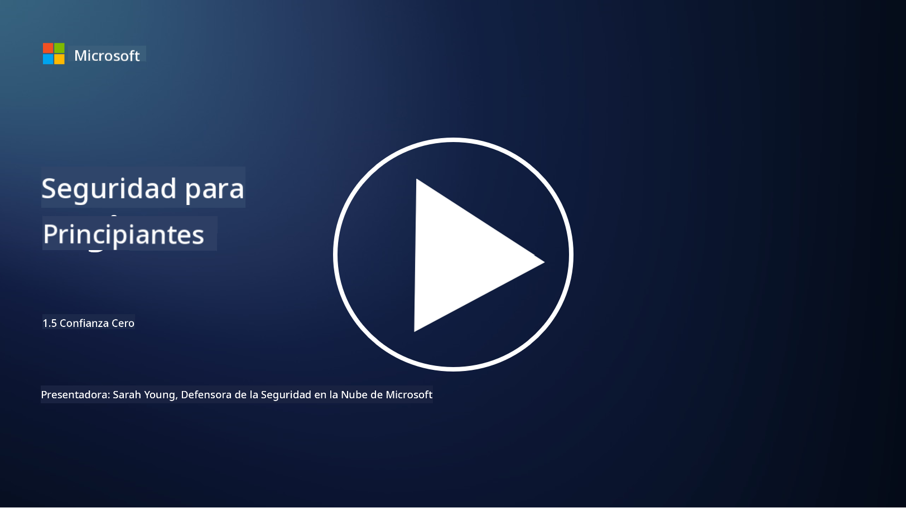
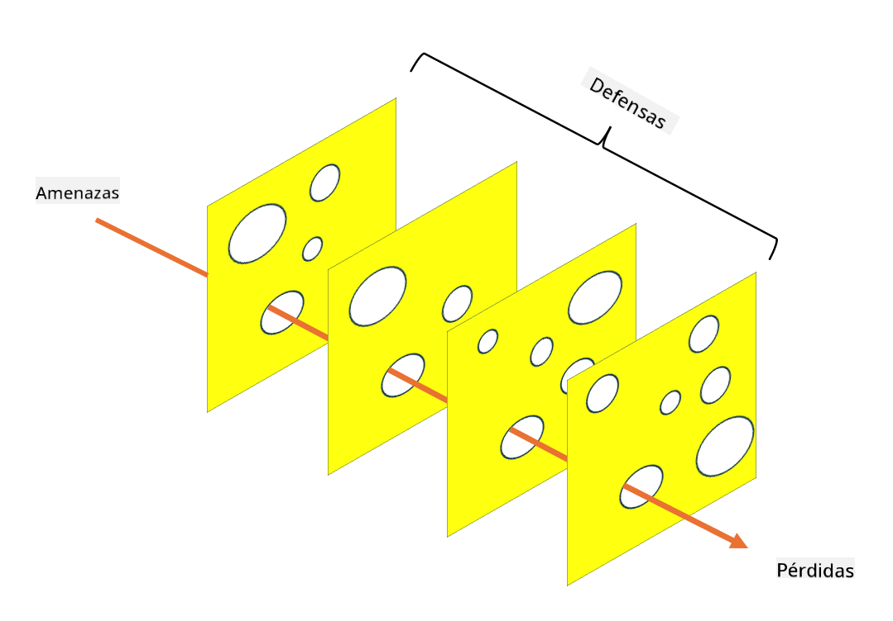

<!--
CO_OP_TRANSLATOR_METADATA:
{
  "original_hash": "75f77f972d2233c584f87c1eb96c983b",
  "translation_date": "2025-09-03T18:23:16+00:00",
  "source_file": "1.5 Zero trust.md",
  "language_code": "es"
}
-->
# Confianza Cero

"Confianza cero" es una frase que se utiliza mucho en los círculos de seguridad hoy en día. Pero, ¿qué significa realmente? ¿Es solo una palabra de moda? En esta lección, profundizaremos en lo que realmente es la confianza cero.

## Introducción

 - En esta lección, cubriremos:
   
   
 - ¿Qué es la confianza cero?

   
  

 - ¿Cómo se diferencia la confianza cero de las arquitecturas de seguridad tradicionales?

   
   

 - ¿Qué es la defensa en profundidad?

## Confianza Cero

Confianza Cero es un enfoque de ciberseguridad que desafía la noción tradicional de "confía pero verifica" al asumir que ninguna entidad, ya sea dentro o fuera de la red de una organización, debe ser confiada de manera inherente. En cambio, Confianza Cero aboga por verificar a cada usuario, dispositivo y aplicación que intente acceder a los recursos, sin importar su ubicación. El principio central de Confianza Cero es minimizar la "superficie de ataque" y reducir el impacto potencial de las brechas de seguridad.

En un modelo de Confianza Cero, se enfatizan los siguientes principios:

1. **Verificar Identidad**: La autenticación y autorización se aplican rigurosamente a todos los usuarios y dispositivos, sin importar su ubicación. Recuerda que una identidad no necesariamente es humana: puede ser un dispositivo, una aplicación, etc.

2. **Menor Privilegio**: A los usuarios y dispositivos se les otorga el nivel mínimo de acceso necesario para realizar sus tareas, reduciendo el daño potencial en caso de compromiso.

3. **Microsegmentación**: Los recursos de la red se dividen en segmentos más pequeños para limitar el movimiento lateral dentro de la red en caso de una brecha.

4. **Monitoreo Continuo**: Se realiza un monitoreo y análisis continuo del comportamiento de usuarios y dispositivos para detectar anomalías y amenazas potenciales. Las técnicas modernas de monitoreo también utilizan aprendizaje automático, inteligencia artificial e inteligencia de amenazas para proporcionar detalles y contexto adicionales.

5. **Cifrado de Datos**: Los datos se cifran tanto en tránsito como en reposo para prevenir accesos no autorizados.

6. **Control de Acceso Estricto**: Los controles de acceso se aplican según el contexto, como roles de usuario, estado del dispositivo y ubicación de la red.

Microsoft divide la confianza cero en cinco pilares, que discutiremos en una lección posterior.

## Diferencias con las Arquitecturas de Seguridad Tradicionales

Confianza Cero se diferencia de las arquitecturas de seguridad tradicionales, como los modelos basados en perímetros, en varios aspectos:

1. **Perímetro vs. Centrado en Identidad**: Los modelos tradicionales se enfocan en asegurar el perímetro de la red y asumen que los usuarios y dispositivos internos pueden ser confiados una vez dentro. Confianza Cero, por otro lado, asume que las amenazas pueden originarse tanto dentro como fuera de la red y aplica controles estrictos basados en identidad.

2. **Confianza Implícita vs. Explícita**: Los modelos tradicionales confían implícitamente en los dispositivos y usuarios dentro de la red hasta que se demuestre lo contrario. Confianza Cero verifica explícitamente las identidades y monitorea continuamente para detectar anomalías.

3. **Red Plana vs. Segmentada**: Las arquitecturas tradicionales a menudo implican redes planas donde los usuarios internos tienen acceso amplio. Confianza Cero aboga por segmentar la red en zonas más pequeñas y aisladas para contener posibles brechas.

4. **Reactivo vs. Proactivo**: La seguridad tradicional a menudo depende de medidas reactivas como firewalls perimetrales y detección de intrusiones. Confianza Cero adopta un enfoque proactivo al asumir que las brechas son probables y minimizar su impacto.

## Defensa en Profundidad

La defensa en profundidad, también conocida como seguridad en capas, es una estrategia de ciberseguridad que implica desplegar múltiples capas de controles y medidas de seguridad para proteger los activos de una organización. El objetivo es crear capas superpuestas de defensa para que, si una capa es vulnerada, otras aún puedan proporcionar protección. Cada capa se enfoca en un aspecto diferente de la seguridad y aumenta la postura general de seguridad de una organización.

La defensa en profundidad implica una combinación de medidas de seguridad técnicas, procedimentales y físicas. Estas pueden incluir firewalls, sistemas de detección de intrusiones, controles de acceso, cifrado, capacitación de usuarios, políticas de seguridad y más. La idea es crear múltiples barreras que, en conjunto, dificulten que los atacantes penetren en los sistemas y redes de una organización. Esto también se conoce a veces como el modelo de "queso suizo", que también se utiliza en la prevención de accidentes en otras industrias (por ejemplo, transporte).

## Lectura adicional

[¿Qué es Confianza Cero?](https://learn.microsoft.com/security/zero-trust/zero-trust-overview?WT.mc_id=academic-96948-sayoung)

[Confianza Cero en evolución – Documento de posición de Microsoft](https://query.prod.cms.rt.microsoft.com/cms/api/am/binary/RWJJdT?WT.mc_id=academic-96948-sayoung)

[Confianza Cero y BeyondCorp Google Cloud | Blog de Google Cloud](https://cloud.google.com/blog/topics/developers-practitioners/zero-trust-and-beyondcorp-google-cloud)

---

**Descargo de responsabilidad**:  
Este documento ha sido traducido utilizando el servicio de traducción automática [Co-op Translator](https://github.com/Azure/co-op-translator). Si bien nos esforzamos por garantizar la precisión, tenga en cuenta que las traducciones automatizadas pueden contener errores o imprecisiones. El documento original en su idioma nativo debe considerarse la fuente autorizada. Para información crítica, se recomienda una traducción profesional realizada por humanos. No nos hacemos responsables de malentendidos o interpretaciones erróneas que puedan surgir del uso de esta traducción.