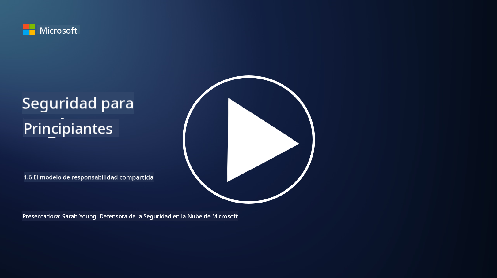

<!--
CO_OP_TRANSLATOR_METADATA:
{
  "original_hash": "a48db640d80c786b928ca178c414f084",
  "translation_date": "2025-09-03T18:34:33+00:00",
  "source_file": "1.6 Shared responsibility model.md",
  "language_code": "es"
}
-->
# El modelo de responsabilidad compartida

La responsabilidad compartida es un concepto relativamente nuevo en TI que surgió con la llegada de la computación en la nube. Desde una perspectiva de ciberseguridad, es fundamental entender quién proporciona qué controles de seguridad para evitar brechas en la defensa.

## Introducción

En esta lección, cubriremos:

 - ¿Qué es la responsabilidad compartida en el contexto de la ciberseguridad?
   
 - ¿Cuál es la diferencia en la responsabilidad compartida de los controles de seguridad entre IaaS, PaaS y SaaS?

 - ¿Dónde puedes encontrar información sobre los controles de seguridad que proporciona tu plataforma en la nube?

 - ¿Qué significa "confiar pero verificar"?

## ¿Qué es la responsabilidad compartida en el contexto de la ciberseguridad?

La responsabilidad compartida en ciberseguridad se refiere a la distribución de responsabilidades de seguridad entre un proveedor de servicios en la nube (CSP) y sus clientes. En entornos de computación en la nube, como Infraestructura como Servicio (IaaS), Plataforma como Servicio (PaaS) y Software como Servicio (SaaS), tanto el CSP como el cliente tienen roles que desempeñar para garantizar la seguridad de los datos, aplicaciones y sistemas.

## ¿Cuál es la diferencia en la responsabilidad compartida de los controles de seguridad entre IaaS, PaaS y SaaS?

La división de responsabilidades generalmente depende del tipo de servicio en la nube que se utilice:

 - **IaaS (Infraestructura como Servicio)**: El CSP proporciona la infraestructura básica (servidores, redes, almacenamiento), mientras que el cliente es responsable de gestionar los sistemas operativos, aplicaciones y configuraciones de seguridad en esa infraestructura.
   
 - **PaaS (Plataforma como Servicio):** El CSP ofrece una plataforma sobre la cual los clientes pueden construir y desplegar aplicaciones. El CSP gestiona la infraestructura subyacente, y el cliente se enfoca en el desarrollo de aplicaciones y la seguridad de los datos.

 - **SaaS (Software como Servicio):** El CSP proporciona aplicaciones completamente funcionales accesibles a través de internet. En este caso, el CSP es responsable de la seguridad de la aplicación y la infraestructura, mientras que el cliente gestiona el acceso de los usuarios y el uso de los datos.

Entender la responsabilidad compartida es crucial porque aclara qué aspectos de seguridad están cubiertos por el CSP y cuáles debe abordar el cliente. Esto ayuda a prevenir malentendidos y asegura que las medidas de seguridad se implementen de manera integral.

## ¿Dónde puedes encontrar información sobre los controles de seguridad que proporciona tu plataforma en la nube?

Para averiguar qué controles de seguridad proporciona tu plataforma en la nube, debes consultar la documentación y los recursos del proveedor de servicios en la nube. Estos incluyen:

 - **Sitio web y documentación del CSP**: El sitio web del CSP tendrá información sobre las características y controles de seguridad ofrecidos como parte de sus servicios. Los CSP suelen ofrecer documentación detallada que explica sus prácticas de seguridad, controles y recomendaciones. Esto puede incluir libros blancos, guías de seguridad y documentación técnica.
   
 - **Evaluaciones y auditorías de seguridad**: La mayoría de los CSP someten sus controles de seguridad a evaluaciones realizadas por expertos y organizaciones independientes. Estas revisiones pueden proporcionar información sobre la calidad de las medidas de seguridad del CSP. A veces, esto lleva a que el CSP obtenga un certificado de cumplimiento de seguridad (ver el siguiente punto).
   
 - **Certificaciones de cumplimiento de seguridad**: La mayoría de los CSP obtienen certificaciones como ISO:27001, SOC 2 y FedRAMP, entre otras. Estas certificaciones demuestran que el proveedor cumple con estándares específicos de seguridad y cumplimiento.

Recuerda que el nivel de detalle y la disponibilidad de información pueden variar entre proveedores de nube. Asegúrate siempre de consultar recursos oficiales y actualizados proporcionados por el proveedor de servicios en la nube para tomar decisiones informadas sobre la seguridad de tus activos en la nube.

## ¿Qué significa "confiar pero verificar"?

En el contexto del uso de un CSP, software de terceros u otros servicios de seguridad de TI, una organización puede inicialmente confiar en las afirmaciones del proveedor sobre las medidas de seguridad. Sin embargo, para garantizar realmente la seguridad de sus datos y sistemas, debe verificar estas afirmaciones mediante evaluaciones de seguridad, pruebas de penetración y una revisión de los controles de seguridad del proveedor antes de integrar completamente el software o servicio en sus operaciones. Todas las personas y organizaciones deben buscar confiar pero verificar los controles de seguridad de los que no son responsables.

## Responsabilidad compartida dentro de una organización

Recuerda que la responsabilidad compartida de la seguridad dentro de una organización entre diferentes equipos también debe tenerse en cuenta. El equipo de seguridad rara vez implementará todos los controles por sí mismo y necesitará colaborar con los equipos de operaciones, desarrolladores y otras partes del negocio para implementar todos los controles de seguridad necesarios para mantener segura a la organización.

## Lecturas adicionales
- [Shared responsibility in the cloud - Microsoft Azure | Microsoft Learn](https://learn.microsoft.com/azure/security/fundamentals/shared-responsibility?WT.mc_id=academic-96948-sayoung)
- [What is shared responsibility model? – Definition from TechTarget.com](https://www.techtarget.com/searchcloudcomputing/definition/shared-responsibility-model)
- [The shared responsibility model explained and what it means for cloud security | CSO Online](https://www.csoonline.com/article/570779/the-shared-responsibility-model-explained-and-what-it-means-for-cloud-security.html)
- [Shared Responsibility for Cloud Security: What You Need to Know (cisecurity.org)](https://www.cisecurity.org/insights/blog/shared-responsibility-cloud-security-what-you-need-to-know)

---

**Descargo de responsabilidad**:  
Este documento ha sido traducido utilizando el servicio de traducción automática [Co-op Translator](https://github.com/Azure/co-op-translator). Si bien nos esforzamos por garantizar la precisión, tenga en cuenta que las traducciones automatizadas pueden contener errores o imprecisiones. El documento original en su idioma nativo debe considerarse la fuente autorizada. Para información crítica, se recomienda una traducción profesional realizada por humanos. No nos hacemos responsables de malentendidos o interpretaciones erróneas que puedan surgir del uso de esta traducción.