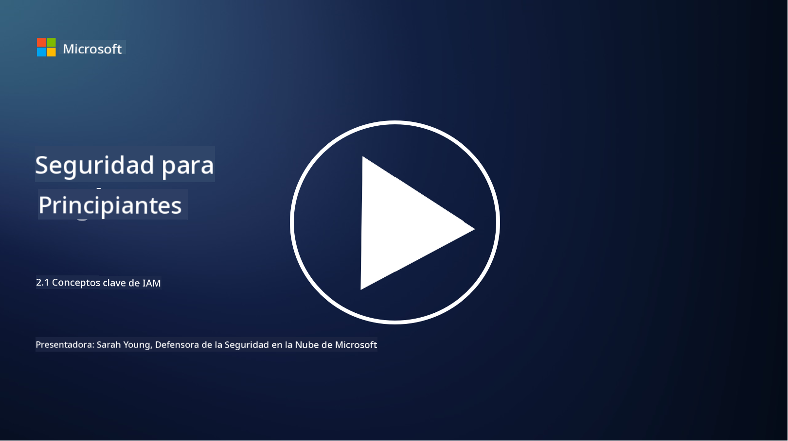

<!--
CO_OP_TRANSLATOR_METADATA:
{
  "original_hash": "2e3864e3d579f0dbb4ac2ec8c5f82acf",
  "translation_date": "2025-09-03T18:03:57+00:00",
  "source_file": "2.1 IAM key concepts.md",
  "language_code": "es"
}
-->
# Conceptos clave de IAM

¿Alguna vez has iniciado sesión en una computadora o en un sitio web? ¡Por supuesto que sí! Eso significa que ya has utilizado controles de identidad en tu vida cotidiana. La gestión de identidades y accesos (IAM) es un pilar clave de la seguridad, y aprenderemos más sobre ello en las próximas lecciones.

**Introducción**

En esta lección, cubriremos:

- ¿Qué entendemos por gestión de identidades y accesos (IAM) en el
  contexto de la ciberseguridad?
  
- ¿Qué es el principio de privilegio mínimo?
  
- ¿Qué es la segregación de funciones?
  
- ¿Qué son la autenticación y la autorización?

## ¿Qué entendemos por gestión de identidades y accesos (IAM) en el contexto de la ciberseguridad?

La gestión de identidades y accesos (IAM) se refiere a un conjunto de procesos, tecnologías y políticas implementadas para garantizar que las personas adecuadas tengan el acceso apropiado a los recursos dentro del entorno digital de una organización. IAM implica gestionar identidades digitales (usuarios, empleados, socios) y su acceso a sistemas, aplicaciones, datos y redes. El objetivo principal de IAM es mejorar la seguridad, simplificar el acceso de los usuarios y garantizar el cumplimiento de las políticas y regulaciones organizacionales. Las soluciones de IAM generalmente abarcan autenticación de usuarios, autorización, aprovisionamiento de identidades, control de acceso y gestión del ciclo de vida de los usuarios (asegurándose de que las cuentas se eliminen cuando ya no se utilicen).

## ¿Qué es el principio de privilegio mínimo?

El principio de privilegio mínimo es un concepto fundamental que aboga por otorgar a los usuarios y sistemas solo los privilegios mínimos necesarios para realizar sus tareas o roles previstos. Este principio ayuda a limitar el daño potencial en caso de una brecha de seguridad o una amenaza interna. Al adherirse al principio de privilegio mínimo, las organizaciones reducen la superficie de ataque y minimizan el riesgo de acceso no autorizado, filtraciones de datos y uso indebido accidental de privilegios. En la práctica, esto significa que a los usuarios se les concede acceso únicamente a los recursos y funcionalidades específicas requeridas para sus roles laborales, y nada más. Por ejemplo, si solo necesitas leer un documento, sería excesivo que se te otorgaran privilegios de administrador completo sobre dicho documento.

## ¿Qué es la segregación de funciones?

La segregación de funciones es un principio destinado a prevenir conflictos de interés y reducir el riesgo de fraude y errores mediante la distribución de tareas y responsabilidades críticas entre diferentes individuos dentro de una organización. En el contexto de la ciberseguridad, la segregación de funciones implica garantizar que ninguna persona tenga control sobre todos los aspectos de un proceso o sistema crítico. El objetivo es crear un sistema de controles y balances que impida que una sola persona pueda realizar tanto la configuración como la aprobación de un proceso. Por ejemplo, en sistemas financieros, esto podría dictar que la persona que ingresa transacciones en el sistema no sea la misma que las aprueba. Esto reduce el riesgo de acciones no autorizadas o fraudulentas que pasen desapercibidas.

## ¿Qué son la autenticación y la autorización?

La autenticación y la autorización son dos conceptos fundamentales en la ciberseguridad que desempeñan un papel crucial en garantizar la seguridad e integridad de los sistemas informáticos y los datos. A menudo se utilizan conjuntamente para controlar el acceso a recursos y proteger información sensible.

**1. Autenticación**: La autenticación es el proceso de verificar la identidad de un usuario, sistema o entidad que intenta acceder a un sistema informático o recurso específico. Garantiza que la identidad reclamada sea genuina y precisa. Los métodos de autenticación generalmente implican el uso de uno o más de los siguientes factores:

   a. Algo que sabes: Esto incluye contraseñas, PINs u otro conocimiento secreto que solo el usuario autorizado debería poseer.
   
   b. Algo que tienes: Esto implica tokens físicos o dispositivos como tarjetas inteligentes, tokens de seguridad o teléfonos móviles utilizados para confirmar la identidad del usuario.
   
   c. Algo que eres: Esto se refiere a factores biométricos como huellas dactilares, reconocimiento facial o escaneos de retina que son únicos para cada individuo.

Los mecanismos de autenticación se utilizan para confirmar que un usuario es quien dice ser antes de permitir el acceso a un sistema o recurso. Ayuda a prevenir el acceso no autorizado y asegura que solo los usuarios legítimos puedan realizar acciones dentro de un sistema.

**2. Autorización**: La autorización es el proceso de otorgar o denegar permisos y privilegios específicos a usuarios o entidades autenticados una vez que su identidad ha sido verificada. Determina qué acciones u operaciones se permite realizar a un usuario dentro de un sistema o en recursos específicos. La autorización generalmente se basa en políticas predefinidas, reglas de control de acceso y roles asignados a los usuarios.

La autorización puede considerarse como responder a la pregunta: "¿Qué puede hacer un usuario autenticado?" Implica definir y aplicar políticas de control de acceso para proteger datos y recursos sensibles contra el acceso o modificación no autorizados.

**En resumen:**

- La autenticación establece la identidad de los usuarios o entidades.
- La autorización determina qué acciones y recursos pueden acceder o manipular los usuarios autenticados.

## Lecturas adicionales

- [Describe identity concepts - Training | Microsoft Learn](https://learn.microsoft.com/training/modules/describe-identity-principles-concepts/?WT.mc_id=academic-96948-sayoung)
- [Introduction to identity - Microsoft Entra | Microsoft Learn](https://learn.microsoft.com/azure/active-directory/fundamentals/identity-fundamental-concepts?WT.mc_id=academic-96948-sayoung)
- [What is Identity Access Management (IAM)? | Microsoft Security](https://www.microsoft.com/security/business/security-101/what-is-identity-access-management-iam?WT.mc_id=academic-96948-sayoung)
- [What is IAM? Identity and access management explained | CSO Online](https://www.csoonline.com/article/518296/what-is-iam-identity-and-access-management-explained.html)
- [What is IAM? (auth0.com)](https://auth0.com/blog/what-is-iam/)
- [Security+: implementing Identity and Access Management (IAM) controls [updated 2021] | Infosec (infosecinstitute.com)](https://resources.infosecinstitute.com/certifications/securityplus/security-implementing-identity-and-access-management-iam-controls/)
- [least privilege - Glossary | CSRC (nist.gov)](https://csrc.nist.gov/glossary/term/least_privilege)
- [Security: The Principle of Least Privilege (POLP) - Microsoft Community Hub](https://techcommunity.microsoft.com/t5/azure-sql-blog/security-the-principle-of-least-privilege-polp/ba-p/2067390?WT.mc_id=academic-96948-sayoung)
- [Principle of least privilege | CERT NZ](https://www.cert.govt.nz/it-specialists/critical-controls/principle-of-least-privilege/)
- [Why is separation of duties required by NIST 800-171 and CMMC? - (totem.tech)](https://www.totem.tech/cmmc-separation-of-duties/)

---

**Descargo de responsabilidad**:  
Este documento ha sido traducido utilizando el servicio de traducción automática [Co-op Translator](https://github.com/Azure/co-op-translator). Si bien nos esforzamos por garantizar la precisión, tenga en cuenta que las traducciones automatizadas pueden contener errores o imprecisiones. El documento original en su idioma nativo debe considerarse la fuente autorizada. Para información crítica, se recomienda una traducción profesional realizada por humanos. No nos hacemos responsables de malentendidos o interpretaciones erróneas que puedan surgir del uso de esta traducción.