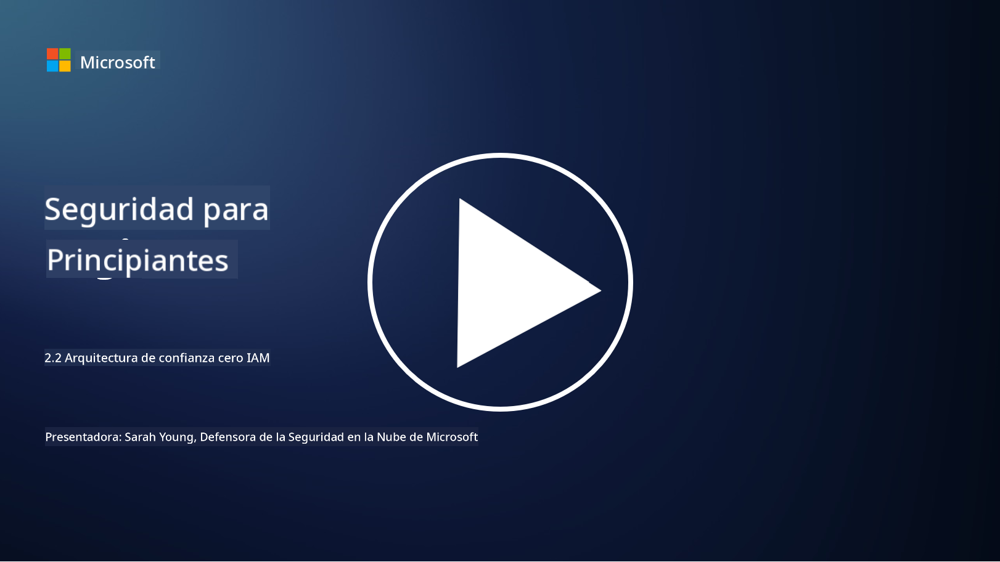

<!--
CO_OP_TRANSLATOR_METADATA:
{
  "original_hash": "4774a978af123f72ebb872199c4c4d4f",
  "translation_date": "2025-09-03T18:21:27+00:00",
  "source_file": "2.2 IAM zero trust architecture.md",
  "language_code": "es"
}
-->
# Arquitectura de confianza cero en IAM

La identidad es una parte clave para implementar una arquitectura de confianza cero y construir un perímetro para cualquier entorno de TI. En esta sección exploraremos por qué es importante usar controles de identidad para implementar confianza cero.

## Introducción

En esta lección, cubriremos:

 - ¿Por qué necesitamos usar la identidad como nuestro perímetro en los entornos modernos de TI?
   
 - ¿En qué se diferencia esto de las arquitecturas tradicionales de TI?

 - ¿Cómo se utiliza la identidad para implementar una arquitectura de confianza cero?

## ¿Por qué necesitamos usar la identidad como nuestro perímetro en los entornos modernos de TI?

En los entornos modernos de TI, el concepto tradicional de un perímetro físico (usando herramientas como firewalls y límites de red) como la línea principal de defensa contra las amenazas cibernéticas está perdiendo efectividad debido a la creciente complejidad de la tecnología, el aumento del trabajo remoto y la adopción de servicios en la nube. En su lugar, las organizaciones están cambiando hacia el uso de la identidad como el nuevo perímetro. Esto significa que la seguridad gira en torno a verificar y gestionar la identidad de usuarios, dispositivos y aplicaciones que intentan acceder a recursos, sin importar su ubicación física.

Aquí está el porqué de la importancia de usar la identidad como perímetro en los entornos modernos de TI:

**Fuerza laboral remota**: Con el trabajo remoto y los dispositivos móviles convirtiéndose en la norma, los usuarios pueden acceder a recursos desde diversas ubicaciones y dispositivos. El enfoque tradicional de perímetro no funciona cuando los usuarios ya no están confinados a una oficina física.

**Entornos en la nube e híbridos**: Las organizaciones están adoptando cada vez más servicios en la nube y entornos híbridos. Los datos y las aplicaciones ya no están únicamente dentro de las instalaciones de una organización, lo que hace que las defensas tradicionales de perímetro sean menos relevantes.

**Seguridad de confianza cero**: El concepto de seguridad de confianza cero asume que ninguna entidad, ya sea dentro o fuera de la red, debe ser automáticamente confiada. La identidad se convierte en la base para verificar las solicitudes de acceso, independientemente de su origen.

**Panorama de amenazas**: Las amenazas cibernéticas están evolucionando, y los atacantes están encontrando formas de eludir las defensas tradicionales de perímetro. El phishing, la ingeniería social y las amenazas internas suelen explotar vulnerabilidades humanas en lugar de intentar violar los perímetros de red.

**Enfoque centrado en los datos**: Proteger los datos sensibles es primordial. Al centrarse en la identidad, las organizaciones pueden controlar quién accede a qué datos, reduciendo el riesgo de brechas de seguridad.

## ¿En qué se diferencia esto de las arquitecturas tradicionales de TI?

Las arquitecturas tradicionales de TI dependían en gran medida de modelos de seguridad basados en el perímetro, donde los firewalls y los límites de red desempeñaban un papel importante para mantener las amenazas fuera. Las principales diferencias entre los enfoques tradicionales y los centrados en la identidad son:

|      Aspecto               |      Arquitecturas tradicionales de TI                                                             |      Enfoque centrado en la identidad                                                                       |
|----------------------------|----------------------------------------------------------------------------------------------------|------------------------------------------------------------------------------------------------------------|
|     Enfoque                |     Enfoque en el perímetro: Dependía de defensas perimetrales como firewalls y control de acceso. |     Enfoque en la verificación de identidad: Cambio de los límites de red a la verificación de identidad de usuarios/dispositivos. |
|     Ubicación              |     Dependencia de ubicación: Seguridad vinculada a ubicaciones físicas y límites de red.         |     Independencia de ubicación: Seguridad no vinculada a ubicaciones específicas; acceso desde cualquier lugar. |
|     Suposición de confianza|     Confianza asumida: Confianza dentro del perímetro de red para usuarios/dispositivos.           |     Enfoque de confianza cero: La confianza nunca se asume; el acceso se verifica en función de la identidad y el contexto. |
|     Consideración de dispositivos |     Diversidad de dispositivos: Se asumía que los dispositivos dentro del perímetro de red eran seguros. |     Conciencia de dispositivos: Considera la salud y postura de seguridad del dispositivo, sin importar la ubicación. |
|     Protección de datos    |     Protección de datos: Enfoque en asegurar los perímetros de red para proteger los datos.       |     Protección centrada en los datos: Enfoque en controlar el acceso a los datos en función de la identidad y la sensibilidad de los datos. |
|                            |                                                                                                    |                                                                                                            |

## ¿Cómo se utiliza la identidad para implementar una arquitectura de confianza cero?

En una arquitectura de confianza cero, el principio fundamental es no confiar automáticamente en ninguna entidad, sin importar si está dentro o fuera del perímetro de la red. La identidad desempeña un papel central en la implementación de un enfoque de confianza cero al permitir la verificación continua de las entidades que intentan acceder a recursos. Los controles modernos de seguridad de identidad permiten que cada usuario, dispositivo, aplicación y servicio que busque acceso a recursos sea identificado y autenticado exhaustivamente antes de que se otorgue acceso. Esto implica verificar su identidad digital mediante métodos como combinaciones de nombre de usuario/contraseña, autenticación multifactor (MFA), biometría y otros mecanismos de autenticación robustos.

## Lecturas adicionales

- [Securing identity with Zero Trust | Microsoft Learn](https://learn.microsoft.com/security/zero-trust/deploy/identity?WT.mc_id=academic-96948-sayoung)
- [Zero Trust Principles and Guidance for Identity and Access | CSA (cloudsecurityalliance.org)](https://cloudsecurityalliance.org/artifacts/zero-trust-principles-and-guidance-for-iam/)
- [Zero Trust Identity Controls - Essentials Series - Episode 2 - YouTube](https://www.youtube.com/watch?v=fQZQznIKcGM&list=PLXtHYVsvn_b_gtX1-NB62wNervQx1Fhp4&index=13)

---

**Descargo de responsabilidad**:  
Este documento ha sido traducido utilizando el servicio de traducción automática [Co-op Translator](https://github.com/Azure/co-op-translator). Aunque nos esforzamos por garantizar la precisión, tenga en cuenta que las traducciones automatizadas pueden contener errores o imprecisiones. El documento original en su idioma nativo debe considerarse como la fuente autorizada. Para información crítica, se recomienda una traducción profesional realizada por humanos. No nos hacemos responsables de malentendidos o interpretaciones erróneas que puedan surgir del uso de esta traducción.