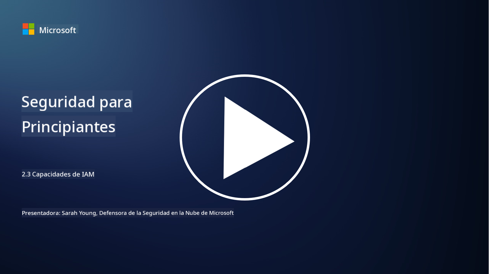

<!--
CO_OP_TRANSLATOR_METADATA:
{
  "original_hash": "bf0b8a54f2c69951744df5a94bc923f7",
  "translation_date": "2025-09-03T18:58:10+00:00",
  "source_file": "2.3 IAM capabilities.md",
  "language_code": "es"
}
-->
# Capacidades de IAM

En esta sección, cubriremos más detalles sobre las herramientas y capacidades principales que se utilizan en la seguridad de identidad.

## Introducción

En esta lección, cubriremos:

 - ¿Qué es un servicio de directorio?
      
     
    
 - ¿Qué tipo de capacidades se pueden usar para proteger identidades?
>
>        Autenticación Multifactor (MFA)
> 
>        Inicio de Sesión Único (SSO)
> 
>        Control de Acceso Basado en Roles (RBAC)
> 
>        Autenticación Adaptativa
> 
>        Autenticación Biométrica
> 
>        Gestión de Acceso Privilegiado (PAM)
> 
>        Gobernanza e Administración de Identidades (IGA)
> 
>        Análisis de Comportamiento

## ¿Qué es un servicio de directorio?

Un servicio de directorio es una base de datos especializada que almacena y gestiona información sobre recursos de red, incluidos usuarios, grupos, dispositivos, aplicaciones y otros objetos. Sirve como un repositorio centralizado de datos relacionados con identidad y acceso, permitiendo a las organizaciones gestionar y controlar la autenticación de usuarios, la autorización y otras tareas relacionadas con la seguridad de manera eficiente.

Los servicios de directorio desempeñan un papel crucial en los entornos de TI modernos al proporcionar una base para las soluciones de gestión de identidad y acceso (IAM). Facilitan el acceso seguro a recursos, aplican políticas de acceso y simplifican las tareas administrativas. Uno de los servicios de directorio más conocidos es Microsoft Active Directory, pero existen otras soluciones como los directorios LDAP (Protocolo Ligero de Acceso a Directorios) que cumplen propósitos similares.

Las funciones y características clave de un servicio de directorio en el contexto de la ciberseguridad incluyen:

 - **Autenticación de Usuarios**: Los servicios de directorio validan las credenciales de los usuarios (como nombres de usuario y contraseñas) para garantizar que solo los usuarios autorizados puedan acceder a la red y sus recursos.
 - **Autorización de Usuarios**: Determinan el nivel de acceso que tiene cada usuario según su rol, pertenencia a grupos y otros atributos. Esto asegura que los usuarios solo puedan acceder a los recursos que tienen permitidos.
 - **Gestión de Grupos**: Los servicios de directorio permiten a los administradores organizar a los usuarios en grupos lógicos, simplificando la gestión del control de acceso. Los permisos se pueden asignar a grupos en lugar de a usuarios individuales.
 - **Políticas de Contraseñas**: Aplican reglas de complejidad y expiración de contraseñas, mejorando la seguridad de las cuentas de usuario.
 - **Inicio de Sesión Único (SSO)**: Algunos servicios de directorio admiten SSO, permitiendo a los usuarios acceder a múltiples aplicaciones y servicios con un único conjunto de credenciales.
 - **Gestión Centralizada de Usuarios**: Los servicios de directorio centralizan la información de los usuarios, facilitando la gestión de cuentas, perfiles y atributos desde una ubicación única.
 - **Auditoría y Registro**: Pueden registrar actividades de autenticación y acceso de usuarios, ayudando en auditorías de seguridad y esfuerzos de cumplimiento.

## ¿Qué tipo de capacidades se pueden usar para proteger identidades?

**Autenticación Multifactor (MFA)**

MFA requiere que los usuarios proporcionen múltiples formas de verificación antes de otorgar acceso. Esto generalmente incluye algo que el usuario sabe (contraseña), algo que el usuario tiene (teléfono inteligente o token de seguridad) y algo que el usuario es (datos biométricos como huella digital o reconocimiento facial).

**Inicio de Sesión Único (SSO)**

SSO permite a los usuarios acceder a múltiples aplicaciones y sistemas con un único conjunto de credenciales. Esto mejora la experiencia del usuario y reduce el riesgo asociado con la gestión de múltiples contraseñas.

**Control de Acceso Basado en Roles (RBAC)**

RBAC asigna permisos basados en roles predefinidos. Los usuarios obtienen acceso según sus roles dentro de una organización.

**Autenticación Adaptativa**

La autenticación adaptativa evalúa factores de riesgo como ubicación, dispositivo, hora de acceso y comportamiento del usuario para ajustar dinámicamente el nivel de autenticación requerido. Si una solicitud parece sospechosa, se pueden activar pasos adicionales de autenticación.

**Autenticación Biométrica**

La autenticación biométrica utiliza características biológicas únicas como huellas digitales, rasgos faciales, patrones de voz e incluso características de comportamiento como la velocidad de escritura para la verificación de identidad.

**Gestión de Acceso Privilegiado (PAM)**

PAM se centra en proteger el acceso a sistemas y datos críticos mediante la aplicación de controles estrictos en cuentas privilegiadas. Incluye características como acceso justo a tiempo y monitoreo de sesiones.

**Gobernanza e Administración de Identidades (IGA)**

Las soluciones de IGA gestionan las identidades de los usuarios y su acceso a recursos durante todo su ciclo de vida. Esto incluye incorporación, aprovisionamiento, control de acceso basado en roles y desactivación.

**Análisis de Comportamiento**

El análisis de comportamiento monitorea el comportamiento de los usuarios y establece patrones base. Las desviaciones de la norma pueden generar alertas para una investigación adicional.

# Lecturas adicionales
- [Documentación sobre fundamentos de Azure Active Directory - Microsoft Entra | Microsoft Learn](https://learn.microsoft.com/azure/active-directory/fundamentals/?WT.mc_id=academic-96948-sayoung)
- [¿Qué es Azure Active Directory? - Microsoft Entra | Microsoft Learn](https://learn.microsoft.com/azure/active-directory/fundamentals/whatis?WT.mc_id=academic-96948-sayoung)
- [Gestiona tu infraestructura de identidad multicloud con Microsoft Entra - YouTube](https://www.youtube.com/watch?v=9qQiq3wTS2Y&list=PLXtHYVsvn_b_gtX1-NB62wNervQx1Fhp4&index=18)

---

**Descargo de responsabilidad**:  
Este documento ha sido traducido utilizando el servicio de traducción automática [Co-op Translator](https://github.com/Azure/co-op-translator). Si bien nos esforzamos por lograr precisión, tenga en cuenta que las traducciones automáticas pueden contener errores o imprecisiones. El documento original en su idioma nativo debe considerarse como la fuente autorizada. Para información crítica, se recomienda una traducción profesional realizada por humanos. No nos hacemos responsables de malentendidos o interpretaciones erróneas que puedan surgir del uso de esta traducción.