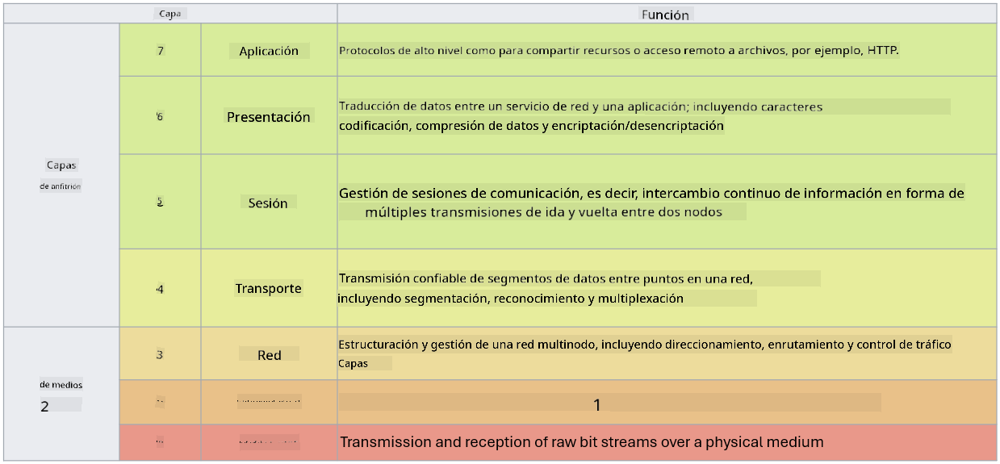

<!--
CO_OP_TRANSLATOR_METADATA:
{
  "original_hash": "252724eceeb183fb9018f88c5e1a3f0c",
  "translation_date": "2025-09-03T18:55:42+00:00",
  "source_file": "3.1 Networking key concepts.md",
  "language_code": "es"
}
-->
# Conceptos clave de redes

Si has trabajado en TI, es probable que hayas estado expuesto a conceptos de redes. Aunque usamos la identidad como nuestro principal control de perímetro en entornos modernos, esto no significa que los controles de red sean redundantes. Aunque este es un tema extenso, en esta lección cubriremos algunos conceptos clave de redes.

En esta lección, abordaremos:

 - ¿Qué es la dirección IP?
   
 - ¿Qué es el modelo OSI?

 

 - ¿Qué son TCP/UDP?

   
 

 - ¿Qué son los números de puerto?

   
  

 - ¿Qué es la encriptación en reposo y en tránsito?

## ¿Qué es la dirección IP?

La dirección IP, o dirección de Protocolo de Internet, es una etiqueta numérica asignada a cada dispositivo conectado a una red informática que utiliza el Protocolo de Internet para comunicarse. Sirve como un identificador único para los dispositivos dentro de una red, permitiéndoles enviar y recibir datos a través de internet u otras redes interconectadas. Hay dos versiones principales de direcciones IP: IPv4 (Protocolo de Internet versión 4) e IPv6 (Protocolo de Internet versión 6). Una dirección IP generalmente se representa en formato IPv4 (por ejemplo, 192.168.1.1) o en formato IPv6 (por ejemplo, 2001:0db8:85a3:0000:0000:8a2e:0370:7334).

## ¿Qué es el modelo OSI?

El modelo OSI (Interconexión de Sistemas Abiertos) es un marco conceptual que estandariza las funciones de un sistema de comunicación en siete capas distintas. Cada capa realiza tareas específicas y se comunica con las capas adyacentes para garantizar una comunicación de datos eficiente y confiable entre dispositivos en una red. Las capas, de abajo hacia arriba, son las siguientes:

 1. Capa Física
    
 
 2. Capa de Enlace de Datos

    
    

 1. Capa de Red

    
   

 1. Capa de Transporte

    

 1. Capa de Sesión

    
   

 1. Capa de Presentación

    
    

 1. Capa de Aplicación

El modelo OSI proporciona una referencia común para entender cómo interactúan los protocolos y tecnologías de redes, independientemente de las implementaciones específicas de hardware o software.

_ref: https://en.wikipedia.org/wiki/OSI_model_

## ¿Qué son TCP/UDP?

TCP (Protocolo de Control de Transmisión) y UDP (Protocolo de Datagramas de Usuario) son dos protocolos fundamentales de la capa de transporte utilizados en redes informáticas para facilitar la comunicación entre dispositivos a través de internet o dentro de una red local. Son responsables de dividir los datos en paquetes para su transmisión y luego reensamblar esos paquetes en los datos originales en el extremo receptor. Sin embargo, difieren en sus características y casos de uso.

**TCP (Protocolo de Control de Transmisión)**:

TCP es un protocolo orientado a la conexión que proporciona entrega confiable y ordenada de datos entre dispositivos. Establece una conexión entre el remitente y el receptor antes de que comience el intercambio de datos. TCP asegura que los paquetes de datos lleguen en el orden correcto y puede manejar la retransmisión de paquetes perdidos para garantizar la integridad y la completitud de los datos. Esto hace que TCP sea adecuado para aplicaciones que requieren entrega confiable de datos, como navegación web, correo electrónico, transferencia de archivos (FTP) y comunicación con bases de datos.

**UDP (Protocolo de Datagramas de Usuario)**:

UDP es un protocolo sin conexión que ofrece una transmisión de datos más rápida pero no proporciona el mismo nivel de confiabilidad que TCP. No establece una conexión formal antes de enviar datos y no incluye mecanismos para reconocer o retransmitir paquetes perdidos. UDP es adecuado para aplicaciones donde la velocidad y la eficiencia son más importantes que la entrega garantizada, como comunicación en tiempo real, transmisión de medios, juegos en línea y consultas DNS.

En resumen, TCP prioriza la confiabilidad y la entrega ordenada, lo que lo hace adecuado para aplicaciones que requieren precisión en los datos, mientras que UDP enfatiza la velocidad y la eficiencia, siendo apropiado para aplicaciones donde se tolera una pérdida menor de datos o un reordenamiento en favor de una menor latencia. La elección entre TCP y UDP depende de los requisitos específicos de la aplicación o servicio que se utilice.

## ¿Qué son los números de puerto?

En redes, un número de puerto es un identificador numérico utilizado para diferenciar entre diferentes servicios o aplicaciones que se ejecutan en un único dispositivo dentro de una red. Los puertos ayudan a dirigir los datos entrantes a la aplicación adecuada. Los números de puerto son enteros sin signo de 16 bits, lo que significa que van de 0 a 65535. Se dividen en tres rangos:

- Puertos Bien Conocidos (0-1023): Reservados para servicios estándar como HTTP (puerto 80) y FTP (puerto 21).

- Puertos Registrados (1024-49151): Utilizados para aplicaciones y servicios que no forman parte del rango bien conocido pero están oficialmente registrados.

- Puertos Dinámicos/Privados (49152-65535): Disponibles para uso temporal o privado por aplicaciones.

## ¿Qué es la encriptación en reposo y en tránsito?

La encriptación es el proceso de convertir datos en un formato seguro para protegerlos contra el acceso no autorizado o la manipulación. La encriptación puede aplicarse a los datos tanto "en reposo" (cuando están almacenados en un dispositivo o servidor) como "en tránsito" (cuando se transmiten entre dispositivos o a través de redes).

Encriptación en Reposo: Esto implica encriptar los datos que están almacenados en dispositivos, servidores o sistemas de almacenamiento. Incluso si un atacante obtiene acceso físico al medio de almacenamiento, no podrá acceder a los datos sin las claves de encriptación. Esto es crucial para proteger datos sensibles en caso de robo de dispositivos, brechas de seguridad o acceso no autorizado.

Encriptación en Tránsito: Esto implica encriptar los datos mientras viajan entre dispositivos o a través de redes. Esto previene la interceptación no autorizada y el espionaje de los datos durante la transmisión. Los protocolos comunes para la encriptación en tránsito incluyen HTTPS para comunicación web y TLS/SSL para asegurar diversos tipos de tráfico de red.

## Lecturas adicionales
- [How Do IP Addresses Work? (howtogeek.com)](https://www.howtogeek.com/341307/how-do-ip-addresses-work/)
- [Understanding IP Address: An Introductory Guide (geekflare.com)](https://geekflare.com/understanding-ip-address/)
- [What is the OSI model? The 7 layers of OSI explained (techtarget.com)](https://www.techtarget.com/searchnetworking/definition/OSI)
- [The OSI Model – The 7 Layers of Networking Explained in Plain English (freecodecamp.org)](https://www.freecodecamp.org/news/osi-model-networking-layers-explained-in-plain-english/)
- [TCP/IP protocols - IBM Documentation](https://www.ibm.com/docs/en/aix/7.3?topic=protocol-tcpip-protocols)
- [Common Ports Cheat Sheet: The Ultimate Ports & Protocols List (stationx.net)](https://www.stationx.net/common-ports-cheat-sheet/)
- [Azure Data Encryption-at-Rest - Azure Security | Microsoft Learn](https://learn.microsoft.com/azure/security/fundamentals/encryption-atrest?WT.mc_id=academic-96948-sayoung)

---

**Descargo de responsabilidad**:  
Este documento ha sido traducido utilizando el servicio de traducción automática [Co-op Translator](https://github.com/Azure/co-op-translator). Si bien nos esforzamos por lograr precisión, tenga en cuenta que las traducciones automáticas pueden contener errores o imprecisiones. El documento original en su idioma nativo debe considerarse como la fuente autorizada. Para información crítica, se recomienda una traducción profesional realizada por humanos. No nos hacemos responsables de malentendidos o interpretaciones erróneas que puedan surgir del uso de esta traducción.