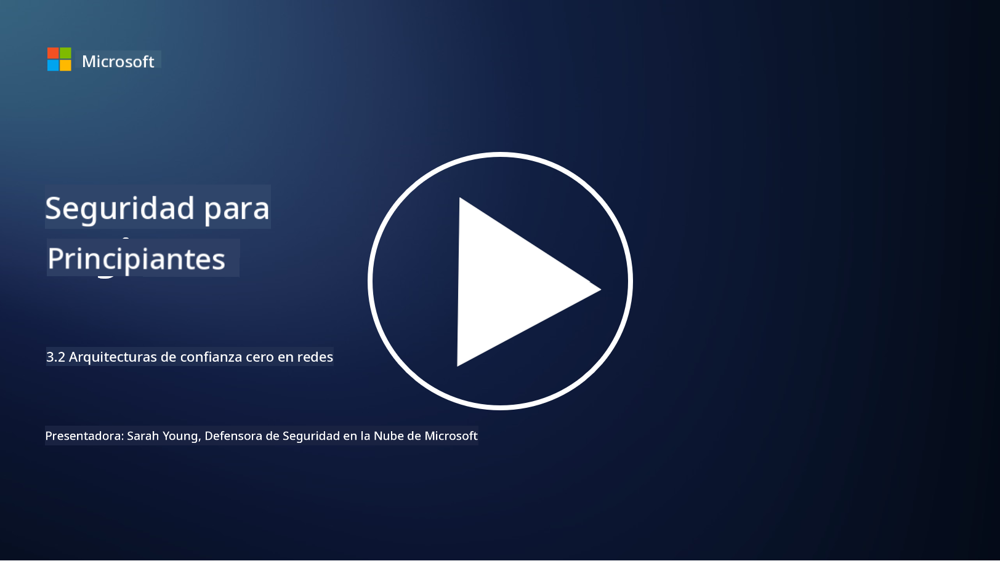

<!--
CO_OP_TRANSLATOR_METADATA:
{
  "original_hash": "680d6e14d9d33fc471c22f44679713f8",
  "translation_date": "2025-09-03T18:37:41+00:00",
  "source_file": "3.2 Networking zero trust architecture.md",
  "language_code": "es"
}
-->
# Arquitecturas de confianza cero en redes

La red proporciona una capa crucial en los controles de confianza cero. En esta lección aprenderemos más sobre lo siguiente:

- ¿Qué es la segmentación de red?  
- ¿Cómo ayuda la segmentación de red a implementar confianza cero?  
- ¿Qué es el cifrado de extremo a extremo?

## ¿Qué es la segmentación de red?

La segmentación de red es la práctica de dividir una red en segmentos o subredes más pequeños y aislados. Cada segmento está separado de los demás, y el acceso entre ellos se controla y restringe según políticas de seguridad específicas. La segmentación de red se utiliza para mejorar la seguridad al contener el impacto de posibles brechas y limitar el movimiento lateral de los atacantes dentro de la red.

Al implementar la segmentación de red, una organización puede crear "zonas" que separen diferentes tipos de usuarios, aplicaciones y datos. Esto reduce la superficie de ataque y minimiza el daño potencial causado por un incidente de seguridad. La segmentación de red puede lograrse mediante tecnologías como redes LAN virtuales (VLANs), firewalls y controles de acceso.

## ¿Cómo ayuda la segmentación de red a implementar confianza cero?

La segmentación de red está estrechamente alineada con los principios del modelo de confianza cero. En una arquitectura de confianza cero, la segmentación de red ayuda a aplicar el principio de "mínimos privilegios" al garantizar que los usuarios y dispositivos tengan acceso únicamente a los recursos y servicios específicos que necesitan para realizar sus tareas. Al segmentar la red en zonas más pequeñas, las organizaciones pueden implementar controles de acceso estrictos, aislar activos críticos y prevenir el movimiento lateral de los atacantes.

La segmentación de red también contribuye a aplicar controles de acceso basados en identidad, donde los usuarios y dispositivos son autenticados y autorizados de manera rigurosa antes de acceder a segmentos específicos. Esto evita el acceso no autorizado a recursos sensibles y mitiga el impacto potencial de credenciales comprometidas.

## ¿Qué es el cifrado de extremo a extremo?

El cifrado de extremo a extremo (E2E) es una medida de seguridad que garantiza que los datos permanezcan cifrados durante todo su recorrido desde el remitente hasta el destinatario. En este proceso, los datos se cifran en el extremo del remitente, y solo el destinatario posee la clave de descifrado para desbloquear y leer los datos. Los procesos de cifrado y descifrado ocurren en los extremos, lo que dificulta enormemente que partes no autorizadas, incluidos proveedores de servicios e intermediarios, accedan a los datos en texto plano.

El cifrado de extremo a extremo proporciona un alto nivel de confidencialidad y seguridad para la transmisión de datos, incluso si los datos pasan por varios sistemas o redes intermediarias. Se utiliza comúnmente en aplicaciones de mensajería segura, servicios de correo electrónico y otras plataformas de comunicación para proteger información sensible contra interceptaciones y accesos no autorizados.

Este método de cifrado asegura que, incluso si los atacantes logran acceder a los datos en tránsito, solo verán contenido cifrado que no tiene sentido sin la clave de descifrado. El cifrado de extremo a extremo desempeña un papel crucial en la protección de la privacidad del usuario y en la seguridad de información sensible contra la exposición a partes no autorizadas.

## ¿Qué es SASE?

SASE significa "Secure Access Service Edge" (Borde de Servicio de Acceso Seguro), y es un marco y arquitectura de ciberseguridad que combina capacidades de seguridad de red y redes de área amplia (WAN) en un único servicio basado en la nube. SASE está diseñado para proporcionar acceso seguro y escalable a recursos de red, aplicaciones y datos para usuarios remotos y móviles, mientras simplifica la gestión de redes y reduce la complejidad de las arquitecturas tradicionales de red y seguridad.

Características clave y componentes de SASE incluyen:

1. **Basado en la nube:** SASE se entrega como un servicio en la nube, lo que significa que las funciones de seguridad y redes se proporcionan desde la nube en lugar de depender de hardware y dispositivos tradicionales en las instalaciones.  

2. **Integración de seguridad y redes:** SASE integra varios servicios de seguridad como puertas de enlace web seguras (SWG), firewall como servicio (FWaaS), prevención de pérdida de datos (DLP), acceso a red de confianza cero (ZTNA) y optimización WAN con capacidades de redes de área amplia. Esta integración ayuda a simplificar las operaciones de seguridad y redes.  

3. **Confianza cero:** SASE opera bajo el principio de confianza cero, lo que significa que aplica controles de acceso estrictos y políticas de acceso de mínimos privilegios. Los usuarios y dispositivos no son confiables por defecto y deben ser autenticados y autorizados antes de acceder a los recursos.  

4. **Centrado en la identidad:** SASE se enfoca en las identidades de usuarios y dispositivos como base para el control de acceso. Las políticas basadas en identidad y contexto se utilizan para determinar permisos de acceso, y estas políticas se adaptan dinámicamente según el comportamiento y contexto del usuario.  

5. **Escalabilidad y flexibilidad:** SASE puede escalar fácilmente para acomodar un gran número de usuarios y dispositivos, lo que lo hace adecuado para organizaciones con necesidades de redes y seguridad diversas y en evolución.  

SASE es particularmente relevante en la era moderna del trabajo remoto y la adopción de la nube, ya que proporciona un enfoque integral y ágil para asegurar y gestionar el acceso a la red. Ayuda a las organizaciones a adaptarse a los requisitos cambiantes de seguridad y redes mientras mantiene un fuerte enfoque en modelos de seguridad centrados en el usuario y confianza cero.

## Lecturas adicionales

- [What Is Network Segmentation? - Cisco](https://www.cisco.com/c/en/us/products/security/what-is-network-segmentation.html#~benefits)  
- [What Is Micro-Segmentation? - Cisco](https://www.cisco.com/c/en/us/products/security/what-is-microsegmentation.html)  
- [Implementing Network Segmentation and Segregation | Cyber.gov.au](https://www.cyber.gov.au/resources-business-and-government/maintaining-devices-and-systems/system-hardening-and-administration/network-hardening/implementing-network-segmentation-and-segregation)  
- [What Is Network Segmentation and Why It Matters | CompTIA](https://www.comptia.org/blog/security-awareness-training-network-segmentation)  
- [Network Segmentation: Concepts and Practices (cmu.edu)](https://insights.sei.cmu.edu/blog/network-segmentation-concepts-and-practices/)  
- [Secure networks with Zero Trust | Microsoft Learn](https://learn.microsoft.com/security/zero-trust/deploy/networks?WT.mc_id=academic-96948-sayoung)  
- [What is end-to-end encryption? | IBM](https://www.ibm.com/topics/end-to-end-encryption)  
- [What Is End-to-End Encryption, and Why Does It Matter? (howtogeek.com)](https://www.howtogeek.com/711656/what-is-end-to-end-encryption-and-why-does-it-matter/)  
- [Definition of Secure Access Service Edge (SASE) - Gartner Information Technology Glossary](https://www.gartner.com/en/information-technology/glossary/secure-access-service-edge-sase)  
- [What Is Secure Access Service Edge (SASE)? | Microsoft Security](https://www.microsoft.com/security/business/security-101/what-is-sase?WT.mc_id=academic-96948-sayoung)  

---

**Descargo de responsabilidad**:  
Este documento ha sido traducido utilizando el servicio de traducción automática [Co-op Translator](https://github.com/Azure/co-op-translator). Si bien nos esforzamos por garantizar la precisión, tenga en cuenta que las traducciones automatizadas pueden contener errores o imprecisiones. El documento original en su idioma nativo debe considerarse la fuente autorizada. Para información crítica, se recomienda una traducción profesional realizada por humanos. No nos hacemos responsables de malentendidos o interpretaciones erróneas que puedan surgir del uso de esta traducción.