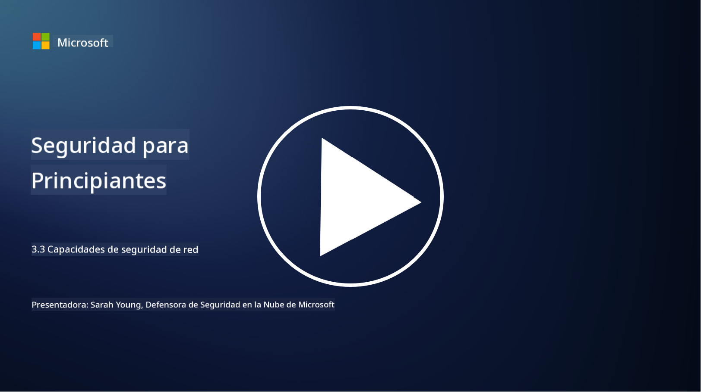

<!--
CO_OP_TRANSLATOR_METADATA:
{
  "original_hash": "c3aba077bb98eebc925dd58d870229ab",
  "translation_date": "2025-09-03T18:19:12+00:00",
  "source_file": "3.3 Network security capabilities.md",
  "language_code": "es"
}
-->
# Capacidades de seguridad de red

En esta lección aprenderemos sobre las siguientes capacidades que se pueden utilizar para proteger una red:

 - Firewalls tradicionales
 - Firewalls de aplicaciones web
 - Grupos de seguridad en la nube
 - CDN
 - Balanceadores de carga
 - Hosts bastión
 - VPNs
 - Protección contra DDoS

## Firewalls tradicionales

Los firewalls tradicionales son dispositivos de seguridad que controlan y monitorean el tráfico de red entrante y saliente según reglas de seguridad predefinidas. Actúan como una barrera entre una red interna confiable y redes externas no confiables, filtrando el tráfico para prevenir accesos no autorizados y posibles amenazas.

## Firewalls de aplicaciones web

Los Firewalls de Aplicaciones Web (WAFs) son firewalls especializados diseñados para proteger aplicaciones web de diversos ataques, como inyección SQL, scripting entre sitios y otras vulnerabilidades. Analizan las solicitudes y respuestas HTTP para identificar y bloquear tráfico malicioso dirigido a aplicaciones web.

## Grupos de seguridad en la nube

Los grupos de seguridad son una característica fundamental de seguridad de red proporcionada por los proveedores de servicios en la nube. Actúan como firewalls virtuales que controlan el tráfico entrante y saliente hacia y desde los recursos en la nube, como máquinas virtuales (VMs) e instancias. Los grupos de seguridad permiten a las organizaciones definir reglas que determinan qué tipos de tráfico están permitidos o denegados, añadiendo una capa adicional de defensa a las implementaciones en la nube.

## Red de entrega de contenido (CDN)

Una Red de Entrega de Contenido es una red distribuida de servidores ubicados en diversas ubicaciones geográficas. Los CDNs ayudan a mejorar el rendimiento y la disponibilidad de los sitios web al almacenar en caché contenido y servirlo desde servidores más cercanos al usuario. También proporcionan cierto nivel de protección contra ataques DDoS al distribuir el tráfico entre múltiples ubicaciones de servidores.

## Balanceadores de carga

Los balanceadores de carga distribuyen el tráfico de red entrante entre múltiples servidores para optimizar la utilización de recursos, garantizar alta disponibilidad y mejorar el rendimiento de las aplicaciones. Ayudan a prevenir la sobrecarga de servidores y mantienen tiempos de respuesta eficientes, mejorando la resiliencia de la red.

## Hosts bastión

Los hosts bastión son servidores altamente seguros y aislados que proporcionan acceso controlado a una red desde una red externa no confiable (como internet). Sirven como puntos de entrada para que los administradores accedan de manera segura a los sistemas internos. Los hosts bastión suelen configurarse con medidas de seguridad robustas para minimizar la superficie de ataque.

## Redes Privadas Virtuales (VPNs)

Las VPNs crean túneles cifrados entre el dispositivo de un usuario y un servidor remoto, asegurando una comunicación segura y privada sobre redes potencialmente inseguras como internet. Las VPNs se utilizan comúnmente para proporcionar acceso remoto a redes internas, permitiendo a los usuarios acceder a recursos como si estuvieran físicamente en la misma red.

## Herramientas de protección contra DDoS

Las herramientas y servicios de protección contra DDoS (Denegación de Servicio Distribuida) están diseñados para mitigar el impacto de los ataques DDoS, donde múltiples dispositivos comprometidos inundan una red o servicio para saturarlo. Las soluciones de protección contra DDoS identifican y filtran el tráfico malicioso, asegurando que el tráfico legítimo pueda llegar a su destino previsto.

## Lecturas adicionales

- [¿Qué es un firewall? - Cisco](https://www.cisco.com/c/en/us/products/security/firewalls/what-is-a-firewall.html#~types-of-firewalls)
- [¿Qué hace realmente un firewall? (howtogeek.com)](https://www.howtogeek.com/144269/htg-explains-what-firewalls-actually-do/)
- [¿Qué es un firewall? Cómo funcionan y tipos de firewalls (kaspersky.com)](https://www.kaspersky.com/resource-center/definitions/firewall)
- [Grupo de seguridad de red - cómo funciona | Microsoft Learn](https://learn.microsoft.com/azure/virtual-network/network-security-group-how-it-works)
- [Introducción a Azure Content Delivery Network (CDN) - Capacitación | Microsoft Learn](https://learn.microsoft.com/training/modules/intro-to-azure-content-delivery-network/?WT.mc_id=academic-96948-sayoung)
- [¿Qué es una red de entrega de contenido (CDN)? - Azure | Microsoft Learn](https://learn.microsoft.com/azure/cdn/cdn-overview?WT.mc_id=academic-96948-sayoung)
- [¿Qué es el balanceo de carga? Cómo funcionan los balanceadores de carga (nginx.com)](https://www.nginx.com/resources/glossary/load-balancing/)
- [Hosts bastión vs. VPNs · Tailscale](https://tailscale.com/learn/bastion-hosts-vs-vpns/)
- [¿Qué es una VPN? Cómo funciona, tipos de VPN (kaspersky.com)](https://www.kaspersky.com/resource-center/definitions/what-is-a-vpn)
- [Introducción a la protección contra DDoS de Azure - Capacitación | Microsoft Learn](https://learn.microsoft.com/training/modules/introduction-azure-ddos-protection/?WT.mc_id=academic-96948-sayoung)
- [¿Qué es un ataque DDoS? | Microsoft Security](https://www.microsoft.com/security/business/security-101/what-is-a-ddos-attack?WT.mc_id=academic-96948-sayoung)

---

**Descargo de responsabilidad**:  
Este documento ha sido traducido utilizando el servicio de traducción automática [Co-op Translator](https://github.com/Azure/co-op-translator). Si bien nos esforzamos por garantizar la precisión, tenga en cuenta que las traducciones automatizadas pueden contener errores o imprecisiones. El documento original en su idioma nativo debe considerarse la fuente autorizada. Para información crítica, se recomienda una traducción profesional realizada por humanos. No nos hacemos responsables de malentendidos o interpretaciones erróneas que puedan surgir del uso de esta traducción.