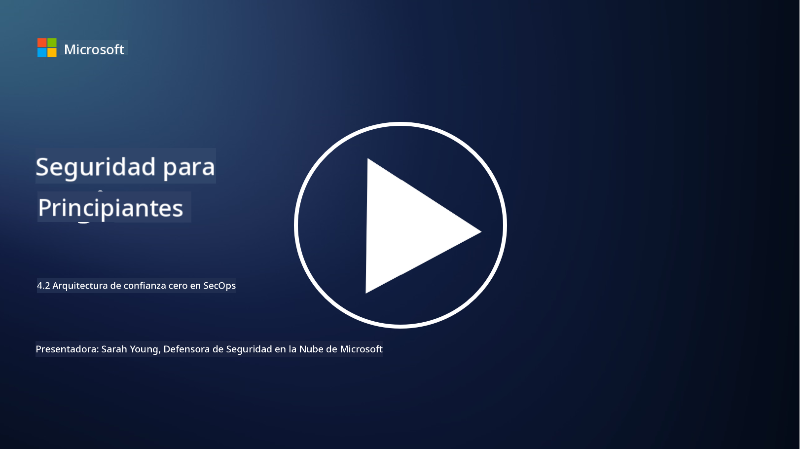

<!--
CO_OP_TRANSLATOR_METADATA:
{
  "original_hash": "45bbdc114e70936816b0b3e7c40189cf",
  "translation_date": "2025-09-03T18:39:44+00:00",
  "source_file": "4.2 SecOps zero trust architecture.md",
  "language_code": "es"
}
-->
# Arquitectura de confianza cero en SecOps

Las operaciones de seguridad forman dos partes de la arquitectura de confianza cero y en esta lección aprenderemos sobre ambas:

- ¿Cómo deben construirse las arquitecturas de TI para permitir la recopilación centralizada de registros?

- ¿Cuáles son las mejores prácticas para las operaciones de seguridad en entornos de TI modernos?

## ¿Cómo deben construirse las arquitecturas de TI para permitir la recopilación centralizada de registros?

La recopilación centralizada de registros es un componente crítico de las operaciones de seguridad modernas. Permite a las organizaciones agregar registros y datos de diversas fuentes, como servidores, aplicaciones, dispositivos de red y herramientas de seguridad, en un repositorio central para análisis, monitoreo y respuesta a incidentes. A continuación, se presentan algunas mejores prácticas para construir arquitecturas de TI que admitan la recopilación centralizada de registros:

1. **Integración de fuentes de registro**:

- Asegúrate de que todos los dispositivos y sistemas relevantes estén configurados para generar registros. Esto incluye servidores, firewalls, routers, switches, aplicaciones y dispositivos de seguridad.

- Configura las fuentes de registro para que envíen los registros a un colector o sistema de gestión centralizado.

2. **Selecciona la herramienta SIEM adecuada (Gestión de Información y Eventos de Seguridad)**:

- Elige una solución SIEM que se alinee con las necesidades y la escala de tu organización.

- Asegúrate de que la solución elegida admita la recopilación, agregación, análisis y generación de informes de registros.

3. **Escalabilidad y redundancia**:

- Diseña la arquitectura para que sea escalable y pueda acomodar un número creciente de fuentes de registro y un mayor volumen de registros.

- Implementa redundancia para garantizar alta disponibilidad y prevenir interrupciones debido a fallos de hardware o red.

4. **Transporte seguro de registros**:

- Utiliza protocolos seguros como TLS/SSL o IPsec para transportar los registros desde las fuentes al repositorio centralizado.

- Implementa controles de autenticación y acceso para garantizar que solo los dispositivos autorizados puedan enviar registros.

5. **Normalización**:

- Estandariza los formatos de registro y normaliza los datos para garantizar consistencia y facilidad de análisis.

6. **Almacenamiento y retención**:

- Determina el período de retención adecuado para los registros según los requisitos de cumplimiento y seguridad.

- Almacena los registros de manera segura, protegiéndolos contra accesos no autorizados y manipulaciones.

## ¿Cuáles son las mejores prácticas para las operaciones de seguridad en entornos de TI modernos?

Además de la recopilación centralizada de registros, aquí hay algunas mejores prácticas para las operaciones de seguridad en entornos de TI modernos:

1. **Monitoreo continuo**: Implementa un monitoreo continuo de las actividades de red y sistemas para detectar y responder a amenazas en tiempo real.

2. **Inteligencia de amenazas**: Mantente informado sobre amenazas y vulnerabilidades emergentes aprovechando servicios y fuentes de inteligencia de amenazas.

3. **Capacitación de usuarios**: Realiza entrenamientos regulares de concienciación en seguridad para los empleados, con el fin de mitigar riesgos asociados con ingeniería social y ataques de phishing.

4. **Plan de respuesta a incidentes**: Desarrolla y prueba un plan de respuesta a incidentes para garantizar una respuesta rápida y efectiva ante incidentes de seguridad.

5. **Automatización de seguridad**: Utiliza herramientas de automatización y orquestación de seguridad para agilizar la respuesta a incidentes y tareas repetitivas.

6. **Respaldo y recuperación**: Implementa soluciones robustas de respaldo y recuperación ante desastres para garantizar la disponibilidad de datos en caso de pérdida de datos o ataques de ransomware.

## Lecturas adicionales

- [Módulo de mejores prácticas de seguridad de Microsoft: Operaciones de seguridad | Microsoft Learn](https://learn.microsoft.com/security/operations/security-operations-videos-and-decks?WT.mc_id=academic-96948-sayoung)
- [Operaciones de seguridad - Marco de adopción en la nube | Microsoft Learn](https://learn.microsoft.com/azure/cloud-adoption-framework/secure/security-operations?WT.mc_id=academic-96948-sayoung)
- [¿Qué es la Arquitectura de Plataforma de Operaciones y Análisis de Seguridad? Una definición de SOAPA, cómo funciona, beneficios y más (digitalguardian.com)](https://www.digitalguardian.com/blog/what-security-operations-and-analytics-platform-architecture-definition-soapa-how-it-works#:~:text=All%20in%20all%2C%20security%20operations%20and%20analytics%20platform,become%20more%20efficient%20and%20operative%20with%20your%20security.)

---

**Descargo de responsabilidad**:  
Este documento ha sido traducido utilizando el servicio de traducción automática [Co-op Translator](https://github.com/Azure/co-op-translator). Aunque nos esforzamos por garantizar la precisión, tenga en cuenta que las traducciones automatizadas pueden contener errores o imprecisiones. El documento original en su idioma nativo debe considerarse como la fuente autorizada. Para información crítica, se recomienda una traducción profesional realizada por humanos. No nos hacemos responsables de malentendidos o interpretaciones erróneas que puedan surgir del uso de esta traducción.