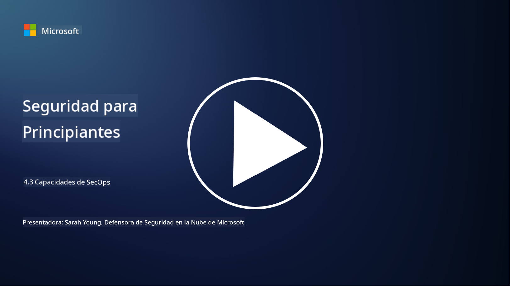

<!--
CO_OP_TRANSLATOR_METADATA:
{
  "original_hash": "553eb694c89f1caca0694e8d8ab89e0e",
  "translation_date": "2025-09-03T18:48:36+00:00",
  "source_file": "4.3 SecOps capabilities.md",
  "language_code": "es"
}
-->
# Capacidades de SecOps

En esta sección, cubriremos más detalles sobre las herramientas y capacidades principales que se pueden utilizar en las operaciones de seguridad.

En esta lección, hablaremos sobre:

- ¿Qué es una herramienta de gestión de información y eventos de seguridad (SIEM)?

- ¿Qué es XDR?

- ¿Qué tipo de capacidades se pueden usar para mejorar las operaciones de seguridad?

## ¿Qué es una herramienta de gestión de información y eventos de seguridad (SIEM)?

Una herramienta de Gestión de Información y Eventos de Seguridad (SIEM, por sus siglas en inglés) se utiliza para proporcionar análisis de alertas de seguridad generadas en todo el entorno de TI de una organización. Estas herramientas recopilan, agregan, correlacionan y analizan datos de registros y eventos de seguridad de diversas fuentes, como dispositivos de red, servidores, aplicaciones y sistemas de seguridad.

Las funciones y capacidades clave de las herramientas SIEM incluyen:

1. **Recopilación de Registros**: Las herramientas SIEM recopilan registros y datos de eventos de seguridad de una amplia gama de dispositivos, sistemas y aplicaciones, incluidos firewalls, sistemas de detección de intrusos, software antivirus y más.

2. **Normalización de Datos**: Normalizan los datos de registro en un formato común para facilitar el análisis y la correlación.

3. **Correlación de Eventos**: Correlacionan eventos para identificar patrones y anomalías que puedan indicar incidentes o amenazas de seguridad.

4. **Alertas y Notificaciones**: Generan alertas y notificaciones en tiempo real cuando se detectan actividades sospechosas o violaciones de seguridad, permitiendo una respuesta inmediata.

5. **Detección de Incidentes**: Facilitan la detección de incidentes de seguridad, como accesos no autorizados, brechas de datos, infecciones de malware y amenazas internas.

6. **Análisis de Comportamiento de Usuarios y Entidades (UEBA)**: Algunas herramientas SIEM incorporan capacidades de UEBA para identificar comportamientos anómalos de usuarios y entidades que puedan indicar cuentas comprometidas o amenazas internas.

7. **Integración de Inteligencia de Amenazas**: Pueden integrarse con fuentes de inteligencia de amenazas para mejorar la detección al comparar indicadores de compromiso (IOCs) conocidos con la actividad de la red.

8. **Automatización y Orquestación**: Las funciones de automatización permiten a los SIEM automatizar respuestas a incidentes de seguridad comunes, reduciendo los tiempos de respuesta y el esfuerzo manual.

9. **Paneles y Visualización**: Ofrecen paneles y herramientas de visualización para monitorear datos de seguridad y crear informes personalizados.

10. **Integración con Otras Herramientas de Seguridad**: A menudo se integran con otras herramientas y tecnologías de seguridad, como soluciones de detección y respuesta en endpoints (EDR), para proporcionar una visión integral de la postura de seguridad de una organización.

## ¿Qué es XDR?

XDR (Detección y Respuesta Extendida, por sus siglas en inglés) es una tecnología que amplía las capacidades de la Detección y Respuesta en Endpoints (EDR) tradicional y las combina con telemetría de seguridad más amplia de diversas fuentes para proporcionar una visión más completa de la postura de seguridad de una organización. XDR busca mejorar la detección de amenazas, la respuesta a incidentes y la seguridad general al abordar las limitaciones de depender únicamente de EDR, SIEM u otras herramientas de seguridad individuales.

Las características y componentes clave de XDR incluyen:

1. **Integración de Datos**: XDR integra datos de múltiples fuentes, incluidos endpoints, tráfico de red, servicios en la nube, correo electrónico y más. Esta agregación de datos proporciona un contexto más amplio para la detección y el análisis de amenazas.

2. **Análisis Avanzado**: Utiliza análisis avanzados, aprendizaje automático y análisis de comportamiento para identificar y priorizar amenazas de seguridad. Busca patrones y anomalías en los datos integrados para detectar amenazas conocidas y desconocidas.

3. **Detección Automática de Amenazas**: Automatiza la detección de amenazas y anomalías al correlacionar información de diversas fuentes. Puede identificar cadenas de ataque complejas que abarcan múltiples vectores.

4. **Investigación y Respuesta a Incidentes**: Proporciona herramientas para la investigación y respuesta a incidentes, ayudando a los equipos de seguridad a evaluar rápidamente el alcance y el impacto de los incidentes y tomar las acciones correctivas adecuadas.

5. **Integración de Inteligencia de Amenazas**: Integra fuentes de inteligencia de amenazas para mejorar la detección al comparar indicadores de compromiso (IOCs) conocidos con la actividad de la red y los endpoints de la organización.

6. **Consola Unificada**: Ofrece una consola o panel unificado donde los equipos de seguridad pueden ver y gestionar alertas e incidentes de seguridad de diferentes fuentes de manera centralizada.

7. **Cobertura Multiplataforma**: Las soluciones XDR abarcan una amplia gama de plataformas, incluidos endpoints, servidores, entornos en la nube y dispositivos móviles, lo que las hace adecuadas para entornos de TI modernos y multiplataforma.

## ¿Qué tipo de capacidades se pueden usar para mejorar las operaciones de seguridad?

Para mejorar las operaciones de seguridad, las organizaciones pueden aprovechar varias capacidades además de las herramientas SIEM:

1. **Aprendizaje Automático e Inteligencia Artificial**: Implementar análisis avanzados, aprendizaje automático e IA para detectar amenazas en evolución y automatizar la búsqueda de amenazas.

2. **Análisis de Comportamiento de Usuarios y Entidades (UEBA)**: Analizar el comportamiento de usuarios y entidades para detectar anomalías y amenazas internas.

3. **Fuentes de Inteligencia de Amenazas**: Integrar fuentes de inteligencia de amenazas para mantenerse actualizado sobre las últimas amenazas e indicadores de compromiso.

4. **Orquestación, Automatización y Respuesta de Seguridad (SOAR)**: Implementar plataformas SOAR para automatizar la respuesta a incidentes y optimizar los flujos de trabajo de las operaciones de seguridad.

5. **Tecnologías de Decepción**: Desplegar tecnologías de decepción para confundir y detectar atacantes dentro de la red.

## Lecturas adicionales

- [What is SIEM? | Microsoft Security](https://www.microsoft.com/security/business/security-101/what-is-siem?WT.mc_id=academic-96948-sayoung)
- [What Is SIEM? - Security Information and Event Management - Cisco](https://www.cisco.com/c/en/us/products/security/what-is-siem.html)
- [Security information and event management - Wikipedia](https://en.wikipedia.org/wiki/Security_information_and_event_management)
- [What Is XDR? | Microsoft Security](https://www.microsoft.com/security/business/security-101/what-is-xdr?WT.mc_id=academic-96948-sayoung)
- [XDR & XDR Security (kaspersky.com.au)](https://www.kaspersky.com.au/resource-center/definitions/what-is-xdr)
- [The Power of SecOps: Redefining Core Security Capabilities - The New Stack](https://thenewstack.io/the-power-of-secops-redefining-core-security-capabilities/)
- [Seven Steps to Improve Your Security Operations and Response (securityintelligence.com)](https://securityintelligence.com/seven-steps-to-improve-your-security-operations-and-response/)

---

**Descargo de responsabilidad**:  
Este documento ha sido traducido utilizando el servicio de traducción automática [Co-op Translator](https://github.com/Azure/co-op-translator). Si bien nos esforzamos por lograr precisión, tenga en cuenta que las traducciones automáticas pueden contener errores o imprecisiones. El documento original en su idioma nativo debe considerarse como la fuente autorizada. Para información crítica, se recomienda una traducción profesional realizada por humanos. No nos hacemos responsables de malentendidos o interpretaciones erróneas que puedan surgir del uso de esta traducción.