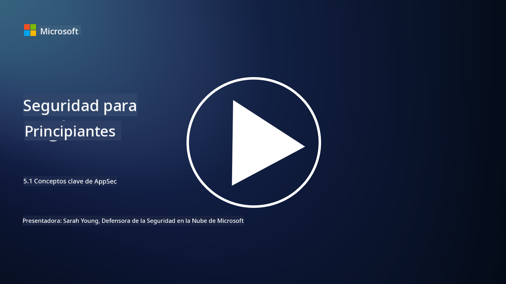

<!--
CO_OP_TRANSLATOR_METADATA:
{
  "original_hash": "e4b56bb23078d3ffb7ad407d280b0c36",
  "translation_date": "2025-09-03T18:36:14+00:00",
  "source_file": "5.1 AppSec key concepts.md",
  "language_code": "es"
}
-->
# Conceptos clave de AppSec

La seguridad de aplicaciones es una especialización en sí misma. En esta parte del curso, profundizaremos más en la seguridad de aplicaciones.

## Introducción

En esta lección, cubriremos:

- ¿Qué es la seguridad de aplicaciones?

- ¿Cuáles son los conceptos/principios clave de la seguridad de aplicaciones?

## ¿Qué es la seguridad de aplicaciones?

La seguridad de aplicaciones, a menudo abreviada como "AppSec," se refiere a la práctica de proteger las aplicaciones de software contra amenazas, vulnerabilidades y ataques de seguridad. Incluye los procesos, técnicas y herramientas utilizadas para identificar, mitigar y prevenir riesgos de seguridad a lo largo del ciclo de vida de desarrollo, implementación y mantenimiento de una aplicación.

La seguridad de aplicaciones es fundamental porque las aplicaciones son objetivos comunes de los ciberataques. Los actores maliciosos explotan vulnerabilidades y debilidades en el software para obtener acceso no autorizado, robar datos, interrumpir servicios o ejecutar otras actividades maliciosas. Una seguridad de aplicaciones efectiva ayuda a garantizar la confidencialidad, integridad y disponibilidad de una aplicación y sus datos asociados.

## ¿Cuáles son los conceptos/principios clave de la seguridad de aplicaciones?

Los conceptos y principios clave que sustentan la seguridad de aplicaciones incluyen:

1. **Seguro por diseño**:

- La seguridad debe integrarse en el diseño y la arquitectura de la aplicación desde el principio, en lugar de añadirse como una idea posterior.

2. **Validación de entradas**:

- Todas las entradas de los usuarios deben validarse para garantizar que cumplen con los formatos esperados y están libres de código o datos maliciosos.

3. **Codificación de salidas**:

- Los datos enviados al cliente deben codificarse adecuadamente para prevenir vulnerabilidades como el cross-site scripting (XSS).

4. **Autenticación y autorización**:

- Autenticar a los usuarios y autorizar su acceso a recursos según sus roles y permisos.

5. **Protección de datos**:

- Los datos sensibles deben cifrarse cuando se almacenan, transmiten y procesan para evitar accesos no autorizados.

6. **Gestión de sesiones**:

- Una gestión segura de sesiones garantiza que las sesiones de los usuarios estén protegidas contra secuestros y accesos no autorizados.

7. **Dependencias seguras**:

- Mantener todas las dependencias de software actualizadas con parches de seguridad para prevenir vulnerabilidades.

8. **Manejo de errores y registro**:

- Implementar un manejo de errores seguro para evitar revelar información sensible y garantizar prácticas seguras de registro.

9. **Pruebas de seguridad**:

- Probar regularmente las aplicaciones en busca de vulnerabilidades utilizando métodos como pruebas de penetración, revisiones de código y herramientas de escaneo automatizadas.

10. **Ciclo de vida de desarrollo de software seguro (SDLC)**:

- Integrar prácticas de seguridad en cada fase del ciclo de vida de desarrollo de software, desde los requisitos hasta la implementación y el mantenimiento.

## Lecturas adicionales

- [SheHacksPurple: ¿Qué es la seguridad de aplicaciones? - YouTube](https://www.youtube.com/watch?v=eNmccQNzSSY)
- [¿Qué es la seguridad de aplicaciones? - Cisco](https://www.cisco.com/c/en/us/solutions/security/application-first-security/what-is-application-security.html#~how-does-it-work)
- [¿Qué es la seguridad de aplicaciones? Un proceso y herramientas para proteger software | CSO Online](https://www.csoonline.com/article/566471/what-is-application-security-a-process-and-tools-for-securing-software.html)
- [OWASP Cheat Sheet Series | OWASP Foundation](https://owasp.org/www-project-cheat-sheets/)

---

**Descargo de responsabilidad**:  
Este documento ha sido traducido utilizando el servicio de traducción automática [Co-op Translator](https://github.com/Azure/co-op-translator). Aunque nos esforzamos por garantizar la precisión, tenga en cuenta que las traducciones automatizadas pueden contener errores o imprecisiones. El documento original en su idioma nativo debe considerarse como la fuente autorizada. Para información crítica, se recomienda una traducción profesional realizada por humanos. No nos hacemos responsables de malentendidos o interpretaciones erróneas que puedan surgir del uso de esta traducción.