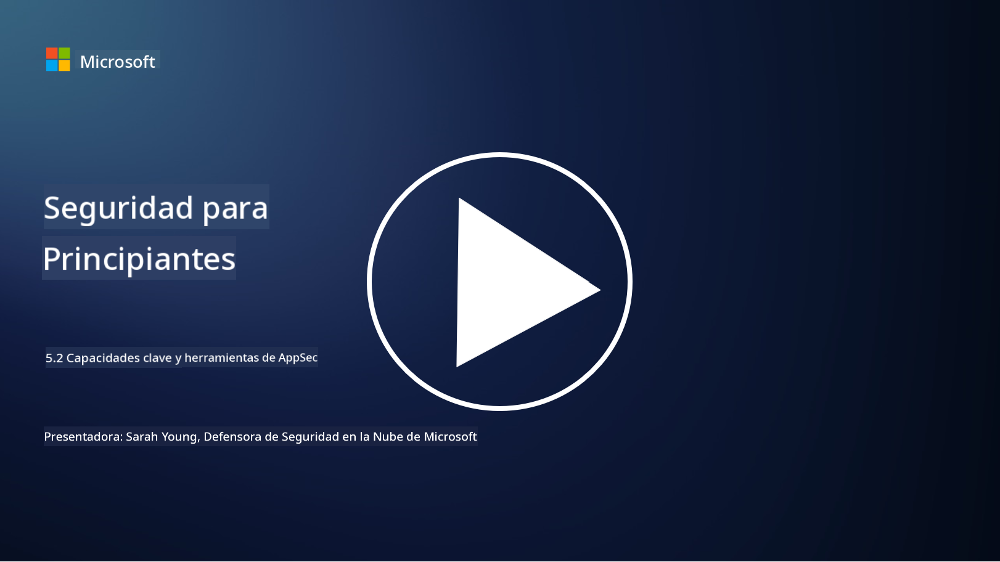

<!--
CO_OP_TRANSLATOR_METADATA:
{
  "original_hash": "790a3fa7e535ec60bb51bde13e759781",
  "translation_date": "2025-09-03T18:41:19+00:00",
  "source_file": "5.2 AppSec key capabilities.md",
  "language_code": "es"
}
-->
En esta sección, cubriremos más detalles sobre las herramientas y capacidades principales que se utilizan en la seguridad de aplicaciones:

## Introducción

En esta lección, cubriremos cuáles son las capacidades y herramientas clave que se utilizan en la seguridad de aplicaciones.

## Capacidades y herramientas clave de AppSec

Las capacidades y herramientas clave utilizadas en la seguridad de aplicaciones son esenciales para identificar, mitigar y prevenir vulnerabilidades y amenazas de seguridad en aplicaciones de software. Aquí están algunas de las más importantes:

**1. Pruebas de Seguridad de Aplicaciones Estáticas (SAST)**:

- **Capacidades**: Analiza el código fuente, bytecode o código binario para identificar vulnerabilidades de seguridad en la base de código de la aplicación.

- **Herramientas**: Ejemplos incluyen Fortify, Checkmarx y Veracode.

**2. Pruebas de Seguridad de Aplicaciones Dinámicas (DAST)**:

- **Capacidades**: Escanea una aplicación en ejecución para identificar vulnerabilidades enviando solicitudes de entrada y analizando las respuestas.

- **Herramientas**: Ejemplos incluyen ZAP, Burp Suite y Qualys Web Application Scanning.

**3. Pruebas de Seguridad de Aplicaciones Interactivas (IAST)**:

- **Capacidades**: Combina elementos de SAST y DAST para analizar el código durante la ejecución, proporcionando resultados más precisos y reduciendo falsos positivos.

- **Herramientas**: Ejemplos incluyen Contrast Security y HCL AppScan.

**4. Protección de Aplicaciones en Tiempo de Ejecución (RASP)**:

- **Capacidades**: Monitorea y protege aplicaciones en tiempo real, detectando y respondiendo a amenazas de seguridad a medida que ocurren.

- **Herramientas**: Ejemplos incluyen Veracode Runtime Protection y F5 Advanced WAF con RASP.

**5. Firewalls de Aplicaciones Web (WAFs)**:

- **Capacidades**: Proporciona una capa protectora entre la aplicación y el internet, filtrando el tráfico entrante y bloqueando solicitudes maliciosas.

- **Herramientas**: Ejemplos incluyen ModSecurity, AWS WAF y Akamai Kona Site Defender.

**6. Escaneo de Dependencias**:

- **Capacidades**: Identifica vulnerabilidades en bibliotecas y componentes de terceros utilizados en la aplicación.

- **Herramientas**: Ejemplos incluyen OWASP Dependency-Check y Snyk.

**7. Pruebas de Penetración (Pen Testing)**:

- **Capacidades**: Simula ataques reales para descubrir vulnerabilidades y evaluar la seguridad de una aplicación.

- **Herramientas**: Realizadas por hackers éticos certificados y profesionales de seguridad utilizando diversas herramientas como Metasploit y Nmap.

**8. Escaneo y Análisis de Seguridad**:

- **Capacidades**: Escanea en busca de vulnerabilidades conocidas, errores de configuración y configuraciones de seguridad incorrectas.

- **Herramientas**: Ejemplos incluyen Nessus, Qualys Vulnerability Management y OpenVAS.

**9. Herramientas de Seguridad para Contenedores**:

- **Capacidades**: Se centran en asegurar aplicaciones contenedorizadas y sus entornos.

- **Herramientas**: Ejemplos incluyen Docker Security Scanning y Aqua Security.

**10. Capacitación en Desarrollo Seguro**:

- **Capacidades**: Proporciona programas de capacitación y concienciación para los equipos de desarrollo para fomentar prácticas de codificación segura.

- **Herramientas**: Programas de capacitación personalizados y plataformas.

**11. Marcos de Pruebas de Seguridad**:

- **Capacidades**: Proporciona marcos de pruebas integrales para diferentes necesidades de pruebas de seguridad de aplicaciones.

- **Herramientas**: OWASP Amass, OWASP OWTF y FrAppSec.

**12. Herramientas de Revisión de Código Seguro**:

- **Capacidades**: Revisa el código fuente en busca de vulnerabilidades de seguridad y mejores prácticas de codificación.

- **Herramientas**: Ejemplos incluyen SonarQube y Checkmarx.

**13. Herramientas para APIs y Microservicios Seguros**:

- **Capacidades**: Se centran en asegurar APIs y microservicios, incluyendo autenticación, autorización y protección de datos.

- **Herramientas**: Ejemplos incluyen Apigee, AWS API Gateway e Istio.

## Lecturas adicionales

- [¿Qué es la seguridad de aplicaciones? Conceptos, herramientas y mejores prácticas | HackerOne](https://www.hackerone.com/knowledge-center/what-application-security-concepts-tools-best-practices)
- [¿Qué es IAST? (Pruebas de Seguridad de Aplicaciones Interactivas) (comparitech.com)](https://www.comparitech.com/net-admin/what-is-iast/)
- [10 tipos de herramientas de pruebas de seguridad de aplicaciones: cuándo y cómo usarlas (cmu.edu)](https://insights.sei.cmu.edu/blog/10-types-of-application-security-testing-tools-when-and-how-to-use-them/)
- [Equilibrando el riesgo de ciberseguridad: principios y enfoques para seguridad por diseño y por defecto | Cyber.gov.au](https://www.cyber.gov.au/about-us/view-all-content/publications/principles-and-approaches-for-security-by-design-and-default)

---

**Descargo de responsabilidad**:  
Este documento ha sido traducido utilizando el servicio de traducción automática [Co-op Translator](https://github.com/Azure/co-op-translator). Si bien nos esforzamos por lograr precisión, tenga en cuenta que las traducciones automáticas pueden contener errores o imprecisiones. El documento original en su idioma nativo debe considerarse como la fuente autorizada. Para información crítica, se recomienda una traducción profesional realizada por humanos. No nos hacemos responsables de malentendidos o interpretaciones erróneas que puedan surgir del uso de esta traducción.