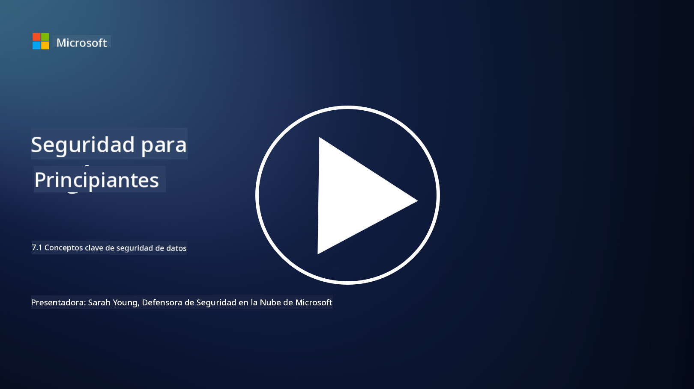

<!--
CO_OP_TRANSLATOR_METADATA:
{
  "original_hash": "9703868f41dcddd5a98dea9ea6fcd94d",
  "translation_date": "2025-09-03T18:25:58+00:00",
  "source_file": "7.1 Data security key concepts.md",
  "language_code": "es"
}
-->
# Conceptos clave de seguridad de datos

Hemos mencionado la seguridad de datos y la hemos abordado varias veces en este curso. Ahora, profundicemos en este tema. En esta lección aprenderás:

- ¿Qué es la seguridad de datos?

- ¿Qué es la clasificación de datos?

- ¿Qué es la gestión del ciclo de vida de los datos?

- ¿Qué es la prevención de pérdida de datos (DLP)?

- ¿Por qué es importante la seguridad de datos para una organización?

## ¿Qué es la seguridad de datos?

**Seguridad de datos** se refiere a la práctica de proteger datos digitales, como bases de datos, archivos e información sensible, contra el acceso no autorizado, divulgación, alteración o destrucción. El objetivo principal de la seguridad de datos es garantizar la confidencialidad, integridad y disponibilidad de los datos. Esto implica implementar una combinación de medidas de seguridad técnicas, administrativas y físicas para proteger los datos frente a diversas amenazas y vulnerabilidades, incluidos ciberataques, amenazas internas y brechas de seguridad. Las medidas de seguridad de datos pueden incluir cifrado, controles de acceso, autenticación, registros de auditoría y políticas de seguridad.

## ¿Qué es la clasificación de datos?

**Clasificación de datos** es el proceso de categorizar los datos según su sensibilidad, valor e importancia para una organización. El propósito de la clasificación de datos es ayudar a las organizaciones a identificar y priorizar la protección y el manejo de diferentes tipos de datos. Las categorías comunes de clasificación de datos incluyen "público", "interno", "confidencial" y "restringido" o "altamente confidencial". Una vez que los datos están clasificados, las organizaciones pueden aplicar controles de seguridad y restricciones de acceso apropiados para garantizar que los datos sensibles estén adecuadamente protegidos y que se cumplan los requisitos regulatorios.

## ¿Qué es la gestión del ciclo de vida de los datos?

**Gestión del ciclo de vida de los datos** es un enfoque estructurado para gestionar los datos a lo largo de todo su ciclo de vida, desde su creación o adquisición hasta su archivo o eliminación. El ciclo de vida de los datos generalmente consta de etapas como creación, almacenamiento, procesamiento, transmisión, archivo y eliminación. La gestión del ciclo de vida de los datos implica definir políticas y procedimientos para cada etapa del ciclo de vida de los datos, incluyendo retención de datos, controles de acceso, copias de seguridad y limpieza de datos. Una gestión efectiva del ciclo de vida de los datos ayuda a las organizaciones a optimizar el almacenamiento de datos, mejorar la calidad de los datos y garantizar el cumplimiento de las regulaciones de protección de datos.

## ¿Qué es la prevención de pérdida de datos (DLP)?

**Prevención de pérdida de datos (DLP)** se refiere a un conjunto de tecnologías, políticas y prácticas diseñadas para evitar el acceso no autorizado, el intercambio o la filtración de datos sensibles o confidenciales. Las soluciones DLP utilizan inspección de contenido y análisis contextual para monitorear y controlar los datos en movimiento (por ejemplo, correos electrónicos, tráfico web), los datos en reposo (por ejemplo, archivos almacenados y bases de datos) y los datos en uso (por ejemplo, datos que están siendo accedidos o manipulados por usuarios). DLP tiene como objetivo identificar y bloquear o cifrar datos sensibles para prevenir brechas de seguridad, cumplir con las regulaciones de protección de datos y proteger la reputación de una organización.

## ¿Por qué es importante la seguridad de datos para una organización?

La seguridad de datos es fundamental para las organizaciones por varias razones:

- **Protección de información sensible**: Las organizaciones suelen almacenar datos sensibles, como registros de clientes, propiedad intelectual, datos financieros e información de empleados. La seguridad de datos protege esta información sensible contra el acceso no autorizado o el robo.

- **Cumplimiento**: Muchas industrias y jurisdicciones tienen regulaciones estrictas de protección y privacidad de datos. La seguridad de datos ayuda a las organizaciones a cumplir con estas leyes, evitando sanciones legales y daños a la reputación.

- **Prevención de brechas de seguridad**: Las brechas de seguridad pueden resultar en pérdidas financieras, daño a la reputación y consecuencias legales. Las medidas efectivas de seguridad de datos ayudan a prevenir brechas de seguridad o limitar su impacto.

- **Preservación de la confianza**: Los clientes y las partes interesadas confían en las organizaciones con sus datos. Las brechas de seguridad erosionan esa confianza. Mantener una sólida seguridad de datos ayuda a preservar la confianza y la confianza de los clientes.

- **Ventaja competitiva**: Demostrar un compromiso con la seguridad de datos puede ser una ventaja competitiva. Los clientes y socios son más propensos a trabajar con organizaciones que toman en serio la seguridad de datos.

- **Continuidad operativa**: Las medidas de seguridad de datos, incluidas las copias de seguridad de datos y la planificación de recuperación ante desastres, ayudan a garantizar la disponibilidad de datos críticos y la continuidad del negocio en caso de pérdida de datos o desastres.

- **Protección contra amenazas internas**: Las medidas de seguridad de datos también abordan amenazas dentro de la organización, incluyendo la exposición accidental de datos por parte de empleados y acciones maliciosas de personas internas.

En resumen, la seguridad de datos es esencial para proteger información sensible, cumplir con regulaciones, prevenir brechas de seguridad, preservar la confianza y garantizar el éxito continuo y la reputación de una organización.

## Lecturas adicionales

- [What Is Data Security? | Microsoft Security](https://www.microsoft.com/en-au/security/business/security-101/what-is-data-security?WT.mc_id=academic-96948-sayoung)
- [Automatically Classify & Protect Documents & Data | Microsoft Purview Information Protection](https://youtu.be/v8LqmzBUaOo)
- [Example data classification policy](https://www.cmu.edu/data/guidelines/data-classification.html)
- [What is Data Security? Data Security Definition and Overview | IBM](https://www.ibm.com/topics/data-security)
- [Data Lifecycle Management: A 2023 Guide for Your Business (cloudwards.net)](https://www.cloudwards.net/data-lifecycle-management/)
- [What is data loss prevention (DLP)? | Microsoft Security](https://www.microsoft.com/security/business/security-101/what-is-data-loss-prevention-dlp?WT.mc_id=academic-96948-sayoung)
- [What is DLP? How data loss prevention software works and why you need it | CSO Online](https://www.csoonline.com/article/569559/what-is-dlp-how-data-loss-prevention-software-works-and-why-you-need-it.html)

---

**Descargo de responsabilidad**:  
Este documento ha sido traducido utilizando el servicio de traducción automática [Co-op Translator](https://github.com/Azure/co-op-translator). Si bien nos esforzamos por garantizar la precisión, tenga en cuenta que las traducciones automatizadas pueden contener errores o imprecisiones. El documento original en su idioma nativo debe considerarse como la fuente autorizada. Para información crítica, se recomienda una traducción profesional realizada por humanos. No nos hacemos responsables de malentendidos o interpretaciones erróneas que puedan surgir del uso de esta traducción.