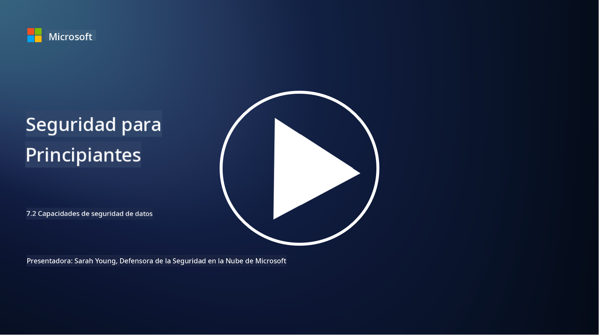

<!--
CO_OP_TRANSLATOR_METADATA:
{
  "original_hash": "50697add9758e54693442d502d2d5f8a",
  "translation_date": "2025-09-03T18:42:52+00:00",
  "source_file": "7.2 Data security capabilities.md",
  "language_code": "es"
}
-->
# Capacidades de seguridad de datos

En esta sección, cubriremos más detalles sobre las herramientas y capacidades principales que se utilizan en la seguridad de datos:

**Introducción**

En esta lección, cubriremos:

- ¿Qué es el conjunto de herramientas para la prevención de pérdida de datos?

- ¿Qué es el conjunto de herramientas para la gestión de riesgos internos?

- ¿Qué herramientas de retención de datos están disponibles?

## ¿Qué es el conjunto de herramientas para la prevención de pérdida de datos?

Las herramientas de Prevención de Pérdida de Datos (DLP, por sus siglas en inglés) se refieren a un conjunto de soluciones de software y tecnologías diseñadas para prevenir el acceso no autorizado, el intercambio o la filtración de datos sensibles o confidenciales dentro de una organización. Estas herramientas utilizan inspección de contenido, aplicación de políticas y monitoreo para identificar y proteger datos sensibles de ser expuestos o mal utilizados. Ejemplos de productos DLP incluyen: Symantec Data Loss Prevention, McAfee Total Protection for Data Loss Prevention, Microsoft 365 DLP**: Se integra con las aplicaciones de Microsoft 365 para ayudar a las organizaciones a identificar y proteger datos sensibles en correos electrónicos, documentos y mensajes.

## ¿Qué es el conjunto de herramientas para la gestión de riesgos internos?

Las herramientas de Gestión de Riesgos Internos ayudan a las organizaciones a identificar y mitigar riesgos planteados por empleados, contratistas o socios que puedan comprometer la seguridad de los datos de manera intencional o no intencional. Estas herramientas monitorean el comportamiento de los usuarios, los patrones de acceso y el uso de datos para detectar actividades sospechosas y posibles amenazas internas. Ejemplos de productos de gestión de riesgos internos incluyen: Microsoft Insider Risk Management (parte de Microsoft 365), Forcepoint Insider Threat Data Protection, Varonis Insider Threat Detection.

## ¿Qué herramientas de retención de datos están disponibles?

Las herramientas de retención de datos incluyen software y soluciones diseñadas para gestionar la retención y eliminación de datos de acuerdo con las políticas de retención de datos y los requisitos legales de una organización. Estas herramientas ayudan a automatizar el proceso de retener datos durante períodos específicos y eliminarlos de forma segura cuando ya no son necesarios. Ejemplos de productos de retención de datos incluyen: Veritas Enterprise Vault, Commvault Complete Data Protection, Microsoft data lifecycle management. Estas soluciones ayudan a las organizaciones a mantener el control sobre la retención y eliminación de datos, asegurando el cumplimiento de las regulaciones de protección de datos mientras gestionan eficientemente los datos a lo largo de su ciclo de vida.

## Lecturas adicionales

- [Guía para la Gestión de Postura de Seguridad de Datos (DSPM) | CSA (cloudsecurityalliance.org)](https://cloudsecurityalliance.org/blog/2023/03/31/the-big-guide-to-data-security-posture-management-dspm/)
- [Prevención de Pérdida de Datos en dispositivos, aplicaciones y servicios | Microsoft Purview](https://youtu.be/hvqq8L_0kgI)
- [18 Mejores Herramientas de Software para la Prevención de Pérdida de Datos 2023 (Gratis + Pagadas) (comparitech.com)](https://www.comparitech.com/data-privacy-management/data-loss-prevention-tools-software/)
- [Prevención de Pérdida de Datos (nist.gov)](https://tsapps.nist.gov/publication/get_pdf.cfm?pub_id=904672)
- [Aprende sobre la gestión de riesgos internos | Microsoft Learn](https://learn.microsoft.com/purview/insider-risk-management?WT.mc_id=academic-96948-sayoung)
- [Gestión del Ciclo de Vida de los Datos | IBM](https://www.ibm.com/topics/data-lifecycle-management)
- [¿Qué es la Gestión del Ciclo de Vida de los Datos (DLM)? | Mejores Prácticas 2023 (selecthub.com)](https://www.selecthub.com/big-data-analytics/data-lifecycle-management/)

---

**Descargo de responsabilidad**:  
Este documento ha sido traducido utilizando el servicio de traducción automática [Co-op Translator](https://github.com/Azure/co-op-translator). Si bien nos esforzamos por lograr precisión, tenga en cuenta que las traducciones automáticas pueden contener errores o imprecisiones. El documento original en su idioma nativo debe considerarse como la fuente autorizada. Para información crítica, se recomienda una traducción profesional realizada por humanos. No nos hacemos responsables de malentendidos o interpretaciones erróneas que puedan surgir del uso de esta traducción.