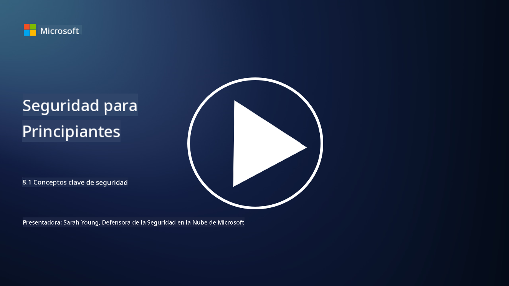

<!--
CO_OP_TRANSLATOR_METADATA:
{
  "original_hash": "66b61d96936cf25d20fcb411d4ce5227",
  "translation_date": "2025-09-03T18:06:15+00:00",
  "source_file": "8.1 AI security key concepts.md",
  "language_code": "es"
}
-->
# Conceptos clave de seguridad en IA

## ¿En qué se diferencia la seguridad en IA de la ciberseguridad tradicional?

Asegurar sistemas de IA presenta desafíos únicos en comparación con la ciberseguridad tradicional, principalmente debido a la naturaleza de las capacidades de aprendizaje y los procesos de toma de decisiones de la IA. Estas son algunas diferencias clave:

-   **Integridad de los datos**: Los sistemas de IA dependen en gran medida de los datos para aprender. Garantizar la integridad de estos datos es crucial, ya que los atacantes pueden manipularlos para influir en el comportamiento de la IA, una táctica conocida como envenenamiento de datos.
-   **Seguridad del modelo**: El modelo de toma de decisiones de la IA en sí mismo puede ser un objetivo. Los atacantes pueden intentar invertir el diseño del modelo o explotar sus debilidades para provocar decisiones incorrectas o dañinas.
-   **Ataques adversariales**: Los sistemas de IA pueden ser vulnerables a ataques adversariales, donde pequeñas alteraciones, a menudo imperceptibles, en los datos de entrada pueden hacer que la IA cometa errores o realice predicciones incorrectas.
-   **Seguridad de la infraestructura**: Aunque la ciberseguridad tradicional también se centra en proteger la infraestructura, los sistemas de IA pueden tener capas adicionales de complejidad, como servicios en la nube o hardware especializado, que requieren medidas de seguridad específicas.
-   **Consideraciones éticas**: El uso de IA en seguridad plantea consideraciones éticas, como preocupaciones sobre la privacidad y el potencial sesgo en la toma de decisiones, que deben abordarse en la estrategia de seguridad.

En general, asegurar sistemas de IA requiere un enfoque diferente que considere los aspectos únicos de la tecnología de IA, incluyendo la protección de datos, modelos y el proceso de aprendizaje de la IA, al mismo tiempo que se abordan las implicaciones éticas de su implementación.

La seguridad en IA y la ciberseguridad tradicional comparten muchas similitudes, pero también tienen diferencias distintivas debido a las características y capacidades únicas de los sistemas de inteligencia artificial. Estas son algunas de las diferencias:

- **Complejidad de las amenazas**: Los sistemas de IA introducen nuevas capas de complejidad en la ciberseguridad. La ciberseguridad tradicional se ocupa principalmente de amenazas como malware, ataques de phishing e intrusiones en redes. Sin embargo, los sistemas de IA pueden ser vulnerables a ataques como ataques adversariales, envenenamiento de datos y evasión de modelos, que apuntan específicamente a los algoritmos de aprendizaje automático.
  
- **Superficie de ataque**: Los sistemas de IA a menudo tienen superficies de ataque más amplias en comparación con los sistemas tradicionales. Esto se debe a que no solo dependen del software, sino también de los datos y los modelos. Los atacantes pueden dirigirse a los datos de entrenamiento, manipular modelos o explotar vulnerabilidades en los propios algoritmos.

- **Adaptabilidad de las amenazas**: Los sistemas de IA pueden adaptarse y aprender de su entorno, lo que puede hacerlos más susceptibles a amenazas adaptativas y en evolución. Las medidas de ciberseguridad tradicionales pueden no ser suficientes para defenderse de ataques que evolucionan constantemente en función del comportamiento del sistema de IA.

- **Interpretabilidad y explicabilidad**: Comprender por qué un sistema de IA tomó una decisión particular suele ser más desafiante en comparación con los sistemas de software tradicionales. Esta falta de interpretabilidad y explicabilidad puede dificultar la detección y mitigación efectiva de ataques en sistemas de IA.

- **Preocupaciones sobre la privacidad de los datos**: Los sistemas de IA a menudo dependen de grandes cantidades de datos, lo que puede introducir riesgos de privacidad si no se manejan adecuadamente. Las medidas de ciberseguridad tradicionales pueden no abordar adecuadamente estas preocupaciones específicas de privacidad en sistemas de IA.

- **Cumplimiento normativo**: El panorama regulatorio para la seguridad en IA aún está evolucionando, con regulaciones y estándares específicos que surgen para abordar los desafíos únicos que presentan los sistemas de IA. Los marcos de ciberseguridad tradicionales pueden necesitar ser ampliados o adaptados para garantizar el cumplimiento de estas nuevas regulaciones.

- **Consideraciones éticas**: La seguridad en IA no solo implica proteger los sistemas contra ataques maliciosos, sino también garantizar que los sistemas de IA se utilicen de manera ética y responsable. Esto incluye consideraciones como equidad, transparencia y responsabilidad, que pueden no ser tan prominentes en la ciberseguridad tradicional.

## ¿En qué se parece la seguridad en IA a la seguridad de los sistemas de TI tradicionales?

Asegurar sistemas de IA comparte varios principios fundamentales con la ciberseguridad tradicional:

-   **Protección contra amenazas**: Tanto los sistemas de IA como los tradicionales deben protegerse contra accesos no autorizados, modificaciones de datos y destrucción, así como contra otras amenazas comunes.
-   **Gestión de vulnerabilidades**: Muchas vulnerabilidades que afectan a los sistemas tradicionales, como errores de software o configuraciones incorrectas, también pueden impactar a los sistemas de IA.
-   **Seguridad de los datos**: La protección de los datos procesados es crucial en ambos dominios para prevenir violaciones de datos y garantizar la confidencialidad.
-   **Seguridad de la cadena de suministro**: Ambos tipos de sistemas son susceptibles a ataques en la cadena de suministro, donde un componente comprometido puede poner en riesgo la seguridad de todo el sistema.

Estas similitudes destacan que, aunque los sistemas de IA introducen nuevos desafíos de seguridad, también requieren la aplicación de prácticas de ciberseguridad establecidas para garantizar una protección sólida. Es una combinación de aprovechar la sabiduría de la seguridad tradicional mientras se adapta a los aspectos únicos de la tecnología de IA.

## Lecturas adicionales

- [Not with a Bug, But with a Sticker [Book] (oreilly.com)](https://www.oreilly.com/library/view/not-with-a/9781119883982/)
   
- [Intro to AI Security Part 1: AI Security 101 | by HarrietHacks | Medium](https://medium.com/@harrietfarlow/intro-to-ai-security-part-1-ai-security-101-b8662a9efe5)
   
- [Best practices for AI security risk management | Microsoft Security Blog](https://www.microsoft.com/en-us/security/blog/2021/12/09/best-practices-for-ai-security-risk-management/?WT.mc_id=academic-96948-sayoung)
   
- [OWASP AI Security and Privacy Guide | OWASP Foundation](https://owasp.org/www-project-ai-security-and-privacy-guide/)

---

**Descargo de responsabilidad**:  
Este documento ha sido traducido utilizando el servicio de traducción automática [Co-op Translator](https://github.com/Azure/co-op-translator). Aunque nos esforzamos por garantizar la precisión, tenga en cuenta que las traducciones automatizadas pueden contener errores o imprecisiones. El documento original en su idioma nativo debe considerarse como la fuente autorizada. Para información crítica, se recomienda una traducción profesional realizada por humanos. No nos hacemos responsables de malentendidos o interpretaciones erróneas que puedan surgir del uso de esta traducción.