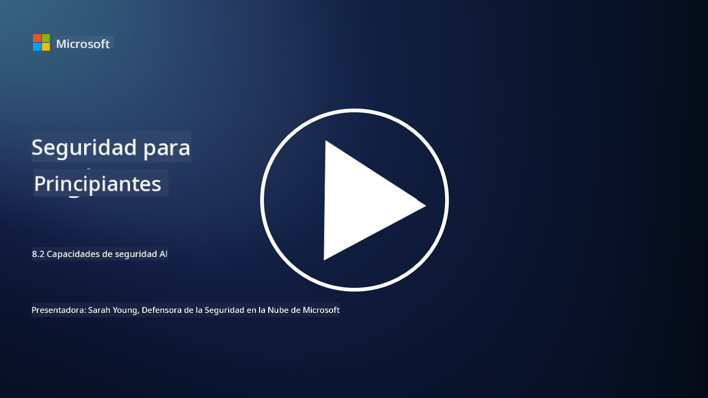

<!--
CO_OP_TRANSLATOR_METADATA:
{
  "original_hash": "b6bb7175672298d1e2f73ba7e0006f95",
  "translation_date": "2025-09-03T18:45:12+00:00",
  "source_file": "8.2 AI security capabilities.md",
  "language_code": "es"
}
-->
# Capacidades de seguridad en IA

## ¿Qué herramientas y capacidades tenemos actualmente para asegurar los sistemas de IA?

Actualmente, existen varias herramientas y capacidades disponibles para proteger los sistemas de IA:

-   **Counterfit**: Una herramienta de automatización de código abierto para pruebas de seguridad en sistemas de IA, diseñada para ayudar a las organizaciones a realizar evaluaciones de riesgos de seguridad en IA y garantizar la solidez de sus algoritmos.
-   **Herramientas de Aprendizaje Automático Adversarial**: Estas herramientas evalúan la robustez de los modelos de aprendizaje automático frente a ataques adversariales, ayudando a identificar y mitigar vulnerabilidades.
-   **Kits de Herramientas de Seguridad en IA**: Existen kits de herramientas de código abierto que proporcionan recursos para proteger los sistemas de IA, incluyendo bibliotecas y marcos para implementar medidas de seguridad.
-   **Plataformas Colaborativas**: Asociaciones entre empresas y comunidades de IA para desarrollar escáneres de seguridad específicos para IA y otras herramientas destinadas a proteger la cadena de suministro de IA.

Estas herramientas y capacidades forman parte de un campo en crecimiento dedicado a mejorar la seguridad de los sistemas de IA frente a diversas amenazas. Representan una combinación de investigación, herramientas prácticas y colaboración en la industria para abordar los desafíos únicos que plantean las tecnologías de IA.

## ¿Qué hay del red teaming en IA? ¿En qué se diferencia del red teaming de seguridad tradicional?

El red teaming en IA se diferencia del red teaming de seguridad tradicional en varios aspectos clave:

-   **Enfoque en Sistemas de IA**: El red teaming en IA se centra específicamente en las vulnerabilidades únicas de los sistemas de IA, como los modelos de aprendizaje automático y las canalizaciones de datos, en lugar de la infraestructura de TI tradicional.
-   **Pruebas de Comportamiento de la IA**: Implica probar cómo responden los sistemas de IA a entradas inusuales o inesperadas, lo que puede revelar vulnerabilidades que podrían ser explotadas por atacantes.
-   **Exploración de Fallos en IA**: El red teaming en IA analiza tanto fallos maliciosos como benignos, considerando un conjunto más amplio de escenarios y posibles fallos del sistema más allá de las brechas de seguridad.
-   **Inyección de Prompts y Generación de Contenido**: También incluye la exploración de fallos como la inyección de prompts, donde los atacantes manipulan los sistemas de IA para que generen contenido dañino o sin fundamento.
-   **Ética y Responsabilidad en IA**: Forma parte de garantizar una IA responsable desde el diseño, asegurando que los sistemas de IA sean robustos frente a intentos de hacerlos comportarse de maneras no intencionadas.

En general, el red teaming en IA es una práctica ampliada que no solo abarca la búsqueda de vulnerabilidades de seguridad, sino también la prueba de otros tipos de fallos específicos de las tecnologías de IA. Es una parte crucial del desarrollo de sistemas de IA más seguros al comprender y mitigar los riesgos novedosos asociados con el despliegue de IA.

## Lecturas adicionales

 - [Microsoft AI Red Team construyendo el futuro de una IA más segura | Blog de Seguridad de Microsoft](https://www.microsoft.com/en-us/security/blog/2023/08/07/microsoft-ai-red-team-building-future-of-safer-ai/?WT.mc_id=academic-96948-sayoung)
 - [Anunciando el marco de automatización abierto de Microsoft para red teaming en sistemas de IA generativa | Blog de Seguridad de Microsoft](https://www.microsoft.com/en-us/security/blog/2024/02/22/announcing-microsofts-open-automation-framework-to-red-team-generative-ai-systems/?WT.mc_id=academic-96948-sayoung)
 - [Herramientas de Seguridad en IA: El Kit de Herramientas de Código Abierto | Wiz](https://www.wiz.io/academy/ai-security-tools)

---

**Descargo de responsabilidad**:  
Este documento ha sido traducido utilizando el servicio de traducción automática [Co-op Translator](https://github.com/Azure/co-op-translator). Si bien nos esforzamos por lograr precisión, tenga en cuenta que las traducciones automáticas pueden contener errores o imprecisiones. El documento original en su idioma nativo debe considerarse como la fuente autorizada. Para información crítica, se recomienda una traducción profesional realizada por humanos. No nos hacemos responsables de malentendidos o interpretaciones erróneas que puedan surgir del uso de esta traducción.