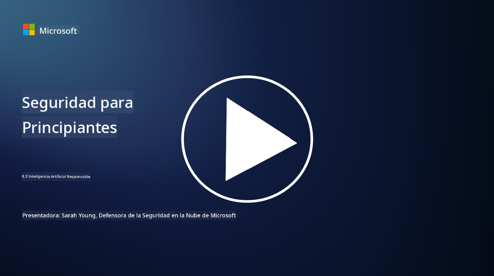

<!--
CO_OP_TRANSLATOR_METADATA:
{
  "original_hash": "5e9775ee91bde7d44577891d5f11c4c5",
  "translation_date": "2025-09-03T18:28:32+00:00",
  "source_file": "8.3 Responsible AI.md",
  "language_code": "es"
}
-->
# IA Responsable

## ¿Qué es la IA responsable y cómo se relaciona con la seguridad en IA?

La IA responsable se refiere al desarrollo y uso de inteligencia artificial de manera ética, transparente y alineada con los valores de la sociedad. Incluye principios como la equidad, la responsabilidad y la solidez, asegurando que los sistemas de IA estén diseñados y operen para beneficiar a las personas, las comunidades y la sociedad en general.

La relación entre la IA responsable y la seguridad en IA es significativa porque:

-   **Consideraciones Éticas**: La IA responsable implica consideraciones éticas que impactan directamente en la seguridad, como la privacidad y la protección de datos. Garantizar que los sistemas de IA respeten la privacidad de los usuarios y protejan los datos personales es un aspecto clave de la IA responsable.
-   **Solidez y Fiabilidad**: Los sistemas de IA deben ser sólidos frente a manipulaciones y ataques, lo cual es un principio fundamental tanto de la IA responsable como de la seguridad en IA. Esto incluye protegerse contra ataques adversariales y garantizar la integridad de los procesos de toma de decisiones de la IA.
-   **Transparencia y Explicabilidad**: Parte de la IA responsable es asegurarse de que los sistemas de IA sean transparentes y sus decisiones puedan explicarse. Esto es crucial para la seguridad, ya que los interesados necesitan entender cómo operan los sistemas de IA para confiar en sus medidas de seguridad.
-   **Responsabilidad**: Los sistemas de IA deben ser responsables de sus acciones, lo que significa que deben existir mecanismos para rastrear decisiones y corregir cualquier problema. Esto se alinea con las prácticas de seguridad que monitorean y auditan las actividades del sistema para prevenir y responder a brechas.

En esencia, la IA responsable y la seguridad en IA están entrelazadas, con las prácticas de IA responsable mejorando la seguridad de los sistemas de IA y viceversa. Implementar principios de IA responsable ayuda a crear sistemas de IA que no solo son éticamente sólidos, sino también más seguros frente a posibles amenazas.

## ¿Cómo puedo asegurarme de que mi sistema de IA sea seguro y ético?

Asegurar que tu sistema de IA sea seguro y ético implica un enfoque multifacético que incluye los siguientes pasos:

- **Adherirse a Principios Éticos**: Sigue pautas éticas establecidas que enfatizan el bienestar humano, social y ambiental; la equidad; la protección de la privacidad; la fiabilidad; la transparencia; la capacidad de cuestionar decisiones; y la responsabilidad.

- **Implementar Medidas de Seguridad Robustas**: Utiliza pruebas de seguridad proactivas y programas de gestión de confianza, riesgos y seguridad en IA para protegerte contra amenazas y vulnerabilidades.

- **Involucrar a Diversos Interesados**: Incluye una amplia gama de participantes en el proceso de desarrollo de IA, como especialistas en ética, científicos sociales y representantes de las comunidades afectadas, para garantizar que se consideren diversas perspectivas y valores.

- **Garantizar Transparencia y Explicabilidad**: Asegúrate de que los procesos de toma de decisiones de la IA sean transparentes y puedan explicarse, lo que permite una mayor confianza y facilita la identificación de posibles sesgos o errores.

- **Mantener la Privacidad de los Datos**: Protege la privacidad y autenticidad de los datos mediante cifrado y otras medidas de protección de datos para respetar los derechos de privacidad de los usuarios.

- **Habilitar Supervisión Humana**: Implementa mecanismos para la supervisión humana que permitan cuestionar las decisiones tomadas por los sistemas de IA y garantizar la responsabilidad.

- **Mantente Informado sobre la Seguridad en IA**: Mantente al día con las últimas investigaciones y debates sobre seguridad en IA para comprender el panorama en evolución de la seguridad y la ética en IA.

- **Cumplir con las Regulaciones**: Asegúrate de que tu sistema de IA cumpla con todas las leyes y regulaciones relevantes, que pueden incluir leyes de protección de datos, leyes contra la discriminación y pautas específicas de la industria.

## ¿Puedes darme algunos ejemplos de problemas de seguridad causados por el uso no ético de la IA?

Aquí hay algunos ejemplos de problemas de seguridad que pueden surgir del uso no ético de la IA:

- **Toma de Decisiones Sesgada**: Los sistemas de IA pueden perpetuar y amplificar sesgos existentes si se entrenan con conjuntos de datos sesgados. Por ejemplo, si un motor de búsqueda se entrena con datos que reflejan estereotipos sociales, puede mostrar resultados sesgados, lo que puede llevar a un trato injusto o discriminación.

- **IA en Sistemas Judiciales**: El uso de IA en la toma de decisiones legales puede plantear preocupaciones éticas, especialmente si el proceso de toma de decisiones de la IA carece de transparencia o está influenciado por datos sesgados. Esto podría resultar en resultados legales injustos y violar los derechos de las personas.

- **Manipulación de Sistemas de IA**: Los sistemas de IA pueden ser susceptibles a ataques adversariales, donde pequeñas modificaciones en los datos de entrada pueden causar resultados incorrectos. Por ejemplo, los vehículos autónomos podrían ser engañados para interpretar mal señales de tráfico, lo que generaría riesgos de seguridad.

- **Vigilancia Potenciada por IA**: El despliegue de IA para fines de vigilancia puede llevar a violaciones de la privacidad, especialmente si se utiliza sin el consentimiento adecuado o de maneras que infrinjan las libertades individuales. Esto puede ser particularmente problemático en regímenes autoritarios que podrían usar la IA para monitorear y reprimir la disidencia.

Estos ejemplos destacan la importancia de las consideraciones éticas en el desarrollo y la implementación de sistemas de IA para prevenir problemas de seguridad y proteger los derechos y la privacidad de las personas.

## Lecturas adicionales

 - [Microsoft Responsible AI Standard v2 General Requirements](https://query.prod.cms.rt.microsoft.com/cms/api/am/binary/RE5cmFl?culture=en-us&country=us&WT.mc_id=academic-96948-sayoung)
 - [Responsible AI (mit.edu)](https://sloanreview.mit.edu/big-ideas/responsible-ai/)
 - [13 Principles for Using AI Responsibly (hbr.org)](https://hbr.org/2023/06/13-principles-for-using-ai-responsibly)

---

**Descargo de responsabilidad**:  
Este documento ha sido traducido utilizando el servicio de traducción automática [Co-op Translator](https://github.com/Azure/co-op-translator). Si bien nos esforzamos por garantizar la precisión, tenga en cuenta que las traducciones automatizadas pueden contener errores o imprecisiones. El documento original en su idioma nativo debe considerarse la fuente autorizada. Para información crítica, se recomienda una traducción profesional realizada por humanos. No nos hacemos responsables de malentendidos o interpretaciones erróneas que puedan surgir del uso de esta traducción.