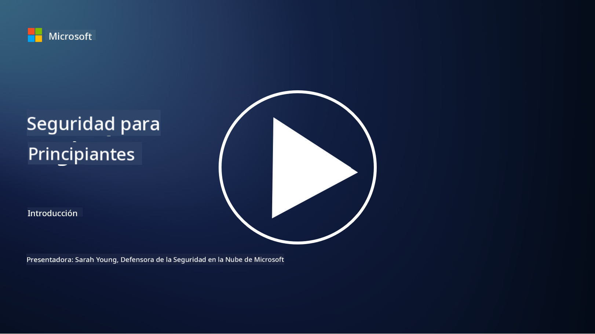

<!--
CO_OP_TRANSLATOR_METADATA:
{
  "original_hash": "79a7e63fa60f649eb3560e1cd7246272",
  "translation_date": "2025-11-18T17:02:38+00:00",
  "source_file": "README.md",
  "language_code": "es"
}
-->
  
  
  
  
  
  

### 🌐 Soporte Multilingüe

#### Soportado a través de GitHub Action (Automatizado y Siempre Actualizado)

<!-- CO-OP TRANSLATOR LANGUAGES TABLE START -->
[Árabe](../ar/README.md) | [Bengalí](../bn/README.md) | [Búlgaro](../bg/README.md) | [Birmano (Myanmar)](../my/README.md) | [Chino (Simplificado)](../zh/README.md) | [Chino (Tradicional, Hong Kong)](../hk/README.md) | [Chino (Tradicional, Macao)](../mo/README.md) | [Chino (Tradicional, Taiwán)](../tw/README.md) | [Croata](../hr/README.md) | [Checo](../cs/README.md) | [Danés](../da/README.md) | [Holandés](../nl/README.md) | [Estonio](../et/README.md) | [Finlandés](../fi/README.md) | [Francés](../fr/README.md) | [Alemán](../de/README.md) | [Griego](../el/README.md) | [Hebreo](../he/README.md) | [Hindi](../hi/README.md) | [Húngaro](../hu/README.md) | [Indonesio](../id/README.md) | [Italiano](../it/README.md) | [Japonés](../ja/README.md) | [Coreano](../ko/README.md) | [Lituano](../lt/README.md) | [Malayo](../ms/README.md) | [Maratí](../mr/README.md) | [Nepalí](../ne/README.md) | [Pidgin Nigeriano](../pcm/README.md) | [Noruego](../no/README.md) | [Persa (Farsi)](../fa/README.md) | [Polaco](../pl/README.md) | [Portugués (Brasil)](../br/README.md) | [Portugués (Portugal)](../pt/README.md) | [Panyabí (Gurmukhi)](../pa/README.md) | [Rumano](../ro/README.md) | [Ruso](../ru/README.md) | [Serbio (Cirílico)](../sr/README.md) | [Eslovaco](../sk/README.md) | [Esloveno](../sl/README.md) | [Español](./README.md) | [Suajili](../sw/README.md) | [Sueco](../sv/README.md) | [Tagalo (Filipino)](../tl/README.md) | [Tamil](../ta/README.md) | [Tailandés](../th/README.md) | [Turco](../tr/README.md) | [Ucraniano](../uk/README.md) | [Urdu](../ur/README.md) | [Vietnamita](../vi/README.md)  
<!-- CO-OP TRANSLATOR LANGUAGES TABLE END -->

**Si deseas que se admitan traducciones adicionales, los idiomas compatibles están listados [aquí](https://github.com/Azure/co-op-translator/blob/main/getting_started/supported-languages.md)**

#### Únete a Nuestra Comunidad  

# 🚀 Ciberseguridad para Principiantes – un plan de estudios

En esta era de rápida adopción de tecnologías de IA, es aún más crucial entender cómo proteger los sistemas de TI. Este curso está diseñado para enseñarte conceptos fundamentales de ciberseguridad y comenzar tu aprendizaje en seguridad. Es independiente de proveedores y está dividido en pequeñas lecciones que deberían tomar entre 30 y 60 minutos para completarse. Cada lección incluye un pequeño cuestionario y enlaces para lecturas adicionales si deseas profundizar más en el tema.

Lo que cubre este curso 📚

- 🔐 Conceptos básicos de ciberseguridad como la tríada CIA, las diferencias entre riesgos, amenazas, etc.
- 🛡️ Comprender qué es un control de seguridad y las formas que puede tomar.
- 🌐 Entender qué es la confianza cero (zero trust) y por qué es importante en la ciberseguridad moderna.
- 🔑 Comprender conceptos y temas clave en identidad, redes, operaciones de seguridad, infraestructura y seguridad de datos.
- 🔧 Proporcionar algunos ejemplos de herramientas utilizadas para implementar controles de seguridad.

Lo que este curso no cubre 🙅‍♂️

- 🚫 Cómo usar herramientas de seguridad específicas.
- 🚫 Cómo "hackear" o realizar pruebas de penetración/ofensivas.
- 🚫 Aprender sobre estándares de cumplimiento específicos.

Cuando termines este curso, puedes pasar a algunos de nuestros módulos de Microsoft Learn. Te recomendamos continuar tu aprendizaje con [Microsoft Security, Compliance, and Identity Fundamentals.](https://learn.microsoft.com/training/paths/describe-concepts-of-security-compliance-identity/?WT.mc_id=academic-96948-sayoung)  

Finalmente, podrías considerar tomar el [Examen SC-900: Microsoft Security, Compliance, and Identity Fundamentals.](https://learn.microsoft.com/credentials/certifications/exams/sc-900/?WT.mc_id=academic-96948-sayoung)  

> 💁 Si tienes comentarios o sugerencias sobre este curso y cualquier contenido que falte, ¡nos encantaría saber de ti!

## Resumen de Módulos 📝  
| **Número del módulo** | **Nombre del módulo**                  | **Conceptos enseñados**              | **Objetivos de aprendizaje**                                                                                     |
|-----------------------|---------------------------------------|--------------------------------------|-----------------------------------------------------------------------------------------------------------------|
| **1.1**               | Conceptos básicos de seguridad        | [La tríada CIA](https://github.com/microsoft/Security-101/blob/main/1.1%20The%20CIA%20triad%20and%20other%20key%20concepts.md)                        | Aprende sobre confidencialidad, disponibilidad e integridad. También autenticidad, no repudio y privacidad.     |
| **1.2**               | Conceptos básicos de seguridad        | [Amenazas comunes de ciberseguridad](https://github.com/microsoft/Security-101/blob/main/1.2%20Common%20cybersecurity%20threats.md)        | Aprende sobre las amenazas comunes de ciberseguridad que enfrentan individuos y organizaciones.                 |
| **1.3**               | Conceptos básicos de seguridad        | [Comprender la gestión de riesgos](https://github.com/microsoft/Security-101/blob/main/1.3%20Understanding%20risk%20management.md)       | Aprende sobre cómo evaluar y comprender riesgos – impacto/probabilidad e implementar controles.                 |
| **1.4**               | Conceptos básicos de seguridad        | [Prácticas y documentación de seguridad](https://github.com/microsoft/Security-101/blob/main/1.4%20Security%20practices%20and%20documentation.md) | Aprende sobre la diferencia entre políticas, procedimientos, estándares y regulaciones/leyes.                   |
| **1.5**               | Conceptos básicos de seguridad        | [Confianza cero](https://github.com/microsoft/Security-101/blob/main/1.5%20Zero%20trust.md)                           | Aprende qué es la confianza cero y cómo afecta la arquitectura. ¿Qué es la defensa en profundidad?              |
| **1.6**               | Conceptos básicos de seguridad        | [El modelo de responsabilidad compartida](https://github.com/microsoft/Security-101/blob/main/1.6%20Shared%20responsibility%20model.md)                           | ¿Qué es el modelo de responsabilidad compartida y cómo afecta la ciberseguridad?                                |
| **1.7**               | [Cuestionario de fin de módulo](https://github.com/microsoft/Security-101/blob/main/1.7%20End%20of%20module%20quiz.md)                        |                                      |                                                                                                                 |
| **2.1**               | Fundamentos de gestión de identidad y acceso | [Conceptos clave de IAM](https://github.com/microsoft/Security-101/blob/main/2.1%20IAM%20key%20concepts.md)                     | Aprende sobre el principio de privilegio mínimo, segregación de funciones y cómo IAM respalda la confianza cero.|
| **2.2**               | Fundamentos de gestión de identidad y acceso | [Arquitectura de confianza cero en IAM](https://github.com/microsoft/Security-101/blob/main/2.2%20IAM%20zero%20trust%20architecture.md)          | Aprende cómo la identidad es el nuevo perímetro para los entornos de TI modernos y las amenazas que mitiga.     |
| **2.3**               | Fundamentos de gestión de identidad y acceso | [Capacidades de IAM](https://github.com/microsoft/Security-101/blob/main/2.3%20IAM%20capabilities.md)                     | Aprende sobre las capacidades y controles de IAM para proteger identidades.                                     |
| **2.4**               | [Cuestionario de fin de módulo](https://github.com/microsoft/Security-101/blob/main/2.4%20End%20of%20module%20quiz.md)                        |                                      |                                                                                                                 |
| **3.1**               | Fundamentos de seguridad de red       | [Conceptos clave de redes](https://github.com/microsoft/Security-101/blob/main/3.1%20Networking%20key%20concepts.md)              | Aprende sobre conceptos de redes (direcciones IP, números de puerto, cifrado, etc.).                            |
| **3.2**               | Fundamentos de seguridad de red       | [Arquitectura de confianza cero en redes](https://github.com/microsoft/Security-101/blob/main/3.2%20Networking%20zero%20trust%20architecture.md)   | Aprende cómo las redes contribuyen a una arquitectura de confianza cero de extremo a extremo y las amenazas que mitiga.|
| **3.3**               | Fundamentos de seguridad de red       | [Capacidades de seguridad de red](https://github.com/microsoft/Security-101/blob/main/3.3%20Network%20security%20capabilities.md)        | Aprende sobre herramientas de seguridad de red – firewalls, WAF, protección contra DDoS, etc.                   |
| **3.4**               | [Cuestionario de fin de módulo](https://github.com/microsoft/Security-101/blob/main/3.4%20End%20of%20module%20quiz.md)                        |                                      |                                                                                                                 |
| **4.1**               | Fundamentos de operaciones de seguridad | [Conceptos clave de SecOps](https://github.com/microsoft/Security-101/blob/main/4.1%20SecOps%20key%20concepts.md)                  | Aprende por qué las operaciones de seguridad son importantes y cómo se diferencian de los equipos normales de TI.|
| **4.2**               | Fundamentos de operaciones de seguridad | [Arquitectura de confianza cero en SecOps](https://github.com/microsoft/Security-101/blob/main/4.2%20SecOps%20zero%20trust%20architecture.md)       | Aprende cómo SecOps contribuye a una arquitectura de confianza cero de extremo a extremo y las amenazas que mitiga.|
| **4.3**               | Fundamentos de operaciones de seguridad | [Capacidades de SecOps](https://github.com/microsoft/Security-101/blob/main/4.3%20SecOps%20capabilities.md)                  | Aprende sobre herramientas de SecOps – SIEM, XDR, etc.                                                          |
| **4.4**               | [Cuestionario de fin de módulo](https://github.com/microsoft/Security-101/blob/main/4.4%20End%20of%20module%20quiz.md)                        |                                      |                                                                                                                 |
| **5.1**               | Fundamentos de seguridad de aplicaciones | [Conceptos clave de AppSec](https://github.com/microsoft/Security-101/blob/main/5.1%20AppSec%20key%20concepts.md)                  | Aprende sobre conceptos de AppSec como diseño seguro, validación de entradas, etc.                              |
| **5.2**           | Fundamentos de seguridad de aplicaciones  | [Capacidades de AppSec](https://github.com/microsoft/Security-101/blob/main/5.2%20AppSec%20key%20capabilities.md)                  | Aprende sobre herramientas de AppSec: herramientas de seguridad en el pipeline, escaneo de código, escaneo de secretos, etc.       |
| **5.3**           | [Cuestionario de fin de módulo](https://github.com/microsoft/Security-101/blob/main/5.3%20End%20of%20module%20quiz.md)                        |                                      |                                                                                                                 |
| **6.1**           | Fundamentos de seguridad de infraestructura | [Conceptos clave de seguridad de infraestructura](https://github.com/microsoft/Security-101/blob/main/6.1%20Infrastructure%20security%20key%20concepts.md) | Aprende sobre el fortalecimiento de sistemas, parches, higiene de seguridad, seguridad de contenedores.         |
| **6.2**           | Fundamentos de seguridad de infraestructura | [Capacidades de seguridad de infraestructura](https://github.com/microsoft/Security-101/blob/main/6.2%20Infrastructure%20security%20capabilities.md) | Aprende sobre herramientas que pueden ayudar con la seguridad de infraestructura, como CSPM, seguridad de contenedores, etc.       |
| **6.3**           | [Cuestionario de fin de módulo](https://github.com/microsoft/Security-101/blob/main/6.3%20End%20of%20module%20quiz.md)                        |                                      |                                                                                                                 |
| **7.1**           | Fundamentos de seguridad de datos          | [Conceptos clave de seguridad de datos](https://github.com/microsoft/Security-101/blob/main/7.1%20Data%20security%20key%20concepts.md)           | Aprende sobre clasificación y retención de datos y por qué esto es importante para una organización.             |
| **7.2**           | Fundamentos de seguridad de datos          | [Capacidades de seguridad de datos](https://github.com/microsoft/Security-101/blob/main/7.2%20Data%20security%20capabilities.md)           | Aprende sobre herramientas de seguridad de datos: DLP, gestión de riesgos internos, gobernanza de datos, etc.    |
| **7.3**           | [Cuestionario de fin de módulo](https://github.com/microsoft/Security-101/blob/main/7.3%20End%20of%20module%20quiz.md)                        |
| **8.1**           | Fundamentos de seguridad en IA             | [Conceptos clave de seguridad en IA](https://github.com/microsoft/Security-101/blob/main/8.1%20AI%20security%20key%20concepts.md)          | Aprende sobre las diferencias y similitudes entre la seguridad tradicional y la seguridad en IA.                 |
| **8.2**           | Fundamentos de seguridad en IA             | [Capacidades de seguridad en IA](https://github.com/microsoft/Security-101/blob/main/8.2%20AI%20security%20capabilities.md)           | Aprende sobre herramientas de seguridad en IA y los controles que se pueden usar para proteger la IA.            |
| **8.3**           | Fundamentos de seguridad en IA             | [IA Responsable](https://github.com/microsoft/Security-101/blob/main/8.3%20Responsible%20AI.md)          | Aprende qué es la IA responsable y los daños específicos de la IA que los profesionales de seguridad deben conocer. |
| **8.4**           | [Cuestionario de fin de módulo](https://github.com/microsoft/Security-101/blob/main/8.4%20End%20of%20module%20quiz.md)     

## 🎒 Otros Cursos 

¡Nuestro equipo produce otros cursos! Echa un vistazo:

### Azure / Edge / MCP / Agentes
  
  
  

---

### Serie de IA Generativa
  
[-9333EA?style=for-the-badge&labelColor=E5E7EB&color=9333EA)](https://github.com/microsoft/Generative-AI-for-beginners-dotnet?WT.mc_id=academic-105485-koreyst)  
[-C084FC?style=for-the-badge&labelColor=E5E7EB&color=C084FC)](https://github.com/microsoft/generative-ai-for-beginners-java?WT.mc_id=academic-105485-koreyst)  
[-E879F9?style=for-the-badge&labelColor=E5E7EB&color=E879F9)](https://github.com/microsoft/generative-ai-with-javascript?WT.mc_id=academic-105485-koreyst)

---

### Aprendizaje Básico
  
  
  
  
  
  

---

### Serie de Copilot
  
  

## Obtener Ayuda

Si te quedas atascado o tienes preguntas sobre cómo construir aplicaciones de IA, únete a otros estudiantes y desarrolladores experimentados en discusiones sobre MCP. Es una comunidad de apoyo donde las preguntas son bienvenidas y el conocimiento se comparte libremente.

Si tienes comentarios sobre el producto o encuentras errores mientras construyes, visita:

---

<!-- CO-OP TRANSLATOR DISCLAIMER START -->
**Descargo de responsabilidad**:  
Este documento ha sido traducido utilizando el servicio de traducción automática [Co-op Translator](https://github.com/Azure/co-op-translator). Si bien nos esforzamos por lograr precisión, tenga en cuenta que las traducciones automáticas pueden contener errores o imprecisiones. El documento original en su idioma nativo debe considerarse la fuente autorizada. Para información crítica, se recomienda una traducción profesional realizada por humanos. No nos hacemos responsables de malentendidos o interpretaciones erróneas que surjan del uso de esta traducción.
<!-- CO-OP TRANSLATOR DISCLAIMER END -->