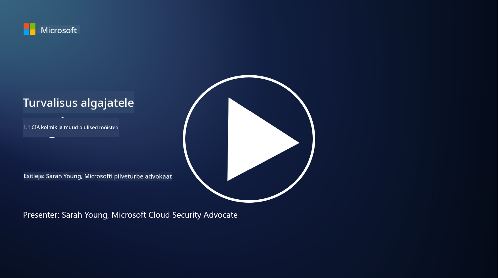
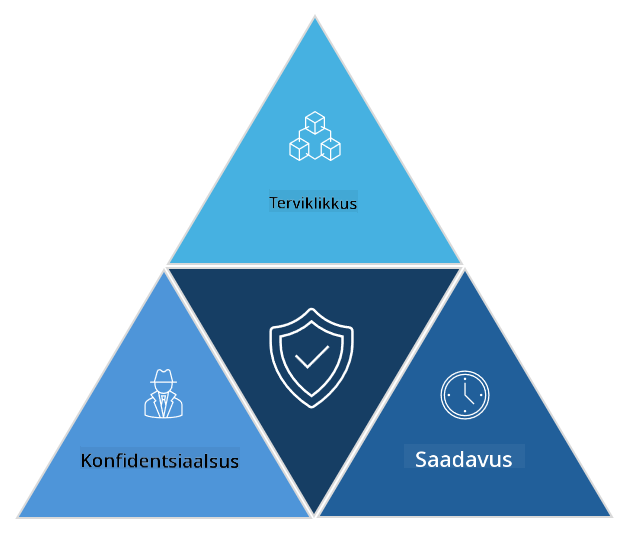

<!--
CO_OP_TRANSLATOR_METADATA:
{
  "original_hash": "16a76f9fa372fb63cffb6d76b855f023",
  "translation_date": "2025-10-11T11:20:41+00:00",
  "source_file": "1.1 The CIA triad and other key concepts.md",
  "language_code": "et"
}
-->
# CIA kolmik ja muud olulised mõisted

## Sissejuhatus

Selles õppetükis käsitleme:

 - Mis on küberturvalisus?
   
 
 - Mis on küberturvalisuse CIA kolmik?

   

 - Mis on autentsus, eitamatus ja privaatsus küberturvalisuse kontekstis?

## Mis on küberturvalisus?

Küberturvalisus, tuntud ka kui infoturvalisus, on arvutisüsteemide, võrkude, seadmete ja andmete kaitsmise praktika digirünnakute, volitamata juurdepääsu, kahjustuste või varguste eest. Küberturvalisuse peamine eesmärk on tagada digitaalsete varade ja teabe konfidentsiaalsus, terviklikkus ja kättesaadavus. Küberturvalisuse spetsialistid kavandavad ja rakendavad turvakontrolle, et kaitsta varasid, andmeid ja teavet. Kuna üha suurem osa meie elust on muutunud digitaalseks ja veebipõhiseks, on küberturvalisus muutunud oluliseks mureks nii eraisikute kui ka organisatsioonide jaoks.

## Mis on küberturvalisuse CIA kolmik?

Küberturvalisuse kolmik viitab mudelile, mis hõlmab kolme peamist aspekti, mida tuleb arvestada igas küberturvalisuse töös või süsteemi/keskkonna kujundamisel:

### Konfidentsiaalsus

See on aspekt, millega enamik inimesi seostab mõistet "küberturvalisus": konfidentsiaalsus tähendab andmete ja teabe kaitsmist volitamata juurdepääsu katsete eest, st ainult need, kellel on vajadus teavet näha, saavad sellele juurde pääseda. Kuid mitte kõik andmed pole võrdsed ja andmed liigitatakse ja kaitstakse tavaliselt selle alusel, kui palju kahju võiks tekkida, kui need satuvad valedesse kätesse.

### Terviklikkus

Viitab andmete täpsuse ja usaldusväärsuse kaitsmisele keskkonnas ning sellele, et volitamata isikud ei saaks andmeid muuta ega parandada. Näiteks kui õpilane muudab oma sünnikuupäeva DMV-s (sõidukite registreerimise amet) oma juhiloa andmetes, et näida vanem ja saada uuesti trükitud juhiluba varasema sünnikuupäevaga, et osta alkoholi.

### Kättesaadavus

Kuigi see on oluline kogu IT-operatsioonide jaoks, on kättesaadavus oluline ka küberturvalisuse seisukohalt. On olemas teatud tüüpi rünnakud, mis sihivad kättesaadavust ja mille vastu turvalisuse spetsialistid peavad kaitsma (nt hajutatud teenusetõkestusrünnakud – DDoS).

**Küberturvalisuse CIA kolmik**

## Mis on autentsus, eitamatus ja privaatsus küberturvalisuse kontekstis?

Need on täiendavad olulised mõisted, mis on seotud süsteemide ja andmete turvalisuse ja usaldusväärsuse tagamisega:

**Autentsus** - viitab kindlusele, et teave, suhtlus või üksus, millega suhtlete, on ehtne ja seda ei ole volitamata osapoolte poolt muudetud ega võltsitud.

**Eitamatus** - on mõiste, mis tagab, et osapool ei saa eitada oma osalust või tehingu või suhtluse autentsust. See takistab kedagi väitmast, et ta ei saatnud sõnumit või ei teinud teatud toimingut, kui on olemas tõendid vastupidise kohta.

**Privaatsus** - viitab tundliku ja isiklikult tuvastatava teabe kaitsmisele volitamata juurdepääsu, kasutamise, avalikustamise või manipuleerimise eest. See hõlmab kontrolli selle üle, kes pääseb isikuandmetele ligi ja kuidas neid andmeid kogutakse, säilitatakse ja jagatakse.

## Lisalugemine

[Mis on infoturvalisus (InfoSec)? | Microsoft Security](https://www.microsoft.com/security/business/security-101/what-is-information-security-infosec#:~:text=Three%20pillars%20of%20information%20security%3A%20the%20CIA%20triad,as%20guiding%20principles%20for%20implementing%20an%20InfoSec%20plan.)

---

**Lahtiütlus**:  
See dokument on tõlgitud, kasutades AI tõlketeenust [Co-op Translator](https://github.com/Azure/co-op-translator). Kuigi püüame tagada täpsust, palun arvestage, et automaatsed tõlked võivad sisaldada vigu või ebatäpsusi. Algne dokument selle algkeeles tuleks lugeda autoriteetseks allikaks. Olulise teabe puhul on soovitatav kasutada professionaalset inimtõlget. Me ei vastuta selle tõlke kasutamisest tulenevate arusaamatuste või valesti tõlgenduste eest.