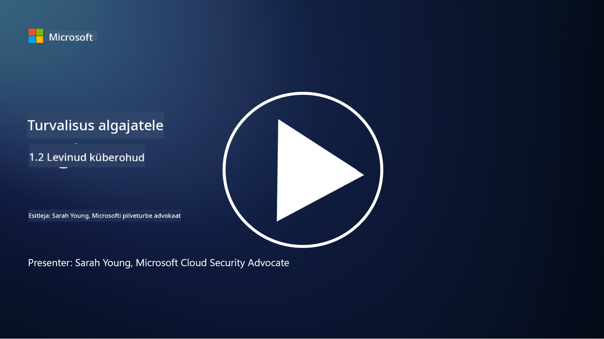

<!--
CO_OP_TRANSLATOR_METADATA:
{
  "original_hash": "6fc3030323139d7134a4ca9d03eccac9",
  "translation_date": "2025-10-11T11:32:16+00:00",
  "source_file": "1.2 Common cybersecurity threats.md",
  "language_code": "et"
}
-->
# Levinumad küberohud

## Sissejuhatus

Selles õppetükis käsitleme:

- Mis on küberoht?

- Miks pahatahtlikud isikud soovivad andmeid ja IT-süsteeme kompromiteerida?

- Millised on kõige levinumad küberohud?

- Mis on MITRE ATT&CK raamistik?

- Kust saab end kursis hoida küberohtude maastikuga?

## Mis on küberoht?

Küberoht viitab igasugusele potentsiaalsele ohule või riskile, mis võib ohustada andmete või IT-süsteemide konfidentsiaalsust, terviklikkust või kättesaadavust. Need ohud tulenevad pahatahtlikest isikutest, kes püüavad ära kasutada haavatavusi, et saada volitamata juurdepääsu, varastada tundlikku teavet, häirida tegevusi või põhjustada kahju üksikisikutele, organisatsioonidele või isegi tervetele riikidele. Küberohud võivad esineda mitmel kujul ja sihtida digisüsteemide ja andmete erinevaid aspekte.

## Miks pahatahtlikud isikud soovivad andmeid ja IT-süsteeme kompromiteerida?

Pahatahtlikud isikud kompromiteerivad andmeid ja IT-süsteeme mitmel põhjusel, sageli isikliku kasu, ideoloogiliste motiivide või häirimissoovi ajendil. Nende motivatsioonide mõistmine aitab organisatsioonidel ja üksikisikutel paremini kaitsta end küberohtude eest. Mõned levinumad põhjused, miks pahatahtlikud isikud küberrünnakuid sooritavad, on:

1. **Rahaline kasu**: Paljud rünnakud on ajendatud rahalisest kasust. Pahatahtlikud isikud võivad varastada tundlikku teavet, nagu krediitkaardi numbrid, pangakonto andmed või isikut tõendav teave, et sooritada pettusi, identiteedivargusi, nõuda lunaraha või müüa varastatud andmeid tumedas veebis.

2. **Spionaaž**: Riigid, konkurendid või muud üksused võivad tegeleda küberluurega, et varastada tundlikke valitsuse, ettevõtte või teadusandmeid poliitilise, majandusliku või sõjalise eelise saamiseks.

3. **Häirimine ja sabotaaž**: Mõned rünnakud on suunatud kriitilise infrastruktuuri, teenuste või tegevuste häirimisele poliitilistel või ideoloogilistel põhjustel. Need rünnakud võivad põhjustada laialdast kaost, rahalist kahju ja mainekahju.

4. **Ideoloogilised motiivid**: Haktivistid ja ideoloogiliste või poliitiliste motiividega grupid võivad süsteeme kompromiteerida, et tõsta teadlikkust teatud teemadest, edendada oma uskumusi või protestida konkreetsete tegevuste või organisatsioonide vastu.

5. **Tahtmatud tegevused**: Mitte kõik pahatahtlikud tegevused pole tahtlikud; mõned isikud võivad tahtmatult kaasa aidata küberohtudele, sattudes sotsiaalse manipuleerimise ohvriks või olles osa kompromiteeritud võrgustikust.

Lõppkokkuvõttes võivad motivatsioonid andmete ja IT-süsteemide kompromiteerimiseks olla väga erinevad ning nende rünnakute mõju võib olla tõsine. On oluline, et üksikisikud, organisatsioonid ja valitsused võtaksid küberjulgeolekut tõsiselt ja rakendaksid meetmeid nende ohtude vastu kaitsmiseks.

## Millised on kõige levinumad küberohud?

Pahatahtlikud isikud kasutavad mitmeid levinud küberrünnakute tüüpe, et kompromiteerida süsteeme, varastada andmeid ja põhjustada häireid. Siin on mõned kõige levinumad rünnakutüübid kirjutamise ajal:

1. **Andmepüük (Phishing)**:

Andmepüük hõlmab petlike e-kirjade või sõnumite saatmist, mis näivad pärinevat usaldusväärsetest allikatest, et petta saajaid avaldama tundlikku teavet, nagu paroolid, krediitkaardi numbrid või isiklikud andmed. Andmepüük võib viia ohvrid pahatahtlikele veebisaitidele või pahavara allalaadimiseni.

2. **Pahavara (Malware)**:

Pahavara (pahatahtlik tarkvara) hõlmab mitmesuguseid pahatahtlikke programme, mis on loodud süsteemide nakatamiseks, andmete varastamiseks või kahju tekitamiseks. Pahavara tüübid hõlmavad:

- **Lunarahavara (Ransomware)**: Krüpteerib failid ja nõuab lunaraha nende dekrüpteerimiseks.

- **Troojalased (Trojans)**: Maskeeritud legitiimse tarkvarana, võimaldavad ründajatele volitamata juurdepääsu.

- **Viirused (Viruses)**: Iselevivad programmid, mis kinnituvad failidele ja levivad.

- **Ussid (Worms)**: Iselevivad programmid, mis levivad võrkude kaudu.

3. **Teenusetõkestusrünnakud (DoS) ja hajutatud teenusetõkestusrünnakud (DDoS)**:

DoS rünnakud koormavad sihtsüsteemi üle, muutes selle kasutajatele kättesaamatuks. DDoS rünnakud kasutavad kompromiteeritud seadmete võrku, et sihtmärki liiklusega üle ujutada, muutes süsteemi korraliku toimimise raskeks või peatades selle täielikult.

4. **SQL süstimine (SQL Injection)**:

Selles rünnakus manipuleerivad ründajad veebirakenduse sisendväljadega, et süstida pahatahtlikke SQL päringuid, mis võivad anda volitamata juurdepääsu andmebaasidele ja tundlikele andmetele.

5. **Ristveebiskriptimine (XSS)**:

Ründajad süstivad pahatahtlikke skripte veebirakendustesse, mis seejärel täidetakse pahaaimamatute kasutajate brauserites. See võib viia kasutajaandmete varguse ja/või pahavara levikuni.

6. **Sotsiaalne manipuleerimine (Social Engineering)**:

Sotsiaalne manipuleerimine kasutab ära inimpsühholoogiat, et manipuleerida inimesi avaldama konfidentsiaalset teavet või sooritama tegevusi, mis ohustavad turvalisust.

7. **Nullpäeva (Zero-Day) haavatavused**:

Need rünnakud sihivad tarkvara või riistvara haavatavusi, mis pole veel müüjale või avalikkusele teada. Ründajad kasutavad neid haavatavusi ära enne, kui parandused on välja töötatud. Paljud organisatsioonid muretsevad nullpäevade pärast, kuna nende vastu pole parandust, kuid need pole nii levinud kui teised rünnakud selles nimekirjas. Kui nullpäev avastatakse, töötavad turvateadlased kiiresti paranduse loomise nimel, mistõttu nullpäevad on üldiselt lühiajalised.

8. **Tunnuste rünnakud (Credential Attacks)**:

Need rünnakud hõlmavad jõurünnakuid, kus ründajad arvavad korduvalt paroole, ja tunnuste täitmisi, kus varastatud tunnuseid ühest saidist kasutatakse juurdepääsu proovimiseks teistel saitidel.

## Mis on MITRE ATT&CK raamistik?

[MITRE ATT&CK raamistik](https://attack.mitre.org/) (Adversarial Tactics, Techniques, and Common Knowledge) on raamistik, mis kataloogib ja kategoriseerib taktikaid, tehnikaid ja protseduure (TTP-d), mida vastased kasutavad küberrünnakute ajal. Raamistik loodi MITRE Corporationi poolt, mis on mittetulunduslik organisatsioon, mis haldab uurimis- ja arenduskeskusi erinevatele valitsusasutustele.

MITRE ATT&CK raamistik pakub standardiseeritud viisi küberohtude kirjeldamiseks ja analüüsimiseks, võimaldades küberjulgeoleku spetsialistidel paremini mõista ja kaitsta erinevate rünnakutehnikate vastu. Seda kasutavad laialdaselt turvameeskonnad, ohujälgijad ja intsidentidele reageerijad, et:

1. **Mõista vastase käitumist**: Raamistik dokumenteerib reaalse maailma rünnakukäitumist, kirjeldades samme, mida ründajad teevad alates esialgsest sisenemisest kuni oma eesmärkide saavutamiseni. See hõlmab laia valikut rünnakutehnikaid, mida erinevad ohugrupid kasutavad.

2. **Planeerida ja rakendada kaitsemeetmeid**: Turvameeskonnad saavad raamistikku kasutada proaktiivsete kaitsemeetmete väljatöötamiseks, mis vastavad konkreetsetele taktika- ja tehnikatele, mida vastased võivad kasutada.

3. **Intsidentidele reageerimine ja ohujälgimine**: Intsidentide uurimisel või ohujälgimise läbiviimisel saavad turvaspetsialistid viidata raamistikule, et tuvastada ja leevendada ründajate kasutatud konkreetseid tehnikaid.

MITRE ATT&CK raamistik on organiseeritud maatriksiteks, mis rühmitavad rünnakutehnikad konkreetsete platvormide ja keskkondade, nagu Windows, macOS, Linux ja pilveteenused, alusel. Iga maatriks jaguneb taktikateks (kõrgetasemelised eesmärgid) ja tehnikateks (konkreetsete eesmärkide saavutamiseks kasutatavad meetodid). Iga tehnika kohta pakub raamistik teavet selle toimimise, võimalike leevendusmeetmete ja asjakohaste viidete kohta reaalse maailma ohugruppidele, kes on tehnikat kasutanud.

Raamistikku uuendatakse ja laiendatakse pidevalt, kui kogutakse uusi ohuluureandmeid ja küberjulgeoleku maastik areneb. See on väärtuslik ressurss organisatsiooni küberjulgeoleku tugevdamiseks, võimaldades sügavamat arusaamist sellest, kuidas ründajad tegutsevad ja kuidas nende taktika vastu kaitsta.

## Kust saab end kursis hoida küberohtude maastikuga?

Küberohtude kohta kursis olemiseks on palju allikaid, siin on valik:

- [Open Web Application Security Project (OWASP) top 10 haavatavust](https://owasp.org/Top10/)
- [Common Vulnerabilities and Exposures (CVEs)](https://www.bing.com/ck/a?!&&p=53df6007f017bca2JmltdHM9MTY5MjU3NjAwMCZpZ3VpZD0zYmY4N2RiYS1jYWI1LTYwMDgtMWY1YS02ZmYyY2JjNjYxZWUmaW5zaWQ9NTc2OQ&ptn=3&hsh=3&fclid=3bf87dba-cab5-6008-1f5a-6ff2cbc661ee&psq=cve&u=a1aHR0cHM6Ly9iaW5nLmNvbS9hbGluay9saW5rP3VybD1odHRwcyUzYSUyZiUyZmN2ZS5taXRyZS5vcmclMmYmc291cmNlPXNlcnAtcnImaD1BZXN4S0VBWTNnbGhNZEFpd3daMlNSZkZQNTlrODhIUnYxRUtlSkY1RTk0JTNkJnA9a2NvZmZjaWFsd2Vic2l0ZQ&ntb=1 "Common Vulnerabilities and Exposures")
- [Microsoft Security Response Center blogid](https://msrc.microsoft.com/blog/)
- [Riiklik Standardite ja Tehnoloogia Instituut (NIST)](https://www.dhs.gov/topics/cybersecurity): NIST pakub ressursse, hoiatusi ja viimaseid värskendusi potentsiaalsete küberohtude kohta.
- [Küberjulgeoleku ja infrastruktuuri turvalisuse agentuur (CISA)](https://www.cisa.gov/resources-tools/resources/free-cybersecurity-services-and-tools): CISA pakub küberjulgeoleku ressursse ja parimaid tavasid ettevõtetele, valitsusasutustele ja teistele organisatsioonidele. CISA jagab ajakohast teavet kõrge mõjuga turvategevuse tüüpide kohta, mis mõjutavad kogukonda laiemalt, ning põhjalikku analüüsi uute ja arenevate küberohtude kohta.
- [Riiklik Küberjulgeoleku Tipptaseme Keskus (NCCoE)](https://www.dhs.gov/topics/cybersecurity): NCCoE on keskus, mis pakub praktilisi küberjulgeoleku lahendusi, mida saab rakendada reaalses elus.
- [US-CERT](https://www.cisa.gov/resources-tools/resources/free-cybersecurity-services-and-tools): Ameerika Ühendriikide Arvuti Hädaolukorra Valmisoleku Meeskond (US-CERT) pakub mitmesuguseid küberjulgeoleku ressursse, sealhulgas hoiatusi, näpunäiteid ja palju muud.
- Teie riigi Küberhädaolukorra Reageerimise Meeskond (CERT)

---

**Lahtiütlus**:  
See dokument on tõlgitud AI tõlketeenuse [Co-op Translator](https://github.com/Azure/co-op-translator) abil. Kuigi püüame tagada täpsust, palume arvestada, et automaatsed tõlked võivad sisaldada vigu või ebatäpsusi. Algne dokument selle algses keeles tuleks pidada autoriteetseks allikaks. Olulise teabe puhul soovitame kasutada professionaalset inimtõlget. Me ei vastuta selle tõlke kasutamisest tulenevate arusaamatuste või valesti tõlgenduste eest.