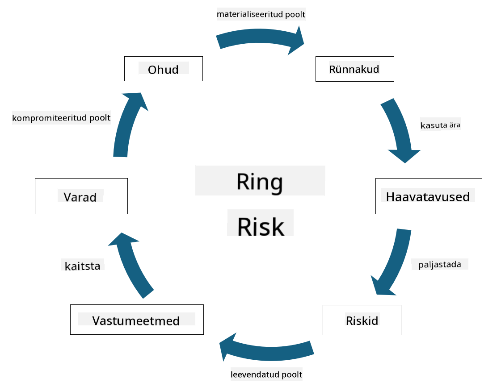

<!--
CO_OP_TRANSLATOR_METADATA:
{
  "original_hash": "fcca304f072cabf206388199e8e2e578",
  "translation_date": "2025-10-11T11:28:44+00:00",
  "source_file": "1.3 Understanding risk management.md",
  "language_code": "et"
}
-->
# Riskijuhtimise mõistmine

## Sissejuhatus

Selles õppetükis käsitleme:

 - Levinud turbeterminoloogia definitsioone
   
 - Turvakontrollide tüüpe

 - Turvariskide hindamist

## Levinud turbeterminoloogia definitsioonid

Need terminid on küberturvalisuse ja riskijuhtimise valdkonna põhikontseptsioonid. Vaatame iga terminit lähemalt ja kuidas need omavahel seotud on:

1. **Ohutegur**:

Ohutegur on isik, grupp, organisatsioon või automatiseeritud süsteem, millel on potentsiaal kasutada süsteemi või võrgu haavatavusi, et põhjustada kahju või kahjustusi. Ohutegurid võivad olla häkkerid, pahavara autorid, rahulolematud töötajad või mis tahes üksus, mis kujutab endast ohtu teabe- ja tehnoloogiasüsteemidele.

2. **Oht**:

Oht on potentsiaalne sündmus või tegevus, mis võib kasutada süsteemi haavatavusi ja põhjustada kahju varale. Ohud võivad hõlmata tegevusi nagu häkkimine, andmelekked, teenusetõkestusrünnakud ja palju muud. Ohud on "mis" potentsiaalse kahju osas, mida organisatsiooni varadele võib tekitada.

3. **Haavatavus**:

Haavatavus on süsteemi disaini, rakenduse või konfiguratsiooni nõrkus või viga, mida ohutegur võib kasutada süsteemi turvalisuse kompromiteerimiseks. Haavatavused võivad esineda tarkvaras, riistvaras, protsessides või inimkäitumises. Haavatavuste tuvastamine ja kõrvaldamine on oluline edukate rünnakute riski minimeerimiseks.

4. **Risk**:

Risk on potentsiaalne kaotus, kahju või kahjustus, mis tuleneb ohu ja haavatavuse koostoimest. See on tõenäosus, et ohutegur kasutab haavatavust, et põhjustada negatiivset mõju. Riski hinnatakse sageli selle potentsiaalse mõju ja esinemise tõenäosuse alusel.

5. **Vara**:

Vara on mis tahes väärtuslik asi, mida organisatsioon soovib kaitsta. Varad võivad hõlmata füüsilisi objekte (näiteks arvutid ja serverid), andmeid (kliendiinfo, finantsdokumendid), intellektuaalset omandit (ärisaladused, patendid) ja isegi inimressursse (töötajate oskused ja teadmised). Varade kaitsmine on küberturvalisuse peamine eesmärk.

6. **Kokkupuude**:

Kokkupuude viitab haavatavuse olemasolule, mida ohutegur võib kasutada. See toob esile riski, mis on seotud haavatavuste olemasoluga süsteemis või võrgus.

7. **Kontroll**:

Kontroll on meede, mis on rakendatud riskide vähendamiseks, mis on seotud haavatavuste ja ohtudega. Kontrollid võivad olla tehnilised, protseduurilised või administratiivsed. Need on mõeldud ohtude ja haavatavuste ennetamiseks, tuvastamiseks või leevendamiseks. Näited hõlmavad tulemüüre, juurdepääsukontrolle, krüpteerimist, turvapoliitikaid ja töötajate koolitust.

Kokkuvõtteks: ohutegurid kasutavad haavatavusi, et teostada ohte, mis võivad viia riskideni, mis võivad kahjustada väärtuslikke varasid. Kokkupuude tekib, kui haavatavused on olemas, ja kontrollid rakendatakse riski vähendamiseks, ennetades või leevendades ohtude mõju varadele. See raamistik moodustab küberturvalisuse riskijuhtimise aluse, juhendades organisatsioone tuvastama, hindama ja lahendama potentsiaalseid riske nende infosüsteemidele ja varadele.

## Turvakontrollide tüübid

Turvakontrollid on meetmed või kaitsevahendid, mis on rakendatud infosüsteemide ja varade kaitsmiseks erinevate ohtude ja haavatavuste eest. Neid saab klassifitseerida mitmesse kategooriasse vastavalt nende fookusele ja eesmärgile. Siin on mõned levinud turvakontrollide tüübid:

1. **Administratiivsed kontrollid**:

Need kontrollid on seotud poliitikate, protseduuride ja juhistega, mis reguleerivad organisatsiooni turvapõhimõtteid ja kasutajate käitumist.

- Turvapoliitikad ja -protseduurid: Dokumenteeritud juhised, mis määratlevad, kuidas turvalisust organisatsioonis hoitakse.

- Turvateadlikkus ja koolitus: Programmid, mis harivad töötajaid turvalisuse parimate tavade ja potentsiaalsete ohtude kohta.

- Intsidentide reageerimine ja haldamine: Plaanid turvaintsidentidele reageerimiseks ja nende leevendamiseks.

2. **Tehnilised kontrollid**:

Tehnilised kontrollid hõlmavad tehnoloogia kasutamist turvameetmete rakendamiseks ja süsteemide ning andmete kaitsmiseks. Näited tehnilistest kontrollidest:

- Juurdepääsukontrollid: Meetmed, mis piiravad kasutajate juurdepääsu ressurssidele vastavalt nende rollidele ja õigustele.

- Krüpteerimine: Andmete muutmine turvaliseks vorminguks, et vältida volitamata juurdepääsu.

- Tulemüürid: Võrguturvaseadmed, mis filtreerivad ja kontrollivad sissetulevat ja väljaminevat liiklust.

- Sissetungide tuvastamise ja ennetamise süsteemid (IDPS): Tööriistad, mis jälgivad võrguliiklust kahtlase tegevuse tuvastamiseks.

- Viirusetõrje ja pahavaratõrje tarkvara: Programmid, mis tuvastavad ja eemaldavad pahatahtlikku tarkvara.

- Autentimismehhanismid: Meetodid kasutajate identiteedi kontrollimiseks, näiteks paroolid, biomeetria ja mitmefaktoriline autentimine.

- Paranduste haldamine: Tarkvara regulaarne uuendamine, et lahendada teadaolevaid haavatavusi.

3. **Füüsilised kontrollid**:

Füüsilised kontrollid on meetmed füüsiliste varade ja rajatiste kaitsmiseks.

- Turvamehed ja juurdepääsukontrolli personal: Personal, kes jälgib ja kontrollib juurdepääsu füüsilistele ruumidele.

- Järelevalvekaamerad: Videovalvesüsteemid tegevuste jälgimiseks ja salvestamiseks.

- Lukud ja füüsilised tõkked: Füüsilised meetmed tundlikele aladele juurdepääsu piiramiseks.

- Keskkonnakontrollid: Meetmed temperatuuri, niiskuse ja muude keskkonnategurite reguleerimiseks, mis mõjutavad seadmeid ja andmekeskusi.

4. **Operatiivsed kontrollid**:

Need kontrollid on seotud igapäevaste tegevuste ja toimingutega, mis tagavad süsteemide pideva turvalisuse.

- Muutuste haldamine: Protsessid süsteemide ja konfiguratsioonide muudatuste jälgimiseks ja heakskiitmiseks.

- Varundamine ja katastroofide taastamine: Plaanid andmete varundamiseks ja taastamiseks süsteemirikke või katastroofi korral.

- Logimine ja auditeerimine: Süsteemitegevuste jälgimine ja salvestamine turvalisuse ja vastavuse eesmärgil.

- Turvalise kodeerimise tavad: Juhised tarkvara kirjutamiseks, et minimeerida haavatavusi.

5. **Õiguslikud ja regulatiivsed kontrollid**:

Need kontrollid tagavad vastavuse asjakohastele seadustele, regulatsioonidele ja tööstusstandarditele. Standardid, millele organisatsioon peab vastama, sõltuvad jurisdiktsioonist, tööstusharust ja muudest teguritest.

- Andmekaitse regulatsioonid: Vastavus seadustele nagu GDPR, HIPAA ja CCPA.

- Tööstusharu spetsiifilised standardid: Vastavus standarditele nagu PCI DSS maksekaardi andmete turvalisuse jaoks.

Need turvakontrollide kategooriad töötavad koos, et luua organisatsioonidele terviklik turvapositsioon, aidates kaitsta nende süsteeme, andmeid ja varasid mitmesuguste ohtude eest.

## Turvariskide hindamine

Mõned turvalisuse spetsialistid arvavad, et riskijuhtimine on riskispetsialistide ülesanne, kuid turvariski juhtimise protsessi mõistmine on oluline igale turvalisuse spetsialistile, et aidata väljendada turvariski keeles, mida ülejäänud organisatsioon saab mõista ja millele reageerida.

Organisatsioonid peavad pidevalt hindama turvariske ja otsustama, milliseid meetmeid (või mitte) võtta äririskide vastu. Allpool on ülevaade sellest, kuidas seda tavaliselt tehakse. Pange tähele, et see protsess viiakse tavaliselt läbi mitme erineva meeskonna poolt organisatsioonis; harva vastutab üks meeskond riskijuhtimise eest algusest lõpuni.

1. **Varade ja ohtude tuvastamine**:

Organisatsioon tuvastab varad, mida ta soovib kaitsta. Need võivad hõlmata andmeid, süsteeme, riistvara, tarkvara, intellektuaalset omandit ja palju muud. Seejärel tuvastatakse potentsiaalsed ohud, mis võivad neid varasid sihtida.

2. **Haavatavuste hindamine**:

Organisatsioonid tuvastavad seejärel haavatavused või nõrkused süsteemides või protsessides, mida ohud võivad kasutada. Need haavatavused võivad tuleneda tarkvara vigadest, valest konfiguratsioonist, turvakontrollide puudumisest ja inimlikest eksimustest.

3. **Tõenäosuse hindamine**:

Organisatsioon hindab seejärel iga ohu esinemise tõenäosust. See hõlmab ajalooliste andmete, ohuluure, tööstustrendide ja sisemiste tegurite kaalumist. Tõenäosust saab kategoriseerida madalaks, keskmiseks või kõrgeks, lähtudes ohu realiseerumise tõenäosusest.

4. **Mõju hindamine**:

Järgmisena määrab organisatsioon iga ohu potentsiaalse mõju, kui see kasutaks haavatavust. Mõju võib hõlmata rahalisi kaotusi, operatiivseid häireid, mainekahju, õiguslikke tagajärgi ja palju muud. Mõju saab samuti kategoriseerida madalaks, keskmiseks või kõrgeks, lähtudes potentsiaalsetest tagajärgedest.

5. **Riski arvutamine**:

Tõenäosuse ja mõju hinnangud kombineeritakse, et arvutada iga tuvastatud ohu üldine riskitase. Seda tehakse sageli riskimaatriksi abil, mis määrab tõenäosuse ja mõju tasemetele numbrilised väärtused või kvalitatiivsed kirjeldused. Tulemuseks olev riskitase aitab prioriseerida, millised riskid vajavad kohest tähelepanu.

6. **Prioriteetide seadmine ja otsuste tegemine**:

Organisatsioon prioriseerib riske, keskendudes neile, millel on kõrgeim kombineeritud tõenäosuse ja mõju väärtus. See võimaldab ressursse ja kontrollimeetmeid tõhusamalt rakendada. Kõrge riskiga ohud vajavad kohest tähelepanu, samas kui madalama riskiga ohte võib käsitleda pikema aja jooksul.

7. **Riski käsitlemine**:

Riski hindamise põhjal otsustab organisatsioon, kuidas iga riski leevendada või hallata. See võib hõlmata turvakontrollide rakendamist, riski ülekandmist kindlustuse kaudu või isegi teatud jääkriski aktsepteerimist, kui see on hallatav/liiga kulukas lahendada/jne.

8. **Pidev jälgimine ja ülevaatus**:

Riski hindamine ei ole ühekordne protsess. Seda tuleks läbi viia perioodiliselt või alati, kui organisatsiooni keskkonnas toimuvad olulised muutused. Pidev jälgimine tagab, et uued ohud, haavatavused või muutused ärikeskkonnas võetakse arvesse.

Hinnates turvariske struktureeritud viisil, saavad organisatsioonid teha teadlikke otsuseid ressursside jaotamise, turvakontrollide ja üldiste riskijuhtimise strateegiate kohta. Eesmärk on vähendada organisatsiooni üldist riskikokkupuudet, samal ajal kui turvalisuse jõupingutused on kooskõlas organisatsiooni ärieesmärkide ja -prioriteetidega.

---

**Lahtiütlus**:  
See dokument on tõlgitud AI tõlketeenuse [Co-op Translator](https://github.com/Azure/co-op-translator) abil. Kuigi püüame tagada täpsust, palume arvestada, et automaatsed tõlked võivad sisaldada vigu või ebatäpsusi. Algne dokument selle algses keeles tuleks pidada autoriteetseks allikaks. Olulise teabe puhul soovitame kasutada professionaalset inimtõlget. Me ei vastuta selle tõlke kasutamisest tulenevate arusaamatuste või valesti tõlgenduste eest.