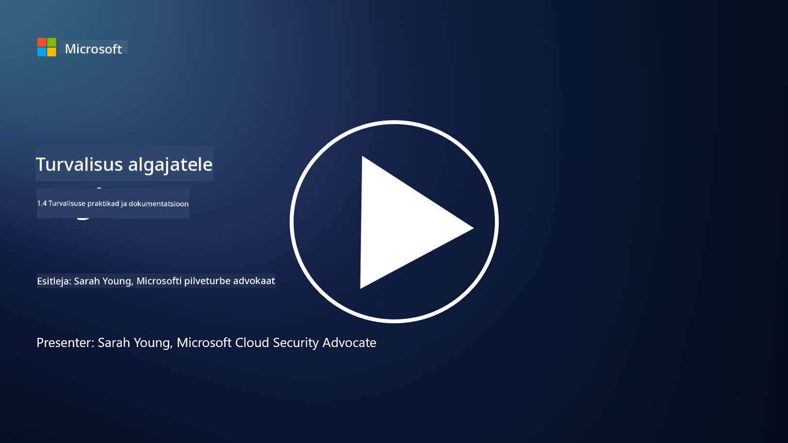

<!--
CO_OP_TRANSLATOR_METADATA:
{
  "original_hash": "d33500902124e52870935bdce4546fcc",
  "translation_date": "2025-10-11T11:17:32+00:00",
  "source_file": "1.4 Security practices and documentation.md",
  "language_code": "et"
}
-->
# Turvapraktikad ja dokumentatsioon

Võib-olla olete varem kuulnud väljendeid „turvapoliitika“, „turvastandard“ jne, kuid tegelikkus on see, et paljud küberjulgeoleku spetsialistid ei kasuta neid õigesti. Selles jaotises selgitame, mida iga väljend tähendab ja miks organisatsioon neid kasutaks.

## Sissejuhatus

Selles õppetükis käsitleme:

- Mis on turvapoliitika?

- Mis on turvastandard?

- Mis on turvaalus?

- Mis on turvajuhend?

- Mis on turvaprotseduur?

- Millised on seadused ja regulatsioonid küberjulgeoleku kontekstis?

Neid termineid kasutatakse sageli küberjulgeoleku kontekstis, et määratleda erinevaid tasemeid turvadokumentatsioonis ja praktikates organisatsioonis. Selgitame iga terminit:

## Mis on turvapoliitika?

Turvapoliitika on kõrgetasemeline dokument, mis kirjeldab organisatsiooni üldisi turvaeesmärke, põhimõtteid ja juhiseid. See pakub raamistiku turvalisusega seotud otsuste tegemiseks ja määrab organisatsiooni turvahoia. Turvapoliitikad hõlmavad tavaliselt selliseid teemasid nagu ressursside lubatud kasutamine, andmekaitse, juurdepääsukontroll, intsidentidele reageerimine ja palju muud. Poliitika on lahendus- ja tehnoloogia sõltumatu. Näiteks paljud on tuttavad organisatsiooni lubatud kasutamise poliitikaga.

## Mis on turvastandard?

Turvastandard on detailsem ja konkreetsem dokument, mis pakub juhiseid ja nõudeid turvakontrollide ja -meetmete rakendamiseks organisatsioonis. Standardid on poliitikast konkreetsemad ja tehnilisemad, pakkudes täpseid juhiseid ja soovitusi süsteemide, võrkude ja protsesside konfigureerimiseks ja hooldamiseks, et saavutada turvaeesmärgid. Näiteks turvastandard võiks olla _„Kõik sisemised andmed peavad olema krüpteeritud nii salvestamisel kui edastamisel.”_

## Mis on turvaalus?

Turvaalus on minimaalsete turvakonfiguratsioonide kogum, mida peetakse oluliseks konkreetse süsteemi, rakenduse või keskkonna jaoks kindlal ajahetkel. See määratleb turvalisuse algtaseme, mida tuleks rakendada kõigis asjakohastes instantsides. Turvaalused aitavad tagada järjepidevust ja teatud tasemel turvalisust kogu organisatsiooni IT-infrastruktuuris. Näiteks turvaalus võiks olla _„Azure virtuaalmasinatel ei tohi olla otsest internetiühendust.”_

## Mis on turvajuhend?

Turvajuhend on dokument, mis pakub soovitusi ja juhiseid, kui konkreetne turvastandard ei kehti. Juhendid püüavad lahendada „hallid alad“, mis tekivad, kui standard ei kata või katab ainult osaliselt mõnda küsimust.

## Mis on turvaprotseduur?

Turvaprotseduur on detailne samm-sammuline juhend, mis kirjeldab konkreetseid tegevusi ja ülesandeid, mida tuleb täita turvalisusega seotud protsessi või ülesande teostamiseks. Protseduurid on praktilised ja rakendatavad dokumendid, mis pakuvad selget tegevuste järjekorda intsidentidele reageerimisel, süsteemi hooldamisel, kasutajate liitmisel ja muudes turvalisusega seotud tegevustes. Näiteks turvaprotseduur võiks olla _„Kui Microsoft Sentinel genereerib P1 turvaintsidendi, peab turvaoperatsioonide keskus (SOC) viivitamatult teavitama valves olevat turvajuhti ja saatma talle intsidenti puudutavad üksikasjad.”_

Kokkuvõttes esindavad need terminid erinevaid dokumentatsiooni ja juhendamise tasemeid organisatsiooni küberjulgeoleku raamistikus. Turvapoliitikad määravad kõrgetasemelised eesmärgid, standardid pakuvad detailseid nõudeid, alused kehtestavad minimaalsed turvakonfiguratsioonid, juhendid pakuvad parimaid praktikaid ja protseduurid pakuvad rakendatavaid samme turvaprotsesside jaoks.

## Mis on seadused/regulatsioonid küberjulgeoleku kontekstis?

Seadused ja regulatsioonid viitavad valitsuste ja regulatiivorganite kehtestatud õigusraamistikele, mis määratlevad ja jõustavad reegleid, standardeid ja nõudeid digitaalsete süsteemide, andmete ja teabe turvalisuse tagamiseks. Need seadused ja regulatsioonid varieeruvad jurisdiktsiooni järgi ning keskenduvad erinevatele küberjulgeoleku aspektidele, sealhulgas andmekaitsele, privaatsusele, intsidentide raporteerimisele ja kriitilise infrastruktuuri turvalisusele. Siin on mõned näited küberjulgeolekuga seotud seadustest ja regulatsioonidest: näiteks üldine andmekaitsemäärus (GDPR), tervisekindlustuse kaasaskantavuse ja vastutuse seadus (HIPAA), California tarbijate privaatsusseadus (CCPA), maksekaarditööstuse andmeturbe standard (PCI DSS).

## Lisalugemine

[Informatsiooni turvapoliitika mallid | SANS Instituut](https://www.sans.org/information-security-policy/)

[Küberjulgeoleku ja privaatsusseaduste ning regulatsioonide järgimine | NIST](https://www.nist.gov/mep/cybersecurity-resources-manufacturers/compliance-cybersecurity-and-privacy-laws-and-regulations)

---

**Lahtiütlus**:  
See dokument on tõlgitud, kasutades AI tõlketeenust [Co-op Translator](https://github.com/Azure/co-op-translator). Kuigi püüame tagada täpsust, palun arvestage, et automaatsed tõlked võivad sisaldada vigu või ebatäpsusi. Algne dokument selle algkeeles tuleks lugeda autoriteetseks allikaks. Olulise teabe puhul on soovitatav kasutada professionaalset inimtõlget. Me ei vastuta selle tõlke kasutamisest tulenevate arusaamatuste või valede tõlgenduste eest.