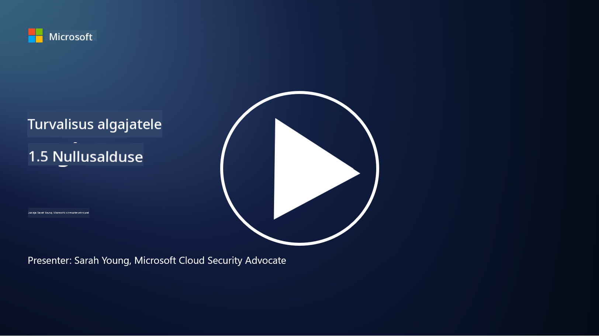
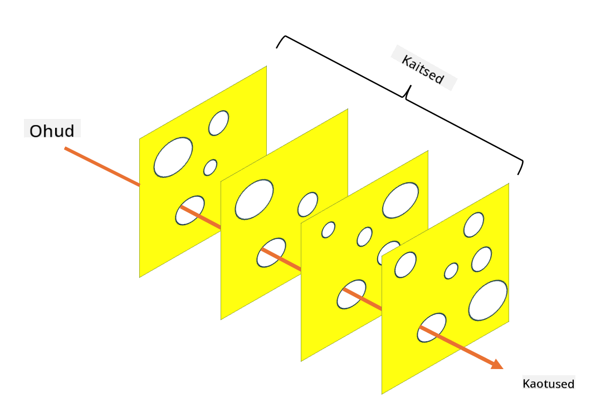

<!--
CO_OP_TRANSLATOR_METADATA:
{
  "original_hash": "75f77f972d2233c584f87c1eb96c983b",
  "translation_date": "2025-10-11T11:26:15+00:00",
  "source_file": "1.5 Zero trust.md",
  "language_code": "et"
}
-->
# Nullusaldus

"Nullusaldus" on fraas, mida tänapäeval turvalisuse valdkonnas sageli kasutatakse. Aga mida see tegelikult tähendab? Kas see on lihtsalt moesõna? Selles õppetükis uurime täpselt, mis nullusaldus endast kujutab.

## Sissejuhatus

- Selles õppetükis käsitleme:

- Mis on nullusaldus?

- Kuidas erineb nullusaldus traditsioonilistest turvaarhitektuuridest?

- Mis on süvaturve?

## Nullusaldus

Nullusaldus on küberjulgeoleku lähenemisviis, mis seab kahtluse alla traditsioonilise "usalda, aga kontrolli" põhimõtte, eeldades, et ükski üksus – olgu see organisatsiooni võrgus sees või väljas – ei tohiks olla automaatselt usaldusväärne. Selle asemel propageerib nullusaldus iga kasutaja, seadme ja rakenduse kontrollimist, mis üritab ressursse kasutada, olenemata nende asukohast. Nullusalduse põhieesmärk on vähendada "rünnakupinda" ja piirata turvarikkumiste võimalikku mõju.

Nullusalduse mudelis rõhutatakse järgmisi põhimõtteid:

1. **Identiteedi kontrollimine**: Autentimine ja autoriseerimine rakendatakse rangelt kõigile kasutajatele ja seadmetele, olenemata nende asukohast. Pidage meeles, et identiteet ei pea tingimata olema inimene – see võib olla ka seade, rakendus jne.

2. **Minimaalne privileeg**: Kasutajatele ja seadmetele antakse ainult minimaalne juurdepääs, mis on vajalik nende ülesannete täitmiseks, vähendades kahju ulatust, kui need kompromiteeritakse.

3. **Mikrosegmenteerimine**: Võrguresursid jagatakse väiksemateks segmentideks, et piirata liikumist võrgus rikkumise korral.

4. **Pidev jälgimine**: Kasutajate ja seadmete käitumist jälgitakse ja analüüsitakse pidevalt, et tuvastada anomaaliaid ja võimalikke ohte. Kaasaegsed jälgimistehnikad kasutavad masinõpet, tehisintellekti ja ohuluure, et pakkuda täiendavat detaili ja konteksti.

5. **Andmete krüpteerimine**: Andmed krüpteeritakse nii edastamisel kui ka salvestamisel, et vältida volitamata juurdepääsu.

6. **Range juurdepääsukontroll**: Juurdepääsukontrolli rakendatakse konteksti alusel, näiteks kasutaja rollid, seadme tervis ja võrgu asukoht.

Microsoft jagab nullusalduse viieks sambaks, mida käsitleme hilisemas õppetükis.

## Erinevused traditsioonilistest turvaarhitektuuridest

Nullusaldus erineb traditsioonilistest turvaarhitektuuridest, nagu perimeetripõhised mudelid, mitmel viisil:

1. **Perimeeter vs. identiteedikesksus**: Traditsioonilised mudelid keskenduvad võrgu perimeetri turvamisele, eeldades, et sisemised kasutajad ja seadmed on usaldusväärsed, kui nad on sees. Nullusaldus eeldab, et ohud võivad pärineda nii seest kui väljast ning rakendab ranget identiteedipõhist kontrolli.

2. **Kaudne vs. otsene usaldus**: Traditsioonilised mudelid usaldavad kaudselt võrgu sees olevaid seadmeid ja kasutajaid, kuni tõestatakse vastupidist. Nullusaldus kontrollib identiteete otseselt ja jälgib pidevalt anomaaliaid.

3. **Lame vs. segmenteeritud võrk**: Traditsioonilised arhitektuurid hõlmavad sageli lamedaid võrke, kus sisemistel kasutajatel on lai juurdepääs. Nullusaldus propageerib võrgu jagamist väiksemateks, isoleeritud tsoonideks, et piirata rikkumiste ulatust.

4. **Reaktiivne vs. proaktiivne**: Traditsiooniline turvalisus tugineb sageli reaktiivsetele meetmetele, nagu perimeetri tulemüürid ja sissetungide tuvastamine. Nullusaldus võtab proaktiivse lähenemise, eeldades, et rikkumised on tõenäolised, ja minimeerides nende mõju.

## Süvaturve

Süvaturve, tuntud ka kui kihiline turvalisus, on küberjulgeoleku strateegia, mis hõlmab mitme turvakontrolli ja meetme rakendamist organisatsiooni varade kaitsmiseks. Eesmärk on luua kattuvad kaitsekihid, nii et kui üks kiht on ohustatud, suudavad teised siiski kaitset pakkuda. Iga kiht keskendub erinevale turvalisuse aspektile ja suurendab organisatsiooni üldist turvalisust.

Süvaturve hõlmab tehniliste, protseduuriliste ja füüsiliste turvameetmete kombinatsiooni. Need võivad hõlmata tulemüüre, sissetungide tuvastamise süsteeme, juurdepääsukontrolle, krüpteerimist, kasutajakoolitust, turvapoliitikaid ja palju muud. Idee on luua mitu barjääri, mis üheskoos muudavad ründajatel organisatsiooni süsteemidesse ja võrkudesse tungimise keeruliseks. Seda nimetatakse mõnikord ka "Šveitsi juustu" mudeliks, mida kasutatakse ka õnnetuste ennetamisel teistes tööstusharudes (nt transport).

## Lisalugemine

[Mis on nullusaldus?](https://learn.microsoft.com/security/zero-trust/zero-trust-overview?WT.mc_id=academic-96948-sayoung)

[Nullusalduse areng – Microsofti seisukohad](https://query.prod.cms.rt.microsoft.com/cms/api/am/binary/RWJJdT?WT.mc_id=academic-96948-sayoung)

[Nullusaldus ja BeyondCorp Google Cloud | Google Cloud Blog](https://cloud.google.com/blog/topics/developers-practitioners/zero-trust-and-beyondcorp-google-cloud)

---

**Lahtiütlus**:  
See dokument on tõlgitud AI tõlketeenuse [Co-op Translator](https://github.com/Azure/co-op-translator) abil. Kuigi püüame tagada täpsust, palume arvestada, et automaatsed tõlked võivad sisaldada vigu või ebatäpsusi. Algne dokument selle algses keeles tuleks pidada autoriteetseks allikaks. Olulise teabe puhul soovitame kasutada professionaalset inimtõlget. Me ei vastuta selle tõlke kasutamisest tulenevate arusaamatuste või valesti tõlgenduste eest.