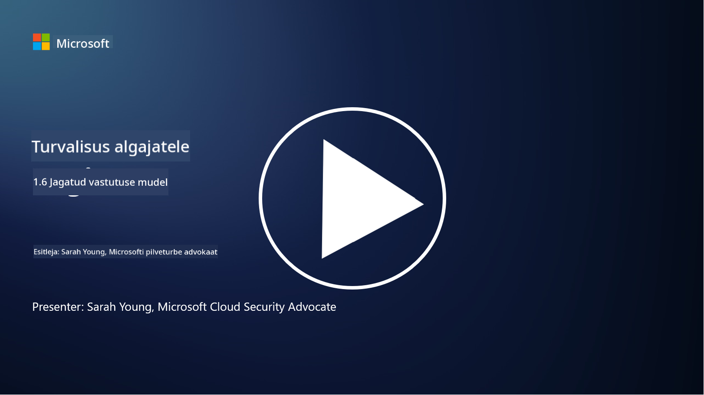

<!--
CO_OP_TRANSLATOR_METADATA:
{
  "original_hash": "a48db640d80c786b928ca178c414f084",
  "translation_date": "2025-10-11T11:25:01+00:00",
  "source_file": "1.6 Shared responsibility model.md",
  "language_code": "et"
}
-->
# Jagatud vastutuse mudel

Jagatud vastutus on IT-s suhteliselt uus kontseptsioon, mis tekkis pilvearvutuse tulekuga. Küberjulgeoleku seisukohalt on kriitiline mõista, kes pakub milliseid turvakontrolle, et vältida kaitselünki.

## Sissejuhatus

Selles õppetükis käsitleme:

 - Mis on jagatud vastutus küberjulgeoleku kontekstis?
   
 - Millised on erinevused turvakontrollide jagatud vastutuses IaaS-i, PaaS-i ja SaaS-i vahel?

 - Kust leida teavet selle kohta, milliseid turvakontrolle teie pilveplatvorm pakub?

 - Mis tähendab "usalda, aga kontrolli"?

## Mis on jagatud vastutus küberjulgeoleku kontekstis?

Jagatud vastutus küberjulgeolekus viitab turvavastutuste jaotamisele pilveteenuse pakkuja (CSP) ja tema klientide vahel. Pilvearvutuse keskkondades, nagu Infrastructure as a Service (IaaS), Platform as a Service (PaaS) ja Software as a Service (SaaS), on nii CSP-l kui ka kliendil rollid, et tagada andmete, rakenduste ja süsteemide turvalisus.

## Millised on erinevused turvakontrollide jagatud vastutuses IaaS-i, PaaS-i ja SaaS-i vahel?

Vastutuste jaotus sõltub tavaliselt kasutatavast pilveteenuse tüübist:

 - **IaaS (Infrastructure as a Service)**: CSP pakub põhiinfrastruktuuri (serverid, võrgud, salvestusruum), samal ajal kui klient vastutab operatsioonisüsteemide, rakenduste ja turvakonfiguratsioonide haldamise eest sellel infrastruktuuril.
   
 - **PaaS (Platform as a Service):** CSP pakub platvormi, millel kliendid saavad rakendusi luua ja juurutada. CSP haldab alusinfrastruktuuri, klient keskendub rakenduste arendamisele ja andmete turvalisusele.

 - **SaaS (Software as a Service):** CSP pakub täielikult funktsionaalseid rakendusi, mis on interneti kaudu kättesaadavad. Sel juhul vastutab CSP rakenduse ja infrastruktuuri turvalisuse eest, samal ajal kui klient haldab kasutajate juurdepääsu ja andmete kasutamist.

Jagatud vastutuse mõistmine on oluline, kuna see selgitab, millised turvaaspektid on CSP poolt kaetud ja millised tuleb kliendil ise lahendada. See aitab vältida arusaamatusi ja tagada, et turvameetmed rakendatakse terviklikult.

## Kust leida teavet selle kohta, milliseid turvakontrolle teie pilveplatvorm pakub?

Teabe leidmiseks pilveplatvormi pakutavate turvakontrollide kohta tuleb viidata pilveteenuse pakkuja dokumentatsioonile ja ressurssidele. Need hõlmavad:

 - **CSP veebisait ja dokumentatsioon**: CSP veebisait sisaldab teavet nende teenuste osana pakutavate turvafunktsioonide ja -kontrollide kohta. CSP-d pakuvad tavaliselt üksikasjalikku dokumentatsiooni, mis selgitab nende turvatavasid, kontrolle ja soovitusi. See võib hõlmata valgeid raamatuid, turvajuhendeid ja tehnilist dokumentatsiooni.
   
 - **Turvahindamised ja auditid**: enamik CSP-sid laseb oma turvakontrollid hinnata sõltumatutel turvaekspertidel ja organisatsioonidel. Need ülevaated annavad ülevaate CSP turvameetmete kvaliteedist. Mõnikord viib see CSP turvastandardite sertifikaadi saamiseni (vt järgmist punkti).
   
 - **Turvastandardite sertifikaadid**: enamik CSP-sid omandab sertifikaate, nagu ISO:27001, SOC 2 ja FedRAMP jne. Need sertifikaadid näitavad, et teenusepakkuja vastab konkreetsetele turva- ja vastavusstandarditele.

Pidage meeles, et teabe detailsus ja kättesaadavus võivad pilveteenuse pakkujate vahel erineda. Veenduge alati, et konsulteerite ametlike ja ajakohaste ressurssidega, mida pilveteenuse pakkuja pakub, et teha teadlikke otsuseid oma pilvepõhiste varade turvalisuse kohta.

## Mis tähendab "usalda, aga kontrolli"?

CSP, kolmanda osapoole tarkvara või muu IT-turvateenuse kasutamise kontekstis võib organisatsioon algselt usaldada teenusepakkuja väiteid turvameetmete kohta. Kuid selleks, et tõeliselt tagada oma andmete ja süsteemide turvalisus, peaksid nad neid väiteid kontrollima turvahindamiste, läbitungimistestide ja välise osapoole turvakontrollide ülevaatamise kaudu enne tarkvara või teenuse täielikku integreerimist oma tegevusse. Kõik isikud ja organisatsioonid peaksid usaldama, kuid kontrollima turvakontrolle, mille eest nad ise ei vastuta.

## Jagatud vastutus organisatsiooni sees

Pidage meeles, et turvalisuse jagatud vastutus organisatsiooni sees erinevate meeskondade vahel tuleb samuti arvesse võtta. Turvameeskond ei rakenda harva kõiki kontrolle ise ja peab tegema koostööd operatsioonimeeskondade, arendajate ja teiste ärivaldkondadega, et rakendada kõiki vajalikke turvakontrolle, mis aitavad organisatsiooni turvalisena hoida.

## Lisalugemine
- [Jagatud vastutus pilves - Microsoft Azure | Microsoft Learn](https://learn.microsoft.com/azure/security/fundamentals/shared-responsibility?WT.mc_id=academic-96948-sayoung)
- [Mis on jagatud vastutuse mudel? – TechTarget.com](https://www.techtarget.com/searchcloudcomputing/definition/shared-responsibility-model)
- [Jagatud vastutuse mudel selgitatud ja mida see tähendab pilveturvalisuse jaoks | CSO Online](https://www.csoonline.com/article/570779/the-shared-responsibility-model-explained-and-what-it-means-for-cloud-security.html)
- [Jagatud vastutus pilveturvalisuse eest: mida peate teadma (cisecurity.org)](https://www.cisecurity.org/insights/blog/shared-responsibility-cloud-security-what-you-need-to-know)

---

**Lahtiütlus**:  
See dokument on tõlgitud AI tõlketeenuse [Co-op Translator](https://github.com/Azure/co-op-translator) abil. Kuigi püüame tagada täpsust, palume arvestada, et automaatsed tõlked võivad sisaldada vigu või ebatäpsusi. Algne dokument selle algses keeles tuleks pidada autoriteetseks allikaks. Olulise teabe puhul soovitame kasutada professionaalset inimtõlget. Me ei vastuta selle tõlke kasutamisest tulenevate arusaamatuste või valesti tõlgenduste eest.