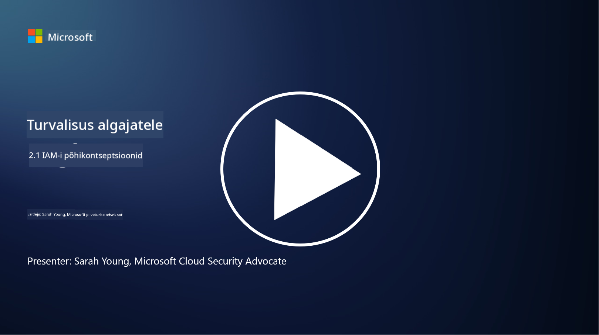

<!--
CO_OP_TRANSLATOR_METADATA:
{
  "original_hash": "2e3864e3d579f0dbb4ac2ec8c5f82acf",
  "translation_date": "2025-10-11T11:29:33+00:00",
  "source_file": "2.1 IAM key concepts.md",
  "language_code": "et"
}
-->
# IAM põhikontseptsioonid

Kas oled kunagi arvutisse või veebilehele sisse loginud? Loomulikult oled! See tähendab, et oled juba igapäevaelus kasutanud identiteedikontrolle. Identiteedi- ja juurdepääsuhaldus (IAM) on turvalisuse oluline tugisammas, millest õpime järgmistes tundides rohkem.

**Sissejuhatus**

Selles tunnis käsitleme:

- Mida me mõtleme identiteedi- ja juurdepääsuhalduse (IAM) all
  küberjulgeoleku kontekstis?
  
- Mis on minimaalsete õiguste põhimõte?
  
- Mis on ülesannete eraldamine?
  
- Mis on autentimine ja autoriseerimine?

## Mida me mõtleme identiteedi- ja juurdepääsuhalduse (IAM) all küberjulgeoleku kontekstis?

Identiteedi- ja juurdepääsuhaldus (IAM) viitab protsesside, tehnoloogiate ja poliitikate kogumile, mis on rakendatud tagamaks, et õiged isikud saavad sobiva juurdepääsu organisatsiooni digitaalse keskkonna ressurssidele. IAM hõlmab digitaalsete identiteetide (kasutajad, töötajad, partnerid) haldamist ning nende juurdepääsu süsteemidele, rakendustele, andmetele ja võrkudele. IAM-i peamine eesmärk on suurendada turvalisust, lihtsustada kasutajate juurdepääsu ja tagada vastavus organisatsiooni poliitikatele ja regulatsioonidele. IAM-lahendused hõlmavad tavaliselt kasutaja autentimist, autoriseerimist, identiteedi loomist, juurdepääsukontrolli ja kasutaja elutsükli haldamist (tagades, et kontod kustutatakse, kui neid enam ei kasutata).

## Mis on minimaalsete õiguste põhimõte?

Minimaalsete õiguste põhimõte on fundamentaalne kontseptsioon, mis soovitab anda kasutajatele ja süsteemidele ainult minimaalsed õigused, mis on vajalikud nende ülesannete või rollide täitmiseks. See põhimõte aitab piirata potentsiaalset kahju, mis võib tekkida turvarikkumise või sisemise ohu korral. Minimaalsete õiguste põhimõtte järgimine vähendab organisatsiooni rünnakupinda ja minimeerib volitamata juurdepääsu, andmelekkete ja privileegide väärkasutuse riski. Praktikas tähendab see, et kasutajatele antakse juurdepääs ainult konkreetsetele ressurssidele ja funktsioonidele, mis on vajalikud nende tööülesannete täitmiseks, ja mitte rohkem. Näiteks, kui sul on vaja ainult dokumenti lugeda, oleks liigne anda sulle dokumendi täielikud administraatoriõigused.

## Mis on ülesannete eraldamine?

Ülesannete eraldamine on põhimõte, mille eesmärk on vältida huvide konflikte ja vähendada pettuste ning vigade riski, jagades kriitilised ülesanded ja vastutused erinevate isikute vahel organisatsioonis. Küberjulgeoleku kontekstis tähendab ülesannete eraldamine, et ükski isik ei tohiks kontrollida kõiki kriitilise protsessi või süsteemi aspekte. Eesmärk on luua kontrollimehhanismide süsteem, mis takistab ühel inimesel teostamast nii seadistamise kui ka kinnitamise etappe protsessis. Näiteks finantssüsteemides võib see tähendada, et isik, kes sisestab tehingud süsteemi, ei tohiks olla sama isik, kes neid tehinguid kinnitab. See vähendab volitamata või petturlike tegevuste märkamatuks jäämise riski.

## Mis on autentimine ja autoriseerimine?

Autentimine ja autoriseerimine on kaks fundamentaalset kontseptsiooni küberjulgeolekus, mis mängivad olulist rolli arvutisüsteemide ja andmete turvalisuse ning terviklikkuse tagamisel. Neid kasutatakse sageli koos, et kontrollida juurdepääsu ressurssidele ja kaitsta tundlikku teavet.

**1. Autentimine**: Autentimine on protsess, mille käigus kontrollitakse kasutaja, süsteemi või üksuse identiteeti, kes üritab pääseda arvutisüsteemile või konkreetsele ressursile. See tagab, et väidetav identiteet on ehtne ja täpne. Autentimismeetodid hõlmavad tavaliselt ühe või mitme järgmise teguri kasutamist:
    
    a. Midagi, mida sa tead: Siia kuuluvad paroolid, PIN-koodid või muud salajased teadmised, mis peaksid olema ainult volitatud kasutaja valduses.
    
    b. Midagi, mis sul on: See hõlmab füüsilisi märke või seadmeid, nagu nutikaardid, turvamärgid või mobiiltelefonid, mida kasutatakse kasutaja identiteedi kinnitamiseks.
    
    c. Midagi, mis sa oled: See viitab biomeetrilistele teguritele, nagu sõrmejäljed, näotuvastus või võrkkesta skaneeringud, mis on unikaalsed konkreetsele isikule.
    

Autentimismehhanisme kasutatakse selleks, et kinnitada, et kasutaja on see, kes ta väidab end olevat, enne kui talle antakse juurdepääs süsteemile või ressursile. See aitab vältida volitamata juurdepääsu ja tagab, et ainult õigustatud kasutajad saavad süsteemis toiminguid teha.

**2. Autoriseerimine**: Autoriseerimine on protsess, mille käigus antakse või keelatakse konkreetseid õigusi ja privileege autentitud kasutajatele või üksustele pärast nende identiteedi kinnitamist. See määrab, milliseid toiminguid või operatsioone kasutaja võib süsteemis või konkreetsetel ressurssidel teha. Autoriseerimine põhineb sageli eelnevalt määratletud poliitikatel, juurdepääsukontrolli reeglitel ja kasutajatele määratud rollidel.

Autoriseerimist võib mõista kui vastust küsimusele: "Mida autentitud kasutaja teha võib?" See hõlmab juurdepääsukontrolli poliitikate määratlemist ja rakendamist, et kaitsta tundlikke andmeid ja ressursse volitamata juurdepääsu või muutmise eest.

**Kokkuvõttes:**

- Autentimine kinnitab kasutajate või üksuste identiteeti.
- Autoriseerimine määrab, milliseid toiminguid ja ressursse autentitud kasutajad võivad kasutada või muuta.

## Lisalugemine

- [Describe identity concepts - Training | Microsoft Learn](https://learn.microsoft.com/training/modules/describe-identity-principles-concepts/?WT.mc_id=academic-96948-sayoung)
- [Introduction to identity - Microsoft Entra | Microsoft Learn](https://learn.microsoft.com/azure/active-directory/fundamentals/identity-fundamental-concepts?WT.mc_id=academic-96948-sayoung)
- [What is Identity Access Management (IAM)? | Microsoft Security](https://www.microsoft.com/security/business/security-101/what-is-identity-access-management-iam?WT.mc_id=academic-96948-sayoung)
- [What is IAM? Identity and access management explained | CSO Online](https://www.csoonline.com/article/518296/what-is-iam-identity-and-access-management-explained.html)
- [What is IAM? (auth0.com)](https://auth0.com/blog/what-is-iam/)
- [Security+: implementing Identity and Access Management (IAM) controls [updated 2021] | Infosec (infosecinstitute.com)](https://resources.infosecinstitute.com/certifications/securityplus/security-implementing-identity-and-access-management-iam-controls/)
- [least privilege - Glossary | CSRC (nist.gov)](https://csrc.nist.gov/glossary/term/least_privilege)
- [Security: The Principle of Least Privilege (POLP) - Microsoft Community Hub](https://techcommunity.microsoft.com/t5/azure-sql-blog/security-the-principle-of-least-privilege-polp/ba-p/2067390?WT.mc_id=academic-96948-sayoung)
- [Principle of least privilege | CERT NZ](https://www.cert.govt.nz/it-specialists/critical-controls/principle-of-least-privilege/)
- [Why is separation of duties required by NIST 800-171 and CMMC? - (totem.tech)](https://www.totem.tech/cmmc-separation-of-duties/)

---

**Lahtiütlus**:  
See dokument on tõlgitud, kasutades AI tõlketeenust [Co-op Translator](https://github.com/Azure/co-op-translator). Kuigi püüame tagada täpsust, palun arvestage, et automaatsed tõlked võivad sisaldada vigu või ebatäpsusi. Algne dokument selle algkeeles tuleks lugeda autoriteetseks allikaks. Olulise teabe puhul on soovitatav kasutada professionaalset inimtõlget. Me ei vastuta selle tõlke kasutamisest tulenevate arusaamatuste või valesti tõlgenduste eest.