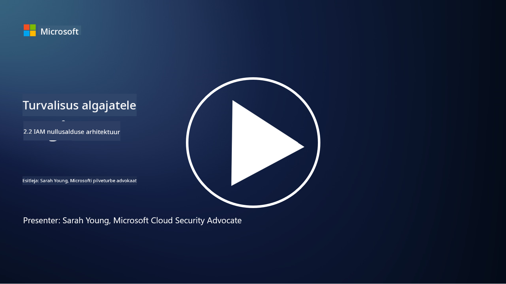

<!--
CO_OP_TRANSLATOR_METADATA:
{
  "original_hash": "4774a978af123f72ebb872199c4c4d4f",
  "translation_date": "2025-10-11T11:25:36+00:00",
  "source_file": "2.2 IAM zero trust architecture.md",
  "language_code": "et"
}
-->
# IAM nullusaldus arhitektuur

Identiteet on nullusaldus arhitektuuri rakendamise ja mis tahes IT-keskkonna perimeetri loomise oluline osa. Selles jaotises uurime, miks on identiteedikontrollide kasutamine nullusaldus arhitektuuri rakendamiseks oluline.

## Sissejuhatus

Selles õppetükis käsitleme:

 - Miks on vaja kasutada identiteeti perimeetrina kaasaegsetes IT-keskkondades?
   
 - Kuidas see erineb traditsioonilistest IT-arhitektuuridest?

 - Kuidas kasutatakse identiteeti nullusaldus arhitektuuri rakendamiseks?

## Miks on vaja kasutada identiteeti perimeetrina kaasaegsetes IT-keskkondades?

Kaasaegsetes IT-keskkondades muutub füüsilise perimeetri (näiteks tulemüüride ja võrgupiiride kasutamine) kontseptsioon küberohtude vastu esmase kaitseliinina vähem tõhusaks tehnoloogia kasvava keerukuse, kaugtöö tõusu ja pilveteenuste kasutuselevõtu tõttu. Selle asemel liiguvad organisatsioonid identiteedi kasutamise suunas uue perimeetrina. See tähendab, et turvalisus keskendub kasutajate, seadmete ja rakenduste identiteedi kontrollimisele ja haldamisele, kes püüavad ressursse kasutada, olenemata nende füüsilisest asukohast.

Siin on põhjused, miks identiteedi kasutamine perimeetrina on kaasaegsetes IT-keskkondades oluline:

**Kaugtööjõud**: Kaugtöö ja mobiilseadmete levikuga saavad kasutajad ressursse kasutada erinevatest asukohtadest ja seadmetest. Traditsiooniline perimeetril põhinev lähenemine ei toimi, kui kasutajad ei ole enam füüsilises kontoris.

**Pilv ja hübriidkeskkonnad**: Organisatsioonid võtavad üha enam kasutusele pilveteenuseid ja hübriidkeskkondi. Andmed ja rakendused ei asu enam ainult organisatsiooni ruumides, muutes traditsioonilised perimeetrikaitsed vähem asjakohaseks.

**Nullusaldus turvalisus**: Nullusaldus turvalisuse kontseptsioon eeldab, et ühtegi üksust, olgu see võrgus sees või väljas, ei tohiks automaatselt usaldada. Identiteet muutub aluseks juurdepääsutaotluste kontrollimiseks, olenemata nende päritolust.

**Ohumaastik**: Küberohud arenevad ja ründajad leiavad viise traditsiooniliste perimeetrikaitsete ületamiseks. Näiteks andmepüük, sotsiaalne manipuleerimine ja sisemised ohud kasutavad sageli inimeste haavatavusi, mitte ei püüa murda võrgupiire.

**Andmekeskne lähenemine**: Tundlike andmete kaitsmine on ülimalt tähtis. Keskendudes identiteedile, saavad organisatsioonid kontrollida, kes pääseb ligi millistele andmetele, vähendades andmelekkete riski.

## Kuidas see erineb traditsioonilistest IT-arhitektuuridest?

Traditsioonilised IT-arhitektuurid tuginesid tugevalt perimeetril põhinevatele turvamudelitele, kus tulemüürid ja võrgupiirid mängisid olulist rolli ohtude eemal hoidmisel. Peamised erinevused traditsiooniliste ja identiteedikesksete lähenemiste vahel on:

|      Aspekt                 |      Traditsioonilised IT-arhitektuurid                                                          |      Identiteedikeskne lähenemine                                                                         |
|-----------------------------|--------------------------------------------------------------------------------------------------|----------------------------------------------------------------------------------------------------------|
|     Fookus                  |     Perimeetrifookus: Tugines perimeetrikaitsetele nagu tulemüürid ja   juurdepääsukontroll.      |     Fookus identiteedi kontrollimisel: Liikumine võrgupiiridelt kasutaja/seadme   identiteedi kontrollimisele. |
|     Asukoht                 |     Asukohast sõltuv: Turvalisus seotud füüsiliste kontorite ja   võrgupiiridega.                 |     Asukohast sõltumatu: Turvalisus ei ole seotud konkreetsete asukohtadega;   juurdepääs kõikjalt.       |
|     Usalduse eeldus         |     Eeldatav usaldus: Eeldati usaldust võrgupiiri sees olevate   kasutajate/seadmete suhtes.      |     Nullusaldus lähenemine: Usaldust ei eeldada kunagi; juurdepääs kontrollitakse   identiteedi ja konteksti alusel. |
|     Seadmete arvestamine    |     Seadmete mitmekesisus: Eeldati, et võrgupiiri sees olevad   seadmed on turvalised.            |     Seadmete teadlikkus: Arvestatakse seadme tervist ja turvalisust,   olenemata asukohast.               |
|     Andmekaitse             |     Andmekaitse: Keskenduti võrgupiiride turvalisusele andmete   kaitsmiseks.                     |     Andmekeskne kaitse: Keskendutakse andmete juurdepääsu kontrollimisele   identiteedi ja andmete tundlikkuse alusel. |

## Kuidas kasutatakse identiteeti nullusaldus arhitektuuri rakendamiseks?

Nullusaldus arhitektuuris on põhimõte mitte kunagi automaatselt usaldada ühtegi üksust, olenemata sellest, kas see asub võrgupiiri sees või väljas. Identiteet mängib keskset rolli nullusaldus lähenemise rakendamisel, võimaldades pidevat kontrolli üksuste üle, kes püüavad ressursse kasutada. Kaasaegsed identiteedi turvakontrollid võimaldavad iga kasutaja, seadme, rakenduse ja teenuse, kes soovib ressursse kasutada, põhjalikult tuvastada ja autentida enne juurdepääsu andmist. See hõlmab nende digitaalsete identiteetide kontrollimist meetodite abil, nagu kasutajanime/parooli kombinatsioonid, mitmefaktoriline autentimine (MFA), biomeetria ja muud tugevad autentimismehhanismid.

## Lisalugemine

- [Securing identity with Zero Trust | Microsoft Learn](https://learn.microsoft.com/security/zero-trust/deploy/identity?WT.mc_id=academic-96948-sayoung)
- [Zero Trust Principles and Guidance for Identity and Access | CSA (cloudsecurityalliance.org)](https://cloudsecurityalliance.org/artifacts/zero-trust-principles-and-guidance-for-iam/)
- [Zero Trust Identity Controls - Essentials Series - Episode 2 - YouTube](https://www.youtube.com/watch?v=fQZQznIKcGM&list=PLXtHYVsvn_b_gtX1-NB62wNervQx1Fhp4&index=13)

---

**Lahtiütlus**:  
See dokument on tõlgitud, kasutades AI tõlketeenust [Co-op Translator](https://github.com/Azure/co-op-translator). Kuigi püüame tagada täpsust, palun arvestage, et automaatsed tõlked võivad sisaldada vigu või ebatäpsusi. Algne dokument selle algses keeles tuleks lugeda autoriteetseks allikaks. Olulise teabe puhul on soovitatav kasutada professionaalset inimtõlget. Me ei vastuta selle tõlke kasutamisest tulenevate arusaamatuste või valede tõlgenduste eest.