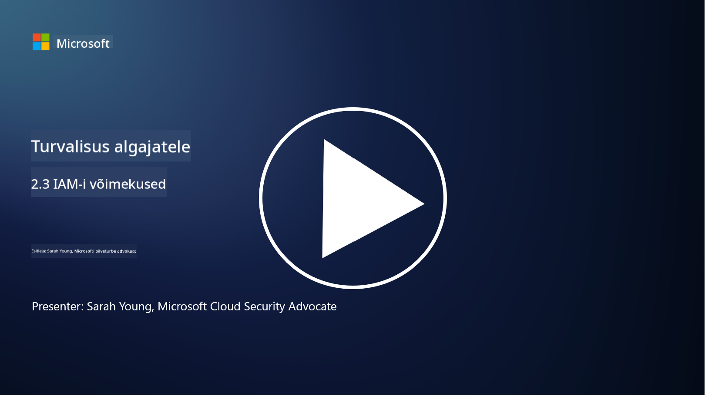

<!--
CO_OP_TRANSLATOR_METADATA:
{
  "original_hash": "bf0b8a54f2c69951744df5a94bc923f7",
  "translation_date": "2025-10-11T11:23:46+00:00",
  "source_file": "2.3 IAM capabilities.md",
  "language_code": "et"
}
-->
# IAM Võimalused

Selles osas käsitleme põhjalikumalt identiteedi turvalisuse jaoks kasutatavaid põhitööriistu ja võimalusi.

## Sissejuhatus

Selles õppetükis käsitleme:

 - Mis on kataloogiteenus?
      
     
    
 - Milliseid võimalusi saab kasutada identiteetide turvamiseks?
>
>        Mitmefaktoriline autentimine (MFA)
> 
>        Ühekordne sisselogimine (SSO)
> 
>        Rollipõhine juurdepääsukontroll (RBAC)
> 
>        Kohanduv autentimine
> 
>        Biomeetriline autentimine
> 
>        Privilegeeritud juurdepääsu haldus (PAM)
> 
>        Identiteedi haldamine ja administreerimine (IGA)
> 
>        Käitumisanalüütika

## Mis on kataloogiteenus?

Kataloogiteenus on spetsialiseeritud andmebaas, mis salvestab ja haldab teavet võrguressursside kohta, sealhulgas kasutajad, grupid, seadmed, rakendused ja muud objektid. See toimib identiteedi ja juurdepääsuga seotud andmete tsentraliseeritud hoidlana, võimaldades organisatsioonidel tõhusalt hallata ja kontrollida kasutaja autentimist, autoriseerimist ja muid turvalisusega seotud ülesandeid.

Kataloogiteenused mängivad kaasaegsetes IT-keskkondades olulist rolli, pakkudes alust identiteedi ja juurdepääsuhalduse (IAM) lahendustele. Need hõlbustavad turvalist juurdepääsu ressurssidele, rakendavad juurdepääsupoliitikaid ja lihtsustavad haldusülesandeid. Üks tuntumaid kataloogiteenuseid on Microsoft Active Directory, kuid on ka teisi lahendusi, nagu LDAP (Lightweight Directory Access Protocol) kataloogid, mis täidavad sarnaseid eesmärke.

Kataloogiteenuse peamised funktsioonid ja omadused küberturvalisuse kontekstis hõlmavad:

 - **Kasutaja autentimine**: Kataloogiteenused valideerivad kasutaja mandaate (näiteks kasutajanimi ja parool), et tagada, et ainult volitatud kasutajad pääsevad võrku ja selle ressurssidele.
 - **Kasutaja autoriseerimine**: Need määravad kindlaks iga kasutaja juurdepääsutaseme, lähtudes tema rollist, grupikuuluvusest ja muudest atribuutidest. See tagab, et kasutajad pääsevad ainult neile määratud ressurssidele.
 - **Grupihaldus**: Kataloogiteenused võimaldavad administraatoritel organiseerida kasutajaid loogilistesse gruppidesse, lihtsustades juurdepääsukontrolli haldamist. Õigusi saab määrata gruppidele, mitte individuaalsetele kasutajatele.
 - **Paroolipoliitikad**: Need rakendavad parooli keerukuse ja aegumise reegleid, parandades kasutajakontode turvalisust.
 - **Ühekordne sisselogimine (SSO)**: Mõned kataloogiteenused toetavad SSO-d, võimaldades kasutajatel pääseda mitmele rakendusele ja teenusele ühe mandaadikomplektiga.
 - **Tsentraliseeritud kasutajahaldus**: Kataloogiteenused tsentraliseerivad kasutajate teabe, muutes kasutajakontode, profiilide ja atribuutide haldamise lihtsamaks ühest kohast.
 - **Audit ja logimine**: Need võivad salvestada kasutaja autentimise ja juurdepääsu tegevused, aidates turvaauditites ja vastavuspüüdlustes.

## Milliseid võimalusi saab kasutada identiteetide turvamiseks?

**Mitmefaktoriline autentimine (MFA)**

MFA nõuab kasutajatelt mitme tõendamisviisi esitamist enne juurdepääsu andmist. Tavaliselt hõlmab see midagi, mida kasutaja teab (parool), midagi, mida kasutaja omab (nutitelefon või turvamärk), ja midagi, mida kasutaja on (biomeetrilised andmed, nagu sõrmejälg või näotuvastus).

**Ühekordne sisselogimine (SSO)**

SSO võimaldab kasutajatel pääseda mitmele rakendusele ja süsteemile ühe mandaadikomplektiga. See parandab kasutajakogemust ja vähendab riske, mis on seotud mitme parooli haldamisega.

**Rollipõhine juurdepääsukontroll (RBAC)**

RBAC määrab õigused eelnevalt määratletud rollide alusel. Kasutajatele antakse juurdepääs nende rollide põhjal organisatsioonis.

**Kohanduv autentimine**

Kohanduv autentimine hindab riskitegureid, nagu asukoht, seade, juurdepääsu aeg ja kasutaja käitumine, et dünaamiliselt kohandada nõutava autentimise taset. Kui taotlus tundub kahtlane, võidakse käivitada täiendavad autentimissammud.

**Biomeetriline autentimine**

Biomeetriline autentimine kasutab unikaalseid bioloogilisi omadusi, nagu sõrmejäljed, näojooned, häälemustrid ja isegi käitumuslikud tunnused, nagu tippimiskiirus, identiteedi kinnitamiseks.

**Privilegeeritud juurdepääsu haldus (PAM)**

PAM keskendub kriitilistele süsteemidele ja andmetele juurdepääsu turvamisele, rakendades rangeid kontrollimeetmeid privilegeeritud kontodele. See hõlmab funktsioone, nagu ajutine juurdepääs ja sessioonide jälgimine.

**Identiteedi haldamine ja administreerimine (IGA)**

IGA lahendused haldavad kasutajate identiteete ja nende juurdepääsu ressurssidele kogu nende elutsükli jooksul. See hõlmab kasutajate lisamist, juurdepääsu määramist, rollipõhist juurdepääsukontrolli ja juurdepääsu eemaldamist.

**Käitumisanalüütika**

Käitumisanalüütika jälgib kasutajate käitumist ja määrab kindlaks baasjooned. Normist kõrvalekalded võivad käivitada hoiatusi edasiseks uurimiseks.

# Lisalugemine
- [Azure Active Directory põhialuste dokumentatsioon - Microsoft Entra | Microsoft Learn](https://learn.microsoft.com/azure/active-directory/fundamentals/?WT.mc_id=academic-96948-sayoung)
- [Mis on Azure Active Directory? - Microsoft Entra | Microsoft Learn](https://learn.microsoft.com/azure/active-directory/fundamentals/whatis?WT.mc_id=academic-96948-sayoung)
- [Halda oma mitme pilve identiteedi infrastruktuuri Microsoft Entra abil - YouTube](https://www.youtube.com/watch?v=9qQiq3wTS2Y&list=PLXtHYVsvn_b_gtX1-NB62wNervQx1Fhp4&index=18)

---

**Lahtiütlus**:  
See dokument on tõlgitud AI tõlketeenuse [Co-op Translator](https://github.com/Azure/co-op-translator) abil. Kuigi püüame tagada täpsust, palume arvestada, et automaatsed tõlked võivad sisaldada vigu või ebatäpsusi. Algne dokument selle algses keeles tuleks pidada autoriteetseks allikaks. Olulise teabe puhul soovitame kasutada professionaalset inimtõlget. Me ei vastuta selle tõlke kasutamisest tulenevate arusaamatuste või valesti tõlgenduste eest.