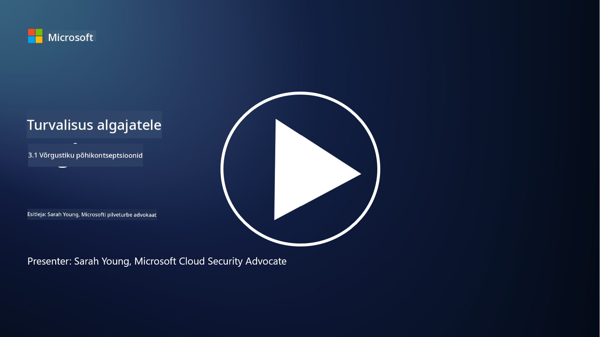
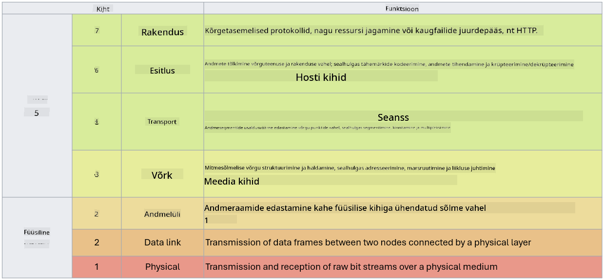

<!--
CO_OP_TRANSLATOR_METADATA:
{
  "original_hash": "252724eceeb183fb9018f88c5e1a3f0c",
  "translation_date": "2025-10-11T11:20:05+00:00",
  "source_file": "3.1 Networking key concepts.md",
  "language_code": "et"
}
-->
# Võrgunduse põhikontseptsioonid

Kui olete töötanud IT-valdkonnas, on tõenäoline, et olete kokku puutunud võrgunduse kontseptsioonidega. Kuigi tänapäevastes keskkondades kasutame identiteeti esmase perimeetri kontrollina, ei tähenda see, et võrgukontrollid oleksid üleliigsed. Kuigi see on väga lai teema, käsitleme selles õppetükis mõningaid võrgunduse põhikontseptsioone.

Selles õppetükis käsitleme:

 - Mis on IP-aadressimine?
   
 - Mis on OSI mudel?

 

 - Mis on TCP/UDP?

   
 

 - Mis on portide numbrid?

   
  

 - Mis on andmete krüpteerimine puhkeolekus ja edastamisel?

## Mis on IP-aadressimine?

IP-aadressimine ehk Interneti-protokolli aadressimine on numbriline märgis, mis määratakse igale seadmele, mis on ühendatud arvutivõrguga ja kasutab suhtlemiseks Interneti-protokolli. See toimib seadmete unikaalse identifikaatorina võrgus, võimaldades neil saata ja vastu võtta andmeid internetis või muudes ühendatud võrkudes. IP-aadressimisel on kaks peamist versiooni: IPv4 (Interneti-protokolli versioon 4) ja IPv6 (Interneti-protokolli versioon 6). IP-aadressi esitatakse tavaliselt kas IPv4 formaadis (nt 192.168.1.1) või IPv6 formaadis (nt 2001:0db8:85a3:0000:0000:8a2e:0370:7334).

## Mis on OSI mudel?

OSI (Open Systems Interconnection) mudel on kontseptuaalne raamistik, mis standardiseerib suhtlussüsteemi funktsioonid seitsmeks eraldi kihiks. Iga kiht täidab konkreetseid ülesandeid ja suhtleb naaberkihiga, et tagada tõhus ja usaldusväärne andmeside seadmete vahel võrgus. Kihid, alt üles, on järgmised:

 1. Füüsiline kiht
    
 
 2. Andmeside kiht

    
    

 1. Võrgukiht

    
   

 1. Transpordikiht

    

 1. Sessioonikiht

    
   

 1. Esitluskiht

    
    

 1. Rakenduskiht

OSI mudel pakub ühist viidet, et mõista, kuidas võrguprotokollid ja -tehnoloogiad omavahel suhtlevad, sõltumata konkreetsetest riist- või tarkvaralahendustest.

_ref: https://en.wikipedia.org/wiki/OSI_model_

## Mis on TCP/UDP?

TCP (Transmission Control Protocol) ja UDP (User Datagram Protocol) on kaks põhilist transpordikihi protokolli, mida kasutatakse arvutivõrkudes seadmete vahelise suhtluse hõlbustamiseks internetis või kohalikus võrgus. Need vastutavad andmete jagamise eest pakettideks edastamiseks ja nende pakettide taasühendamise eest algandmeteks vastuvõtval poolel. Kuid nende omadused ja kasutusjuhtumid erinevad.

**TCP (Transmission Control Protocol)**:

TCP on ühendusele orienteeritud protokoll, mis tagab usaldusväärse ja järjestatud andmete edastamise seadmete vahel. See loob ühenduse saatja ja vastuvõtja vahel enne andmevahetuse algust. TCP tagab, et andmepaketid saabuvad õiges järjekorras ja suudab kaotatud pakette uuesti edastada, et tagada andmete terviklikkus ja täielikkus. See teeb TCP sobivaks rakendustele, mis vajavad usaldusväärset andmeedastust, nagu veebisirvimine, e-post, failiedastus (FTP) ja andmebaaside suhtlus.

**UDP (User Datagram Protocol)**:

UDP on ühenduseta protokoll, mis pakub kiiremat andmeedastust, kuid ei paku sama usaldusväärsust kui TCP. See ei loo enne andmete saatmist formaalset ühendust ega sisalda mehhanisme kaotatud pakettide kinnitamiseks või uuesti edastamiseks. UDP sobib rakendustele, kus kiirus ja tõhusus on olulisemad kui garanteeritud edastus, näiteks reaalajas suhtlus, voogesitus, online-mängud ja DNS-päringud.

Kokkuvõttes eelistab TCP usaldusväärsust ja järjestatud edastust, muutes selle sobivaks rakendustele, mis vajavad andmete täpsust, samas kui UDP rõhutab kiirust ja tõhusust, muutes selle sobivaks rakendustele, kus väike andmekadu või järjekorra muutus on vastuvõetav madalama latentsuse nimel. Valik TCP ja UDP vahel sõltub kasutatava rakenduse või teenuse konkreetsetest nõuetest.

## Mis on portide numbrid?

Võrgunduses on portide number numbriline identifikaator, mida kasutatakse ühe seadme sees töötavate erinevate teenuste või rakenduste eristamiseks võrgus. Portid aitavad suunata sissetulevaid andmeid õigele rakendusele. Portide numbrid on 16-bitised täisarvud, mis tähendab, et nende vahemik on 0 kuni 65535. Need jagunevad kolme vahemikku:

- Hästi tuntud portid (0-1023): Reserveeritud standardteenustele nagu HTTP (port 80) ja FTP (port 21).

- Registreeritud portid (1024-49151): Kasutatakse rakenduste ja teenuste jaoks, mis ei kuulu hästi tuntud vahemikku, kuid on ametlikult registreeritud.

- Dünaamilised/privaatportid (49152-65535): Saadaval ajutiseks või privaatseks kasutamiseks rakenduste poolt.

## Mis on andmete krüpteerimine puhkeolekus ja edastamisel?

Krüpteerimine on protsess, mille käigus andmed muudetakse turvaliseks vorminguks, et kaitsta neid volitamata juurdepääsu või manipuleerimise eest. Krüpteerimist saab rakendada nii andmetele "puhkeolekus" (kui need on salvestatud seadmel või serveris) kui ka "edastamisel" (kui need liiguvad seadmete vahel või võrkudes).

Krüpteerimine puhkeolekus: See hõlmab andmete krüpteerimist, mis on salvestatud seadmetel, serverites või salvestussüsteemides. Isegi kui ründaja saab füüsilise juurdepääsu salvestusmeediale, ei saa ta andmetele ligi ilma krüpteerimisvõtmeteta. See on oluline tundlike andmete kaitsmiseks seadme varguse, andmelekete või volitamata juurdepääsu korral.

Krüpteerimine edastamisel: See hõlmab andmete krüpteerimist nende liikumisel seadmete vahel või võrkudes. See takistab pealtkuulamist ja volitamata andmete vaheltvõtmist edastamise ajal. Tavalised protokollid edastamise krüpteerimiseks hõlmavad HTTPS-i veebisuhtluseks ja TLS/SSL-i erinevate võrguliikluse tüüpide turvamiseks.

## Lisalugemine
- [Kuidas IP-aadressid töötavad? (howtogeek.com)](https://www.howtogeek.com/341307/how-do-ip-addresses-work/)
- [IP-aadressi mõistmine: sissejuhatav juhend (geekflare.com)](https://geekflare.com/understanding-ip-address/)
- [Mis on OSI mudel? OSI 7 kihti selgitatud (techtarget.com)](https://www.techtarget.com/searchnetworking/definition/OSI)
- [OSI mudel – 7 võrgukihti selgitatud lihtsas keeles (freecodecamp.org)](https://www.freecodecamp.org/news/osi-model-networking-layers-explained-in-plain-english/)
- [TCP/IP protokollid - IBM dokumentatsioon](https://www.ibm.com/docs/en/aix/7.3?topic=protocol-tcpip-protocols)
- [Tavaliste portide spikker: lõplik portide ja protokollide nimekiri (stationx.net)](https://www.stationx.net/common-ports-cheat-sheet/)
- [Azure andmete krüpteerimine puhkeolekus - Azure turvalisus | Microsoft Learn](https://learn.microsoft.com/azure/security/fundamentals/encryption-atrest?WT.mc_id=academic-96948-sayoung)

---

**Lahtiütlus**:  
See dokument on tõlgitud AI tõlketeenuse [Co-op Translator](https://github.com/Azure/co-op-translator) abil. Kuigi püüame tagada täpsust, palume arvestada, et automaatsed tõlked võivad sisaldada vigu või ebatäpsusi. Algne dokument selle algses keeles tuleks pidada autoriteetseks allikaks. Olulise teabe puhul soovitame kasutada professionaalset inimtõlget. Me ei vastuta selle tõlke kasutamisest tulenevate arusaamatuste või valesti tõlgenduste eest.