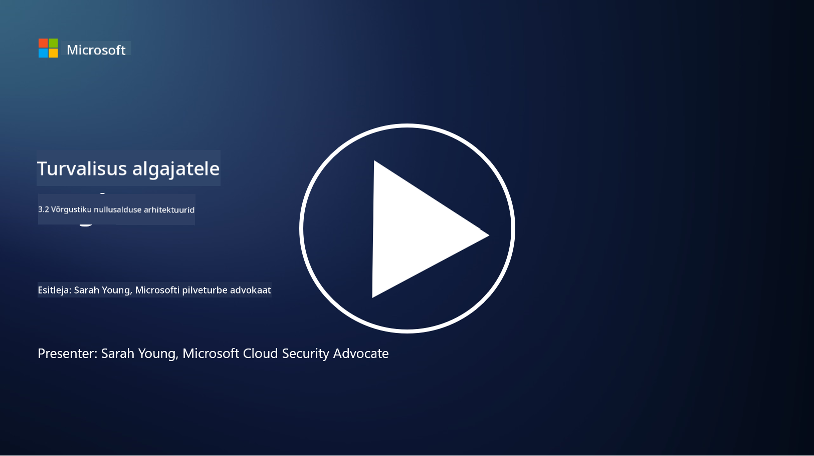

<!--
CO_OP_TRANSLATOR_METADATA:
{
  "original_hash": "680d6e14d9d33fc471c22f44679713f8",
  "translation_date": "2025-10-11T11:22:49+00:00",
  "source_file": "3.2 Networking zero trust architecture.md",
  "language_code": "et"
}
-->
# Võrgunduse nullusalduse arhitektuurid

Võrk pakub nullusalduse kontrollide jaoks olulist kihti. Selles õppetükis õpime rohkem järgmistest teemadest:

- Mis on võrgu segmentimine?  
- Kuidas võrgu segmentimine aitab rakendada nullusalduse põhimõtteid?  
- Mis on otsast lõpuni krüpteerimine?

## Mis on võrgu segmentimine?

Võrgu segmentimine on praktika, mille käigus jagatakse võrk väiksemateks, isoleeritud segmentideks või alavõrkudeks. Iga segment on teistest eraldatud ning juurdepääsu segmentide vahel kontrollitakse ja piiratakse kindlate turvapoliitikate alusel. Võrgu segmentimist kasutatakse turvalisuse parandamiseks, et piirata võimalike rikkumiste mõju ja takistada ründajate külgsuunalist liikumist võrgus.

Segmentimise abil saab organisatsioon luua "tsoonid", mis eraldavad erinevat tüüpi kasutajaid, rakendusi ja andmeid. See vähendab rünnakupinda ja minimeerib turvaintsidendi põhjustatud kahju. Võrgu segmentimist saab saavutada selliste tehnoloogiate abil nagu virtuaalsed LAN-id (VLAN-id), tulemüürid ja juurdepääsukontrollid.

## Kuidas võrgu segmentimine aitab rakendada nullusalduse põhimõtteid?

Võrgu segmentimine on tihedalt seotud nullusalduse mudeli põhimõtetega. Nullusalduse arhitektuuris aitab võrgu segmentimine rakendada "vähima privileegi" põhimõtet, tagades, et kasutajatel ja seadmetel on juurdepääs ainult neile ressurssidele ja teenustele, mida nad oma ülesannete täitmiseks vajavad. Võrgu jagamine väiksemateks tsoonideks võimaldab organisatsioonidel rakendada rangeid juurdepääsukontrolle, isoleerida kriitilisi ressursse ja takistada ründajate külgsuunalist liikumist.

Segmentimine aitab ka identiteedipõhiste juurdepääsukontrollide rakendamisel, kus kasutajad ja seadmed autentitakse ja autoriseeritakse põhjalikult enne konkreetsete segmentide juurde pääsemist. See hoiab ära volitamata juurdepääsu tundlikele ressurssidele ja vähendab kompromiteeritud volituste mõju.

## Mis on otsast lõpuni krüpteerimine?

Otsast lõpuni (E2E) krüpteerimine on turvameede, mis tagab, et andmed jäävad krüpteerituks kogu nende teekonna vältel saatjalt vastuvõtjani. Selle protsessi käigus krüpteeritakse andmed saatja poolel ning ainult vastuvõtjal on dekrüpteerimisvõti, et andmeid avada ja lugeda. Krüpteerimine ja dekrüpteerimine toimuvad lõpp-punktides, muutes volitamata osapoolte, sealhulgas teenusepakkujate ja vahendajate, jaoks selge andmete juurde pääsemise äärmiselt keeruliseks.

E2E krüpteerimine pakub kõrget konfidentsiaalsuse ja turvalisuse taset andmeedastuse jaoks, isegi kui andmed läbivad mitmeid vahesüsteeme või võrke. Seda kasutatakse sageli turvalistes sõnumirakendustes, e-posti teenustes ja muudel suhtlusplatvormidel, et kaitsta tundlikku teavet pealtkuulamise ja volitamata juurdepääsu eest.

See krüpteerimismeetod tagab, et isegi kui ründajad pääsevad andmetele ligi nende edastamise ajal, näevad nad ainult krüpteeritud sisu, mis on ilma dekrüpteerimisvõtmeta mõttetu. Otsast lõpuni krüpteerimine mängib olulist rolli kasutajate privaatsuse kaitsmisel ja tundliku teabe volitamata osapooltele avaldamise vältimisel.

## Mis on SASE?

SASE tähistab "Secure Access Service Edge" (turvalise juurdepääsu teenuse serv) ja see on küberjulgeoleku raamistik ja arhitektuur, mis ühendab võrgu turvalisuse ja laivõrgu (WAN) võimalused ühtseks pilvepõhiseks teenuseks. SASE on loodud pakkuma turvalist ja skaleeritavat juurdepääsu võrguressurssidele, rakendustele ja andmetele kaugtöötajatele ja mobiilikasutajatele, lihtsustades samal ajal võrgu haldamist ja vähendades traditsiooniliste võrgu- ja turbearhitektuuride keerukust.

SASE peamised omadused ja komponendid:

1. **Pilvepõhine:** SASE pakutakse pilveteenusena, mis tähendab, et turvalisuse ja võrgu funktsioonid on saadaval pilvest, mitte traditsiooniliste kohapealsete seadmete ja rakenduste kaudu.

2. **Turvalisuse ja võrgu integreerimine:** SASE integreerib erinevaid turvateenuseid, nagu turvalised veebiväravad (SWG), tulemüür teenusena (FWaaS), andmekao ennetamine (DLP), nullusalduse võrgujuurdepääs (ZTNA) ja WAN-i optimeerimine, koos laivõrgu võimalustega. See integratsioon aitab turvalisuse ja võrgu toiminguid sujuvamaks muuta.

3. **Nullusalduse põhimõte:** SASE toimib nullusalduse põhimõttel, mis tähendab, et see rakendab rangeid juurdepääsukontrolle ja vähima privileegi poliitikaid. Kasutajaid ja seadmeid ei usaldata vaikimisi ning nad peavad olema autentitud ja autoriseeritud enne ressurssidele juurdepääsu.

4. **Identiteedikeskne:** SASE keskendub kasutaja ja seadme identiteetidele kui juurdepääsukontrolli alusele. Identiteedi- ja kontekstipõhiseid poliitikaid kasutatakse juurdepääsuõiguste määramiseks ning need poliitikad kohanduvad dünaamiliselt vastavalt kasutaja käitumisele ja kontekstile.

5. **Skaleeritavus ja paindlikkus:** SASE saab hõlpsasti skaleerida, et mahutada suur hulk kasutajaid ja seadmeid, muutes selle sobivaks organisatsioonidele, kellel on mitmekesised ja muutuvad võrgu- ja turvavajadused.

SASE on eriti oluline tänapäeva kaugtöö ja pilvekasutuse ajastul, kuna see pakub terviklikku ja paindlikku lähenemist võrgujuurdepääsu turvalisuse ja haldamise tagamiseks. See aitab organisatsioonidel kohaneda muutuvate turvalisuse ja võrgu nõuetega, säilitades samal ajal tugeva keskendumise kasutajakesksele ja nullusalduse turvamudelile.

## Lisalugemine

- [Mis on võrgu segmentimine? - Cisco](https://www.cisco.com/c/en/us/products/security/what-is-network-segmentation.html#~benefits)  
- [Mis on mikrosegmentimine? - Cisco](https://www.cisco.com/c/en/us/products/security/what-is-microsegmentation.html)  
- [Võrgu segmentimise ja eraldamise rakendamine | Cyber.gov.au](https://www.cyber.gov.au/resources-business-and-government/maintaining-devices-and-systems/system-hardening-and-administration/network-hardening/implementing-network-segmentation-and-segregation)  
- [Mis on võrgu segmentimine ja miks see on oluline | CompTIA](https://www.comptia.org/blog/security-awareness-training-network-segmentation)  
- [Võrgu segmentimine: kontseptsioonid ja praktikad (cmu.edu)](https://insights.sei.cmu.edu/blog/network-segmentation-concepts-and-practices/)  
- [Turvalised võrgud nullusaldusega | Microsoft Learn](https://learn.microsoft.com/security/zero-trust/deploy/networks?WT.mc_id=academic-96948-sayoung)  
- [Mis on otsast lõpuni krüpteerimine? | IBM](https://www.ibm.com/topics/end-to-end-encryption)  
- [Mis on otsast lõpuni krüpteerimine ja miks see on oluline? (howtogeek.com)](https://www.howtogeek.com/711656/what-is-end-to-end-encryption-and-why-does-it-matter/)  
- [Secure Access Service Edge (SASE) määratlus - Gartner Information Technology Glossary](https://www.gartner.com/en/information-technology/glossary/secure-access-service-edge-sase)  
- [Mis on Secure Access Service Edge (SASE)? | Microsoft Security](https://www.microsoft.com/security/business/security-101/what-is-sase?WT.mc_id=academic-96948-sayoung)  

---

**Lahtiütlus**:  
See dokument on tõlgitud AI tõlketeenuse [Co-op Translator](https://github.com/Azure/co-op-translator) abil. Kuigi püüame tagada täpsust, palume arvestada, et automaatsed tõlked võivad sisaldada vigu või ebatäpsusi. Algne dokument selle algses keeles tuleks pidada autoriteetseks allikaks. Olulise teabe puhul soovitame kasutada professionaalset inimtõlget. Me ei vastuta selle tõlke kasutamisest tulenevate arusaamatuste või valesti tõlgenduste eest.