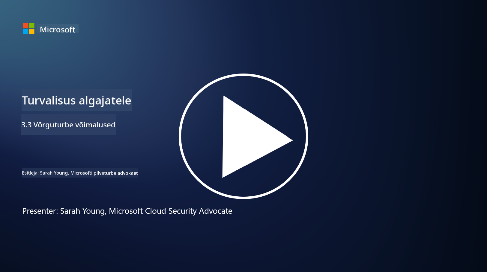

<!--
CO_OP_TRANSLATOR_METADATA:
{
  "original_hash": "c3aba077bb98eebc925dd58d870229ab",
  "translation_date": "2025-10-11T11:33:04+00:00",
  "source_file": "3.3 Network security capabilities.md",
  "language_code": "et"
}
-->
# Võrguturbe võimalused

Selles õppetükis õpime tundma järgmisi võimalusi, mida saab kasutada võrgu turvamiseks:

 - Traditsioonilised tulemüürid
 - Veebirakenduste tulemüürid
 - Pilveturbegrupid
 - CDN
 - Koormuse tasakaalustajad
 - Bastion hostid
 - VPN-id
 - DDoS kaitse

## Traditsioonilised tulemüürid

Traditsioonilised tulemüürid on turvaseadmed, mis kontrollivad ja jälgivad sissetulevat ja väljaminevat võrguliiklust eelnevalt määratletud turvareeglite alusel. Need toimivad usaldusväärse sisemise võrgu ja ebausaldusväärsete väliste võrkude vahelise barjäärina, filtreerides liiklust, et vältida volitamata juurdepääsu ja potentsiaalseid ohte.

## Veebirakenduste tulemüürid

Veebirakenduste tulemüürid (WAF) on spetsiaalsed tulemüürid, mis on loodud veebirakenduste kaitsmiseks erinevate rünnakute, nagu SQL süstimine, ristveebiskriptimine ja muud haavatavused, eest. Need analüüsivad HTTP päringuid ja vastuseid, et tuvastada ja blokeerida pahatahtlikku liiklust, mis on suunatud veebirakendustele.

## Pilveturbegrupid

Turbegrupid on pilveteenuse pakkujate pakutav põhiline võrgu turvafunktsioon. Need toimivad virtuaalsete tulemüüridena, mis kontrollivad pilveressursside, nagu virtuaalmasinate (VM) ja instantside, sissetulevat ja väljaminevat liiklust. Turbegrupid võimaldavad organisatsioonidel määratleda reegleid, mis määravad, millist tüüpi liiklus on lubatud ja keelatud, lisades pilvekeskkondadele täiendava kaitsekihi.

## Sisuteenuste edastusvõrk (CDN)

Sisuteenuste edastusvõrk on hajutatud serverite võrk, mis asub erinevates geograafilistes asukohtades. CDN-id aitavad parandada veebisaitide jõudlust ja kättesaadavust, salvestades sisu vahemällu ja edastades seda serveritest, mis asuvad kasutajale lähemal. Samuti pakuvad need teatud tasemel kaitset DDoS rünnakute vastu, jaotades liiklust mitme serveri asukoha vahel.

## Koormuse tasakaalustajad

Koormuse tasakaalustajad jaotavad sissetuleva võrguliikluse mitme serveri vahel, et optimeerida ressursside kasutamist, tagada kõrge kättesaadavus ja parandada rakenduste jõudlust. Need aitavad vältida serverite ülekoormust ja säilitada tõhusat reageerimisaega, suurendades võrgu vastupidavust.

## Bastion hostid

Bastion hostid on väga turvalised ja isoleeritud serverid, mis pakuvad kontrollitud juurdepääsu võrgule välisest, ebausaldusväärsest võrgust (näiteks internetist). Need toimivad sissepääsupunktidena administraatoritele, et pääseda turvaliselt sisemistele süsteemidele. Bastion hostid on tavaliselt konfigureeritud tugevate turvameetmetega, et vähendada rünnakupinda.

## Virtuaalsed privaatvõrgud (VPN-id)

VPN-id loovad krüpteeritud tunnelid kasutaja seadme ja kaugserveri vahel, tagades turvalise ja privaatse suhtluse potentsiaalselt ebaturvaliste võrkude, nagu internet, kaudu. VPN-e kasutatakse sageli sisemistele võrkudele kaugjuurdepääsu võimaldamiseks, et kasutajad saaksid ressursse kasutada nii, nagu nad oleksid füüsiliselt samas võrgus.

## DDoS kaitse tööriistad

DDoS (Distributed Denial of Service) kaitse tööriistad ja teenused on loodud DDoS rünnakute mõju leevendamiseks, kus mitu kompromiteeritud seadet koormavad võrku või teenust, et seda üle koormata. DDoS kaitse lahendused tuvastavad ja filtreerivad välja pahatahtliku liikluse, tagades, et seaduslik liiklus jõuab endiselt oma sihtkohta.

## Lisalugemine

- [Mis on tulemüür? - Cisco](https://www.cisco.com/c/en/us/products/security/firewalls/what-is-a-firewall.html#~types-of-firewalls)
- [Mida tulemüür tegelikult teeb? (howtogeek.com)](https://www.howtogeek.com/144269/htg-explains-what-firewalls-actually-do/)
- [Mis on tulemüür? Kuidas tulemüürid töötavad ja tüübid (kaspersky.com)](https://www.kaspersky.com/resource-center/definitions/firewall)
- [Võrguturbegrupp - kuidas see töötab | Microsoft Learn](https://learn.microsoft.com/azure/virtual-network/network-security-group-how-it-works)
- [Sissejuhatus Azure sisuteenuste edastusvõrku (CDN) - Koolitus | Microsoft Learn](https://learn.microsoft.com/training/modules/intro-to-azure-content-delivery-network/?WT.mc_id=academic-96948-sayoung)
- [Mis on sisuteenuste edastusvõrk (CDN)? - Azure | Microsoft Learn](https://learn.microsoft.com/azure/cdn/cdn-overview?WT.mc_id=academic-96948-sayoung)
- [Mis on koormuse tasakaalustamine? Kuidas koormuse tasakaalustajad töötavad (nginx.com)](https://www.nginx.com/resources/glossary/load-balancing/)
- [Bastion hostid vs. VPN-id · Tailscale](https://tailscale.com/learn/bastion-hosts-vs-vpns/)
- [Mis on VPN? Kuidas see töötab, VPN-i tüübid (kaspersky.com)](https://www.kaspersky.com/resource-center/definitions/what-is-a-vpn)
- [Sissejuhatus Azure DDoS kaitse - Koolitus | Microsoft Learn](https://learn.microsoft.com/training/modules/introduction-azure-ddos-protection/?WT.mc_id=academic-96948-sayoung)
- [Mis on DDoS rünnak? | Microsoft Security](https://www.microsoft.com/security/business/security-101/what-is-a-ddos-attack?WT.mc_id=academic-96948-sayoung)

---

**Lahtiütlus**:  
See dokument on tõlgitud AI tõlketeenuse [Co-op Translator](https://github.com/Azure/co-op-translator) abil. Kuigi püüame tagada täpsust, palume arvestada, et automaatsed tõlked võivad sisaldada vigu või ebatäpsusi. Algne dokument selle algses keeles tuleks pidada autoriteetseks allikaks. Olulise teabe puhul soovitame kasutada professionaalset inimtõlget. Me ei vastuta selle tõlke kasutamisest tulenevate arusaamatuste või valesti tõlgenduste eest.